# RobOS Create Project & App Wizard

The **RobOS Create Project & App Wizard** (`packages/app-wizard`) is the visual entry point for greenfield application scaffolding and brownfield codebase ingestion. Engineered for both non-technical creators and seasoned software architects, it translates product concepts into fully configured, production-grade applications registered in the RobOS Knowledge Graph.

## Key Usability & Non-Technical Features

- **Simple Mode vs. Advanced Mode**: Default plain-English mode strips away confusing developer jargon (raw YAML editors, TypeSpec, and URNs), replacing them with intuitive checklists. Advanced developers can toggle to granular engineering mode anytime.
- **One-Click Realistic Starter Templates**: Instant one-click templates to test and prototype real-world systems:
  - 🌿 **Urban Plant Tracker** (`robos:FrontEndApp`): Modern Next.js 15 web application with automated plant care schedules and botanical logs.
  - ☕ **Barista Order API** (`robos:Microservice`): Cloud REST microservice for specialty coffee roastery orders with OpenAPI 3.1 contracts.
  - 📑 **DocuVault Desktop** (`robos:DesktopApp`): Electron desktop application for offline-first markdown notes and encrypted personal storage.
  - ⚡ **Pulse Metrics CLI** (`robos:ConsoleApp`): Executable command-line diagnostic tool for uptime monitoring and latency checks.
- **Real-Time Auto-Slug Generation**: As creators type human-friendly names (e.g., "Urban Plant Tracker"), RobOS automatically computes clean, standardized directory paths (`packages/urban-plant-tracker`).
- **Human-Readable Project Launch Card**: Review stage presents a clean visual summary card detailing the archetype, runtime, storage, and automated setup deliverables before scaffolding.

## Architecture & Scaffolding Workflow

```mermaid
flowchart LR
    subgraph S1["1. Archetype & Quick Presets"]
        T1["🌐 Web Application\n(Urban Plant Tracker)"]
        T2["⚡ Cloud API\n(Barista Order API)"]
        T3["🖥️ Desktop Tool\n(DocuVault Desktop)"]
        T4["⌨️ CLI Utility\n(Pulse Metrics CLI)"]
    end

    subgraph S2["2. Plain-English Configuration"]
        C1["Simple Mode\n(Non-technical friendly)"]
        C2["Auto-Slug Synchronization\n(packages/slug)"]
        C3["Advanced Mode Toggle\n(OpenAPI 3.1 & TypeSpec)"]
    end

    subgraph S3["3. Greenfield Scaffolding Engine"]
        E1["Next.js Launch Kit\n(Auth, PGlite, SEO, E2E)"]
        E2["Electron Desktop\n(Window Bridge & Theme)"]
        E3["REST Microservice\n(Express/Node Server & Docker)"]
        E4["Executable CLI\n(CLI Runner & Diagnostics)"]
    end

    subgraph S4["4. RobOS SDLC Registration"]
        R1["Dual-State Knowledge Graph\n(.robos/kgraphs/)"]
        R2["Packages Registry\n(.robos/packages.yaml)"]
        R3["Spotify Backstage\n(catalog-info.yaml)"]
        R4["Living Documentation\n(docs/projects/<slug>.md)"]
    end

    S1 --> S2 --> S3 --> S4

    classDef stage fill:#161b22,stroke:#00bcd4,stroke-width:1.5px,color:#f0f6fc;
    classDef item fill:#0d1117,stroke:#30363d,stroke-width:1px,color:#c9d1d9;
    class S1,S2,S3,S4 stage;
    class T1,T2,T3,T4,C1,C2,C3,E1,E2,E3,E4,R1,R2,R3,R4 item;
```

## Supported Archetypes
- **Modern Web Application** (`robos:FrontEndApp` / `schema:WebApplication`): Phone-first Next.js 15 apps with built-in auth, serverless Neon Postgres, SEO metadata, and Cucumber E2E tests.
- **Desktop Application** (`robos:DesktopApp` / `schema:SoftwareApplication`): Installable Electron desktop apps integrated into the RobOS desktop shell and taskbar.
- **Backend Microservice / Web API** (`robos:Microservice` / `schema:WebApplication`): Express/FastAPI/Spring Boot services with OpenAPI 3.1 specifications and Dockerfiles.
- **Command-Line Tool** (`robos:ConsoleApp` / `schema:SoftwareApplication`): Lightweight terminal utilities with argument parsing and subcommands.
- **PC & Mobile Games** (`robos:PCGame`, `robos:MobileGame`): Godot / Unreal Engine game scaffolds.
- **Data Pipeline & Workers** (`robos:DataPipeline`): Kafka and batch streaming event handlers.
- **Software Libraries** (`robos:Library`): Reusable client SDKs and cross-platform modules.
