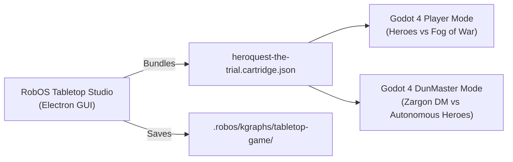

# RobOS Tabletop Studio

RobOS Tabletop Studio is the visual authoring environment and cartridge manager for tabletop dungeon crawler board games modeled after *HeroQuest*. Backed by the RobOS Knowledge Graph (`tabletop-game` package), it provides visual form editors for Quests, Heroes, Monsters, Spells, Furniture, and the 26×19 tactical board grid.

[Tabletop RPG Engine Guide]({{ "/projects/tabletop-rpg/" | relative_url }}){: .btn .btn-primary .mr-2 }

## Features

- **KGraph Data Form Editor**: Visually edit heroes (Barbarian, Dwarf, Elf, Wizard), monsters (Goblin, Orc, Fimir, Skeletons, Gargoyle, Verag Boss), elemental spell cards, and dungeon objects with instant W3C SHACL shape validation.
- **Cartridge Bundler**: Compiles campaigns into standalone `.cartridge.json` files.
- **26×19 Board Studio**: Interactive tile grid previewer highlighting outer corridors, rooms, doors, and the central chamber.
- **Dual Execution Roles**:
  - **Player Mode**: Play as the heroic adventurers exploring rooms, opening doors to lift fog of war, and fighting monsters.
  - **DunMaster (Dungeon Master / Zargon) Mode**: Play as the Evil Wizard! View all hidden rooms behind the DM screen, summon wandering monsters, and command monster attacks against the heroes.

