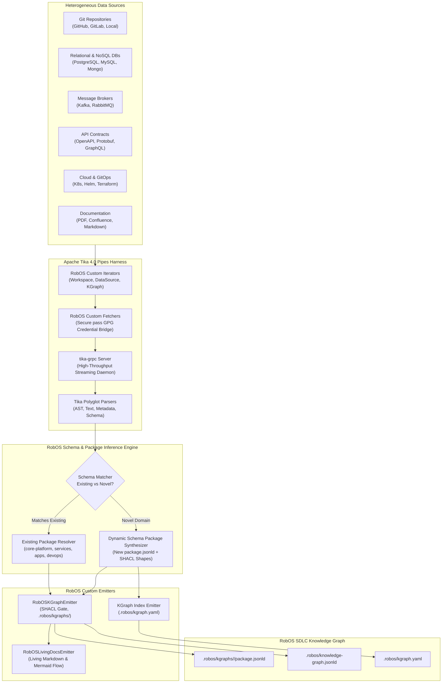

# Feature Spec: RobOS KGraph Crawler — Systematic Schema Inference & Datasource Ingestion via Apache Tika 4.0 Pipes and tika-grpc

- **Status**: Draft
- **Created Date**: 2026-09-11
- **Target Component**: `packages/kgraph-crawler`, `packages/robos-graph`, `packages/data-sources`, `packages/dev-central`, `.robos/` Git Store, `packages/robos-lib`
- **Author/Idea Source**: Apache Tika Committer & Lead System Architect

---

## 1. Overview & Vision

The core premise of RobOS is **Knowledge Graph-First (KGraph-First) Application Generation and Agent Review-Based Development**. To build, test, refactor, and govern software autonomously, AI agents (Google Antigravity, Claude Code, OpenAI Codex, GitHub Copilot) rely on a live, validated Dual-State Knowledge Graph that models every microservice, database, message queue, API contract, CI/CD pipeline, and team topology.

However, in brownfield enterprises and fast-evolving organizations, architectural information is locked away in hundreds of disparate data sources:
- Polyglot Git repositories, mono-repos, and branching histories
- Production relational databases, NoSQL clusters, and data warehouse tables
- Event-driven message brokers (Apache Kafka topics, schema registries, RabbitMQ exchanges)
- API contracts (OpenAPI 3.1 YAML/JSON, Protobuf `.proto` files, GraphQL schemas)
- Cloud infrastructure manifests (Kubernetes manifests, Helm values, Terraform/OpenTofu configurations)
- Unstructured architectural documentation (PDF architecture blueprints, ADRs, Confluence exports, Word briefs)

Until now, mapping these assets into RobOS Modular KGraph Packages (`.robos/kgraphs/<pkg>/package.jsonld`) required manual registration via desktop apps (`data-sources`, `relational-db-manager`, `git-projects`) or one-off ingestion scripts.

### The Solution: RobOS KGraph Crawler

The **RobOS KGraph Crawler** introduces a unified, continuous, and systematic crawling engine designed to ingest any data source, extract architectural entities, and systematically map them into existing Knowledge Graph schema packages or dynamically synthesize new ones.

Built upon the industrial-strength **Apache Tika 4.0 Pipes** architecture and the streaming **`tika-grpc`** daemon, the crawler introduces:
1. **RobOS Custom Pipe Components**:
   - **Iterators**: `RobOSKGraphPipesIterator`, `RobOSDataSourceIterator`, and `RobOSWorkspaceIterator` that emit `FetchEmitTuple` descriptors across heterogeneous data silos.
   - **Fetchers**: `RobOSKGraphFetcher`, `RobOSWorkspaceFetcher`, `RobOSDatabaseFetcher`, and `RobOSCloudConfigFetcher` with native GPG password store (`pass`) credential bridging.
   - **Emitters**: `RobOSKGraphEmitter`, `RobOSSchemaPackageEmitter`, and `RobOSLivingDocsEmitter` that enforce W3C SHACL shape validation gates, prevent graph drift, and maintain aggregated sync to `.robos/knowledge-graph.jsonld`.
2. **Dynamic Schema Inference & Package Auto-Generation**:
   - The crawler inspects extracted entities. If an entity matches an existing RobOS schema package (`core-platform`, `services`, `applications`, `devops`, `testing`, `organization`, `learning`, `documentation`), it inserts or updates the entity.
   - If an entity introduces an entirely novel domain (e.g., IoT edge fleets, AI model weight registries, SAP ERP modules, or bespoke mainframe tables), the crawler systematically scaffolds a **new KGraph schema package** (`.robos/kgraphs/<new-package>/package.jsonld`), synthesizes W3C SHACL constraint shapes linked to standard vocabularies via `robos:refersFrom`, updates `.robos/kgraph.yaml`, and generates living documentation.
3. **High-Throughput Streaming via `tika-grpc`**:
   - Leverages Apache Tika 4.0's streaming gRPC interface (`tika-grpc`), isolating heavy parser execution in crash-proof worker processes, enabling parallel extraction of binary docs, complex ASTs, and massive database DDLs without workstation memory bloat.

---

## 2. User Stories & Use Cases

- **As an Enterprise System Architect**, I want to point the RobOS KGraph Crawler at our Apache Kafka cluster and PostgreSQL warehouse, so that all Kafka topics, Avro schemas, database tables, and column foreign-key topologies are automatically crawled and populated into `.robos/kgraphs/core-platform/package.jsonld` without manual data entry.
- **As a Lead Platform Engineer**, I want the crawler to parse 50+ GitHub repositories using `tika-grpc`, parsing Dockerfiles, `pom.xml`, `package.json`, OpenAPI specifications, and Protobuf definitions to construct full upstream/downstream dependency edges (`robos:consumesContract`, `robos:producesContract`, `robos:dependsOnService`).
- **As an Autonomous AI Agent**, I want to execute a crawl against a legacy COBOL or SAP system, so that the crawler dynamically infers the schema taxonomy, scaffolds a new `.robos/kgraphs/erp-core/` schema package with W3C SHACL shapes, and allows me to write compliant adapters.
- **As a DevOps Engineer**, I want the crawler to run as an automated cron task via the RobOS `Agent Scheduler`, ensuring that the SDLC Knowledge Graph is never out of sync with deployed cloud resources and schema migrations.
- **As an Apache Tika Contributor**, I want RobOS custom iterators, fetchers, and emitters to plug seamlessly into Apache Tika 4.0 Pipes and `tika-grpc`, enabling bidirectional contributions and enterprise-scale content analysis.

---

## 3. Key Capabilities & Scope

### In Scope

#### 3.1 Apache Tika 4.0 Pipes Harness
- **`FetchEmitTuple` Routing**: Standardized Tika 4.0 tuple handling linking source fetch keys (`fetchKey`), extraction configs, and destination emit keys (`emitKey`).
- **Process Isolation & Concurrency**: Multi-threaded, non-blocking pipe execution with crash-isolated child processes or containerized `tika-grpc` daemons.
- **Retry & Circuit Breaking**: Exponential backoff, timeout handling, and failure queues (`dead-letter` tuples) for unavailable remote endpoints.

#### 3.2 RobOS Custom Pipe Subsystems
- **Custom Pipe Iterators**:
  - `RobOSKGraphPipesIterator`: Iterates over existing KGraph nodes to identify unverified edges, missing schema definitions, or external references.
  - `RobOSDataSourceIterator`: Reads registered data source nodes (`robos:Database`, `robos:NoSQLDatabase`, `robos:MessageBroker`) and emits iteration tuples for all constituent schemas, tables, and partitions.
  - `RobOSWorkspaceIterator`: Walks local filesystem directories, git submodules, and monorepos, filtering by architectural assets (`.proto`, `openapi.yaml`, `Dockerfile`, `schema.sql`).
- **Custom Fetchers**:
  - `RobOSKGraphFetcher`: Fetches JSON-LD objects directly from RobOS modular package stores or cache mirrors.
  - `RobOSWorkspaceFetcher`: Reads source files with AST extraction support.
  - `RobOSDatabaseFetcher`: Queries live databases using JDBC or native drivers, bridging credentials securely via UNIX `pass`.
  - `RobOSCloudConfigFetcher`: Fetches live manifests from Kubernetes API servers, Helm registries, or cloud provider APIs.
- **Custom Emitters**:
  - `RobOSKGraphEmitter`: Writes validated OSLC JSON-LD 1.1 nodes into `.robos/kgraphs/<pkg>/package.jsonld`, updates `.robos/kgraph.yaml`, and keeps `.robos/knowledge-graph.jsonld` backward-compatible.
  - `RobOSSchemaPackageEmitter`: Dynamically infers and scaffolds new modular schema packages when novel domains are encountered.
  - `RobOSLivingDocsEmitter`: Regenerates Mermaid flow diagrams and Markdown architecture documentation in `docs/schemas/`.

#### 3.3 Dynamic Schema Inference & Package Auto-Generation
- **Heuristic & AI-Assisted Schema Matching**: Compares extracted entity signatures against existing SHACL shape targets (`sh:targetClass`).
- **Dynamic Package Scaffolding**: Automatically creates:
  - `.robos/kgraphs/<new-pkg>/package.jsonld`
  - W3C SHACL shape constraints with `robos:refersFrom` linking to Schema.org, OSLC, or C4.
  - Package entry in `.robos/kgraph.yaml`.
  - Documentation page in `docs/schemas/<new-pkg>.md`.
- **SHACL Validation Gate**: Every emitted node must pass `kgraph-validate` before persistence.

#### 3.4 `tika-grpc` Integration
- High-performance, streaming gRPC client/server communication.
- Bidirectional streaming for large binary files, SQL dumps, and multi-megabyte OpenAPI documents.
- Support for both containerized `tika-grpc` sidecars and local native runners.

### Out of Scope
- Direct modification of source production databases (the crawler is strictly read-only on external data sources).
- Manual bypass of W3C SHACL shape validation (all inferred entities must have valid shapes).

---

## 4. System Architecture & C4 Model



---

## 5. RobOS Custom Pipe Subsystems

### 5.1 Custom Pipe Iterators

Tika 4.0 `PipesIterator` implementations traverse sources and yield `FetchEmitTuple` objects containing:
- `fetchKey`: Canonical location identifier (e.g. `file:///repo/orders/openapi.yaml`, `jdbc:postgresql://db:5432/orders`, `kafka://broker:9092/order-events`).
- `emitKey`: Destination routing key (e.g. `robos:services:orders-api`, `robos:core:orders-db`).
- `metadata`: Initial extraction context including package hint, repository owner, and timestamp.

```java
public class RobOSDataSourceIterator extends PipesIterator {
    private String kgraphStoreUri;
    private List<String> targetCategories;

    @Override
    protected void enqueueTuples() throws IOException, TikaException {
        // 1. Query SDLCKnowledgeGraphStore for registered data source nodes
        // 2. Iterate through databases, message queues, and API gateways
        // 3. Emit FetchEmitTuple for each target asset
    }
}
```

### 5.2 Custom Fetchers

RobOS fetchers retrieve raw payload streams while securely resolving authentication secrets through the UNIX `pass` GPG store without exposing plaintext tokens in memory or disk logs:

```java
public class RobOSDatabaseFetcher extends AbstractFetcher {
    private PassCredentialBridge passBridge;

    @Override
    public InputStream fetch(String fetchKey, Metadata metadata) throws IOException, TikaException {
        // 1. Extract pass URN from metadata (e.g., urn:robos:pass:devops/databases/prod)
        // 2. Fetch connection credentials securely from pass
        // 3. Extract schema DDL / catalog metadata via JDBC
        // 4. Return serialized stream of catalog definitions
    }
}
```

### 5.3 Custom Emitters

The emitters consume extracted metadata and content, transforming them into OSLC JSON-LD nodes validated against W3C SHACL shapes:

```java
public class RobOSKGraphEmitter extends AbstractEmitter {
    private String kgraphsBaseDir;
    private SHACLValidator validator;

    @Override
    public void emit(String emitKey, List<EmitData> emitDataList) throws IOException, TikaException {
        // 1. Transform Tika metadata and extracted structures into OSLC JSON-LD nodes
        // 2. Validate against W3C SHACL shape constraints (sh:targetClass)
        // 3. Atomically write to .robos/kgraphs/<pkg>/package.jsonld
        // 4. Update aggregated .robos/knowledge-graph.jsonld
    }
}
```

---

## 6. Dynamic Schema Inference & Package Auto-Generation

When the crawler encounters data structures that do not match existing classes in the standard RobOS ontology (`robos:Microservice`, `robos:Database`, `robos:MessageBroker`, `robos:KubernetesCluster`, etc.), the **RobOSSchemaPackageEmitter** executes the following automated pipeline:

1. **Entity Domain Clustering**: Groups unfamiliar structural records by domain, field co-occurrence, and semantic context (e.g. `telematics_sensor_stream`, `fleet_telemetry`).
2. **RDF Class & SHACL Shape Synthesis**:
   - Synthesizes an RDF Class (e.g. `robos:TelematicsDevice`).
   - Determines upstream standard basis via `robos:refersFrom` (e.g., `schema:Device` or `sosa:Sensor`).
   - Generates a W3C SHACL Shape with property constraints (`sh:property`, `sh:datatype`, `sh:minCount`).
3. **Package Manifest Creation**:
   - Creates `.robos/kgraphs/<domain>/package.jsonld` with proper `@context` mappings.
   - Writes the new entity nodes conforming strictly to the synthesized SHACL shape.
4. **Index & Documentation Registration**:
   - Appends the package definition to `.robos/kgraph.yaml`.
   - Generates living documentation in `docs/schemas/<domain>.md` with Mermaid diagrams.

---

## 7. `tika-grpc` Protocol & Service Definition

The crawler interacts with the `tika-grpc` service over HTTP/2 using standard Protocol Buffers:

```protobuf
syntax = "proto3";

package org.apache.tika.pipes.grpc;

service TikaPipesService {
  rpc StreamCrawl (stream CrawlRequest) returns (stream CrawlResponse);
  rpc ProcessTuple (FetchEmitTupleProto) returns (PipesResultProto);
  rpc HealthCheck (HealthRequest) returns (HealthResponse);
}

message CrawlRequest {
  string crawl_session_id = 1;
  string iterator_class = 2;
  map<string, string> iterator_params = 3;
  string fetcher_class = 4;
  string emitter_class = 5;
}

message CrawlResponse {
  string session_id = 1;
  int64 tuples_processed = 2;
  int64 nodes_emitted = 3;
  int64 schemas_inferred = 4;
  string current_status = 5;
  repeated string error_messages = 6;
}
```

---

## 8. BDD Gherkin User Scenarios

```gherkin
Feature: RobOS KGraph Crawler with Apache Tika 4.0 Pipes and tika-grpc
  As a Lead System Architect
  I want the RobOS KGraph Crawler to systematically ingest data sources
  So that the SDLC Knowledge Graph remains automatically synchronized and complete

  Background:
    Given a running RobOS environment with SDLCKnowledgeGraphStore
    And the tika-grpc streaming service is running on port 50051

  Scenario: Ingesting an OpenAPI 3.1 contract into the services package
    Given a local git repository containing "orders-api/openapi.yaml"
    When the crawler runs with "RobOSWorkspaceIterator" targeting "*.yaml"
    And the file is fetched by "RobOSWorkspaceFetcher"
    And parsed by "tika-grpc" with OpenAPI content extraction
    Then "RobOSKGraphEmitter" matches the entity to "robos:Microservice"
    And validates the node against "MicroserviceShape"
    And emits the node into ".robos/kgraphs/services/package.jsonld"
    And the aggregated ".robos/knowledge-graph.jsonld" contains "urn:robos:service:orders-api"

  Scenario: Dynamically discovering an unfamiliar domain and synthesizing a new schema package
    Given a proprietary IoT data store containing "devices/telematics_registry.json"
    When the crawler parses the data source using "RobOSDataSourceIterator"
    And the entity structure does not match any existing SHACL shape in RobOS
    Then "RobOSSchemaPackageEmitter" infers a new domain "iot-fleet"
    And synthesizes a new class "robos:IoTDevice" with "robos:refersFrom" pointing to "schema:Device"
    And creates ".robos/kgraphs/iot-fleet/package.jsonld"
    And registers "iot-fleet" in ".robos/kgraph.yaml"
    And runs "kgraph-validate" to verify zero schema violations
```

---

## 9. Verification & Proof-of-Work Plan

1. **Dockerized Headless E2E Verification**:
   - Containerized test suite in `./scripts/e2e-container.sh` spins up a mock `tika-grpc` daemon and sample data sources (Gitea, PostgreSQL, Kafka mock).
   - Validates that custom iterators emit expected `FetchEmitTuple`s.
   - Validates that `RobOSKGraphEmitter` outputs valid JSON-LD that passes W3C SHACL shape validation with 0 violations.
2. **Schema Ingestion & Drift Check**:
   - Run `kgraph-diff` before and after crawl execution to verify that only intentional entities are added.
3. **1080p Video Proof-of-Work**:
   - Record an end-to-end narrated video walkthrough demonstrating crawler configuration, real-time crawling over `tika-grpc`, dynamic schema package creation, and inspection in **Knowledge Graph Explorer** (`packages/knowledge-graph-explorer`).
