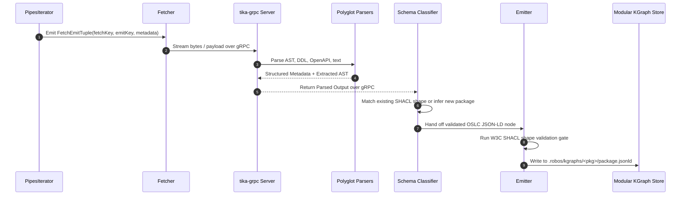
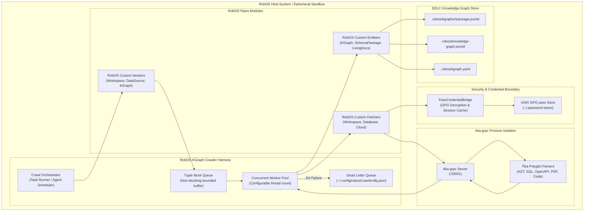

# KGraph Crawler Architecture & Pipeline
{: .no_toc }

Deep-dive into the Apache Tika 4.0 Pipes lifecycle, `FetchEmitTuple` routing, error resilience, and C4 component diagrams powering the RobOS KGraph Crawler.
{: .fs-6 .fw-300 }

## Table of contents
{: .no_toc .text-delta }

1. TOC
{:toc}

---

## 1. Architectural Foundations: Apache Tika 4.0 Pipes

The RobOS KGraph Crawler is built on top of **Apache Tika 4.0 Pipes**, a decoupled, high-performance architecture engineered for enterprise content extraction, asynchronous streaming, and fault-tolerant batch processing.

In traditional crawler setups, content discovery, data fetching, text/AST parsing, and graph indexing are tightly bound into monolithic processes. If an unexpected binary file crashes a parser or exhausts heap memory, the entire crawler dies, leaving the Knowledge Graph in an indeterminate state.

**Tika 4.0 Pipes decouples these concerns into four distinct phases:**



### The 4 Phases of the Pipeline

1. **Iteration (`PipesIterator`)**:
   - Traverses target resources (git workspaces, file directories, database catalogs, Kafka clusters, cloud API endpoints).
   - Generates lightweight `FetchEmitTuple` objects containing routing coordinates without reading actual payload bytes.
2. **Fetching (`Fetcher`)**:
   - Retrieves the payload stream for a given `fetchKey`.
   - RobOS fetchers integrate with local UNIX `pass` GPG encrypted keystores (`robos:hasCredential`) to acquire connection credentials just-in-time, preventing secret leakage.
3. **Parsing (`tika-grpc` & Polyglot Parsers)**:
   - Evaluates content type (MIME detection), extracts structural syntax trees (ASTs), parses schema definitions (OpenAPI, Protobuf, SQL DDL), and analyzes metadata.
   - Executes inside isolated worker processes managed by `tika-grpc`.
4. **Emission (`Emitter`)**:
   - Transforms extracted tokens into OSLC JSON-LD 1.1 entities.
   - Evaluates target schema package (existing vs novel).
   - Enforces W3C SHACL shape constraints.
   - Persists valid nodes to `.robos/kgraphs/<pkg>/package.jsonld` and updates `.robos/kgraph.yaml`.

---

## 2. The `FetchEmitTuple` Lifecycle

At the heart of the pipeline is the `FetchEmitTuple`. In RobOS, `FetchEmitTuple` is augmented with SDLC metadata:

```json
{
  "fetchKey": "file:///home/ndipiazza/source/robos/packages/order-service/openapi.yaml",
  "emitKey": "urn:robos:service:order-service",
  "metadata": {
    "robos:repository": "github.com/nddipiazza/robos",
    "robos:packageHint": "services",
    "robos:fileMimeType": "application/x-yaml",
    "robos:credentialUrn": "urn:robos:pass:devops/git/github",
    "robos:discoveredAt": "2026-09-11T15:30:00Z"
  },
  "container": null,
  "routingParams": {
    "inferSchemaIfMissing": "true",
    "validateSHACL": "true"
  }
}
```

### Tuple Lifecycle States

| State | Description | Transition Trigger |
|:---|:---|:---|
| **`ENQUEUED`** | Tuple generated by `PipesIterator` and enqueued into the in-memory or Kafka pipeline queue. | Iterator detects a new or updated asset. |
| **`FETCHING`** | `Fetcher` connects to the data source and opens a payload stream. | Worker thread pulls tuple from queue. |
| **`PARSING`** | Stream is dispatched to `tika-grpc` for AST and metadata extraction. | Payload stream successfully acquired. |
| **`CLASSIFYING`** | Extracted schema is matched against existing SHACL shapes or flagged for novel package synthesis. | Tika parser returns structured metadata. |
| **`EMITTING`** | OSLC JSON-LD node is validated against SHACL constraints and written to disk. | Classification completed with zero fatal schema errors. |
| **`COMPLETED`** | Node committed to Git-backed package store; aggregated graph synchronized. | Disk I/O succeeds and index updated. |
| **`DEAD_LETTER`** | Tuple failed after max retry attempts (e.g., auth failure, unparseable corrupt payload). | Max retries exceeded; routed to DLQ. |

---

## 3. C4 Component Topology



---

## 4. Fault Tolerance & Crash Isolation

Content extraction engines frequently process untrusted, corrupted, or adversarially crafted files:
- 500 MB malformed SQL dump files
- Circular JSON-LD or YAML references (Billion Laughs attack)
- Deeply nested ZIP or JAR archives (Zip bombs)
- Memory-leaking binary parsers

### The Three-Layer Isolation Boundary

1. **Process Isolation (`tika-grpc`)**:
   - The parser runtime executes in a separate process or Docker container from the RobOS Crawler Harness.
   - If a parser encounters a fatal JVM `OutOfMemoryError` or segmentation fault, **only that worker thread/process terminates**.
   - The `tika-grpc` daemon supervisor automatically replaces the worker and returns a structured gRPC error status (`DEADLINE_EXCEEDED` or `RESOURCE_EXHAUSTED`) to the crawler.
2. **Circuit Breaking & Dead-Letter Queue (DLQ)**:
   - If a specific `FetchEmitTuple` fails repeatedly, it is marked as `DEAD_LETTER` and persisted to `~/.config/robos/crawler/dlq.json`.
   - The crawl continues uninterrupted across the remaining thousands of files.
3. **Atomic File Emission**:
   - The `RobOSKGraphEmitter` writes to temporary shadow files (`package.jsonld.tmp`) before renaming, ensuring that a power cut or system kill signal never corrupts the underlying Git repository.

---

## 5. Next Steps

- Explore [**Custom Iterators & Fetchers**]({{ '/kgraph-crawler/pipes-iterators-fetchers.html' | relative_url }}) to configure data source adapters.
- Learn how the crawler synthesizes new schema packages in [**Emitters & Schema Inference**]({{ '/kgraph-crawler/emitters-and-schema-inference.html' | relative_url }}).
- Inspect the [**tika-grpc Streaming Service**]({{ '/kgraph-crawler/tika-grpc-service.html' | relative_url }}).
