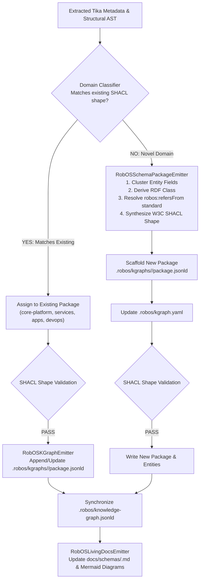

# Emitters & Autonomous Schema Inference
{: .no_toc }

How the RobOS KGraph Crawler transforms extracted payloads into validated Knowledge Graph packages, dynamically infers novel schema domains, and synthesizes W3C SHACL shape constraints.
{: .fs-6 .fw-300 }

## Table of contents
{: .no_toc .text-delta }

1. TOC
{:toc}

---

## 1. The Output Stage: From Raw Extraction to Validated Knowledge

In Apache Tika 4.0 Pipes, the **Emitter** is responsible for writing extracted metadata and structured text to target sinks (e.g., OpenSearch, Solr, S3, or Kafka).

In RobOS, the target sink is not an unstructured document store — it is the **RobOS Dual-State SDLC Knowledge Graph**. The emitter must output strictly typed, machine-readable **OSLC JSON-LD 1.1** records that conform to W3C SHACL shape constraints and align with standard enterprise vocabularies.



---

## 2. RobOS Custom Emitters

### 2.1 `RobOSKGraphEmitter`
The primary persistence emitter for known architectural components:
- **Atomicity**: Uses temporary shadow write-buffers (`package.jsonld.tmp`) and file renames to guarantee atomic updates without Git file corruption.
- **Deduplication**: Resolves entities by canonical `@id` URN (e.g. `urn:robos:service:payment-gateway`). Updates existing properties while preserving manual human annotations.
- **Backward Compatibility**: Automatically aggregates changes into `.robos/knowledge-graph.jsonld` for backwards compatibility with legacy tooling.

### 2.2 `RobOSSchemaPackageEmitter`
The autonomous schema synthesis emitter. When the crawler discovers data structures that do not match existing classes in the RobOS ontology, this emitter activates.

### 2.3 `RobOSLivingDocsEmitter`
Ensures that architectural documentation never drifts from reality:
- Inspects newly emitted or updated nodes.
- Synthesizes Mermaid FlowDiagrams visualizing component interactions.
- Writes living Markdown documentation pages directly into `docs/schemas/<pkg>.md`.

---

## 3. Autonomous Schema Inference Engine

### The Problem: Schema Rigidity in Traditional Crawlers
Traditional enterprise crawlers fail when encountering unfamiliar domain structures:
- A crawler scanning an automotive IoT backend encounters CAN-bus telemetry topics that do not fit traditional "Microservice" or "Database" models.
- Without dynamic schema handling, either the data is discarded, or it is shoehorned into generic string key-value pairs, losing all semantic reasoning value for AI coding agents.

### The RobOS Solution: 4-Stage Inference

#### Stage 1: Field & Taxonomy Clustering
The crawler analyzes the extracted structural fields (types, nested keys, cardinality, and documentation comments):
- Example extracted payload:
  ```json
  {
    "sensor_id": "string",
    "vehicle_vin": "string",
    "telemetry_stream": "string (url)",
    "sample_rate_hz": "integer",
    "firmware_version": "string"
  }
  ```

#### Stage 2: Derive RDF Class & Canonical Provenance (`robos:refersFrom`)
RobOS requires that all architectural shapes point to upstream international standards (Schema.org, OASIS OSLC, C4 Model, or SOSA/SSN ontologies):
- The inference engine maps the cluster to `sosa:Sensor` and `schema:Device`.
- Declares the new class: `robos:TelematicsSensor`.
- Annotates provenance:
  ```json
  {
    "@id": "robos:TelematicsSensor",
    "@type": "rdfs:Class",
    "rdfs:label": "Telematics Sensor",
    "robos:refersFrom": "https://schema.org/Device",
    "rdfs:isDefinedBy": "http://robos.dev/ontology#"
  }
  ```

#### Stage 3: Synthesize W3C SHACL Shape Constraints
The engine synthesizes a compliant W3C SHACL NodeShape enforcing property types, minimum count, and documentation descriptions:

```turtle
@prefix sh: <http://www.w3.org/ns/shacl#> .
@prefix robos: <http://robos.dev/ontology#> .
@prefix xsd: <http://www.w3.org/2001/XMLSchema#> .

robos:TelematicsSensorShape a sh:NodeShape ;
    sh:targetClass robos:TelematicsSensor ;
    robos:refersFrom <https://schema.org/Device> ;
    sh:property [
        sh:path robos:sensorId ;
        sh:datatype xsd:string ;
        sh:minCount 1 ;
        sh:description "Unique hardware identifier of the telematics unit." ;
    ] ;
    sh:property [
        sh:path robos:sampleRateHz ;
        sh:datatype xsd:integer ;
        sh:minCount 1 ;
        sh:description "Telemetry sampling frequency in Hertz." ;
    ] .
```

#### Stage 4: Scaffold Package & Register Index
1. Scaffolds `.robos/kgraphs/telematics/package.jsonld`:
   ```json
   {
     "@context": {
       "robos": "http://robos.dev/ontology#",
       "schema": "https://schema.org/",
       "dcterms": "http://purl.org/dc/terms/"
     },
     "robos:packageId": "telematics",
     "robos:namespace": "robos.telematics",
     "robos:nodes": [ ... ]
   }
   ```
2. Updates `.robos/kgraph.yaml`:
   ```yaml
   packages:
     - id: telematics
       namespace: robos.telematics
       description: "Vehicle telematics units, sensors, and telemetry pipelines"
       path: "kgraphs/telematics/package.jsonld"
       version: "1.0.0"
   ```

---

## 4. The W3C SHACL Validation Gate

To protect the Knowledge Graph from malformed or corrupted nodes, the `RobOSKGraphEmitter` executes `kgraph-validate` on every batch prior to disk serialization.

### Validation Rules
- **Shape Conformance**: All required properties (`sh:minCount 1`) must exist.
- **URN Uniqueness**: No duplicate `@id` entries permitted across any package store.
- **Reference Integrity**: All foreign keys (e.g. `robos:dependsOnService`, `robos:hasCredential`) must resolve to valid target nodes or registered external URIs.

If validation fails, the emitter rejects the batch, writes the error details to `~/.config/robos/crawler/validation-errors.json`, and triggers an alert for review.

---

## 5. Next Steps

- Inspect the streaming backend in [**tika-grpc Streaming Service**]({{ '/kgraph-crawler/tika-grpc-service.html' | relative_url }}).
- Follow end-to-end ingestion scenarios in [**Datasources Crawling Guide**]({{ '/kgraph-crawler/datasources-guide.html' | relative_url }}).
