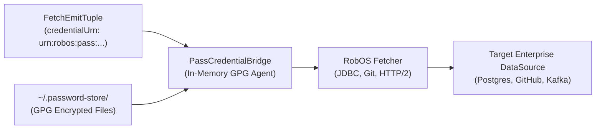

# RobOS Custom Pipe Iterators & Fetchers
{: .no_toc }

Comprehensive guide to RobOS-specific Apache Tika 4.0 `PipesIterator` and `Fetcher` implementations, credential bridging via UNIX `pass`, and pipeline configurations.
{: .fs-6 .fw-300 }

## Table of contents
{: .no_toc .text-delta }

1. TOC
{:toc}

---

## 1. Overview: The Input Stage of the Pipeline

In Apache Tika 4.0 Pipes, the **Iterator** and **Fetcher** form the decoupled input mechanism of content ingestion:
- **`PipesIterator`**: Discovers what exists (file paths, database table names, Kafka topics, git commit hashes) and yields lightweight `FetchEmitTuple` objects.
- **`Fetcher`**: Connects to the underlying storage protocol (filesystem, JDBC, Kafka, git forge, cloud storage) to retrieve the raw byte stream on demand.

RobOS extends these standard Tika components with **SDLC-aware metadata discovery** and **hardware/GPG-secured credential bridging**.

---

## 2. Custom RobOS Pipe Iterators

### 2.1 `RobOSWorkspaceIterator`
Designed for scanning local monorepos, polyglot workspaces, and multi-package repositories.

- **Capabilities**:
  - Traverses directory trees while automatically respecting `.gitignore`, `.dockerignore`, and RobOS workspace settings.
  - Prioritizes architectural assets (OpenAPI YAML/JSON, Protobuf `.proto`, GraphQL `.graphql`, Dockerfiles, Kubernetes manifests, `pom.xml`, `package.json`, `Cargo.toml`, `go.mod`, `.bazelrc`).
  - Emits tuples with pre-populated package hints based on directory structure (e.g. `packages/` or `services/`).

```xml
<!-- tika-config.xml -->
<pipesIterator class="dev.robos.tika.pipes.iterator.RobOSWorkspaceIterator">
  <params>
    <baseDirectory>/home/ndipiazza/source/robos</baseDirectory>
    <includes>
      <include>*.yaml</include>
      <include>*.json</include>
      <include>*.proto</include>
      <include>Dockerfile*</include>
      <include>pom.xml</include>
    </includes>
    <excludes>
      <exclude>**/node_modules/**</exclude>
      <exclude>**/.git/**</exclude>
      <exclude>**/dist/**</exclude>
    </excludes>
    <maxDepth>12</maxDepth>
  </params>
</pipesIterator>
```

### 2.2 `RobOSDataSourceIterator`
Queries registered data sources in the RobOS Knowledge Graph (`robos:Database`, `robos:NoSQLDatabase`, `robos:MessageBroker`) to discover unindexed tables, columns, indexes, and message topics.

- **Capabilities**:
  - Reads active nodes from `.robos/kgraphs/core-platform/package.jsonld`.
  - Connects to relational catalogs (`information_schema`, `pg_catalog`, `all_tables`) or Kafka schema registries.
  - Emits one `FetchEmitTuple` per table, partition, or topic.

```yaml
# robos-crawler.yaml
iterator:
  type: dev.robos.tika.pipes.iterator.RobOSDataSourceIterator
  params:
    kgraphPackage: core-platform
    targetTypes:
      - robos:Database
      - robos:NoSQLDatabase
      - robos:MessageBroker
    crawlCadence: "daily"
```

### 2.3 `RobOSKGraphPipesIterator`
Audits the existing Knowledge Graph to identify stale edges, unresolved URN pointers, or nodes that require schema re-validation.

- **Capabilities**:
  - Validates cross-package dependencies between `services`, `applications`, `core-platform`, and `devops`.
  - Emits tuples for every node whose source repository or external endpoint has had updates since the last recorded crawl timestamp.

---

## 3. Custom RobOS Fetchers & GPG Credential Bridging

Connecting to enterprise data sources requires credentials: database passwords, Git personal access tokens, AWS IAM access keys, and Kafka SASL/SCRAM secrets.

> [!IMPORTANT]
> **Zero Plaintext Credentials in RobOS**: RobOS enforces strict credential hygiene. Crawlers never accept plaintext passwords in config files or environment variables. All authentication tokens are bridged through the UNIX GPG password store (`pass`).

### 3.1 `PassCredentialBridge`
RobOS fetchers utilize the `PassCredentialBridge` helper. When a `FetchEmitTuple` arrives with a `robos:credentialUrn` (e.g., `urn:robos:pass:devops/databases/prod-pg`):
1. The fetcher resolves the path to `~/.password-store/devops/databases/prod-pg.gpg`.
2. Decrypts the secret in-memory via GPG pinentry/agent.
3. Injects authentication headers or connection credentials directly into the client connection pool.
4. Securely zeros memory buffers after the session closes.



### 3.2 `RobOSDatabaseFetcher`
Retrieves schema definitions, column constraints, foreign-key relationships, and sample data directly from SQL/NoSQL engines:
- **Relational Databases**: PostgreSQL, MySQL, MariaDB, Oracle, SQL Server, SQLite, DuckDB, Snowflake.
- **Extraction Mode**: Generates ANSI SQL DDL statements and serialized JSON catalog descriptors for Tika parsing.

```xml
<fetcher class="dev.robos.tika.pipes.fetcher.RobOSDatabaseFetcher">
  <name>robos-db-fetcher</name>
  <params>
    <connectionTimeoutMs>15000</connectionTimeoutMs>
    <extractForeignKeyRelationships>true</extractForeignKeyRelationships>
    <extractSampleDistributions>false</extractSampleDistributions>
  </params>
</fetcher>
```

### 3.3 `RobOSGitForgeFetcher`
Fetches repository trees, branch topologies, git tags, and commits from GitHub, GitLab, Gitea, or Bitbucket APIs without cloning entire gigabyte-sized repositories.
- Employs HTTP/2 streaming to extract only configuration files, build descriptors, and API schemas.

### 3.4 `RobOSWorkspaceFetcher`
Fetches local files with streaming support, memory-mapped file descriptors, and AST pre-tokenization.

---

## 4. Full Pipeline Configuration Example

A complete `tika-config.xml` demonstrating the RobOS custom iterator and fetcher integration:

```xml
<?xml version="1.0" encoding="UTF-8"?>
<properties>
  <service-loader initializableProblemHandler="WARN"/>

  <!-- Tika-gRPC Service Coordinates -->
  <server>
    <port>50051</port>
    <host>127.0.0.1</host>
    <maxMessageSize>67108864</maxMessageSize>
  </server>

  <!-- Pipes Harness Configuration -->
  <pipes>
    <params>
      <maxForEmitBatch>100</maxForEmitBatch>
      <queueSize>10000</queueSize>
      <numClients>8</numClients>
      <forkedJvmArgs>
        <arg>-Xmx2g</arg>
        <arg>-XX:+UseG1GC</arg>
      </forkedJvmArgs>
    </params>

    <!-- 1. RobOS Custom Workspace Iterator -->
    <pipesIterator class="dev.robos.tika.pipes.iterator.RobOSWorkspaceIterator">
      <params>
        <baseDirectory>/home/ndipiazza/source/robos</baseDirectory>
        <includes>
          <include>*.yaml</include>
          <include>*.json</include>
          <include>*.proto</include>
          <include>*.sql</include>
        </includes>
      </params>
    </pipesIterator>

    <!-- 2. Registered Fetchers -->
    <fetchers>
      <fetcher class="dev.robos.tika.pipes.fetcher.RobOSWorkspaceFetcher">
        <name>workspace-fetcher</name>
      </fetcher>
      <fetcher class="dev.robos.tika.pipes.fetcher.RobOSDatabaseFetcher">
        <name>database-fetcher</name>
      </fetcher>
    </fetchers>

    <!-- 3. Registered Emitters -->
    <emitters>
      <emitter class="dev.robos.tika.pipes.emitter.RobOSKGraphEmitter">
        <name>robos-kgraph-emitter</name>
        <params>
          <kgraphsRoot>/home/ndipiazza/source/robos/.robos/kgraphs</kgraphsRoot>
          <validateSHACL>true</validateSHACL>
          <inferMissingSchemas>true</inferMissingSchemas>
        </params>
      </emitter>
    </emitters>
  </pipes>
</properties>
```

---

## 5. Next Steps

- Learn how extracted entities are classified and persisted in [**Emitters & Schema Inference**]({{ '/kgraph-crawler/emitters-and-schema-inference.html' | relative_url }}).
- Inspect the high-throughput [**tika-grpc Streaming Service**]({{ '/kgraph-crawler/tika-grpc-service.html' | relative_url }}).
