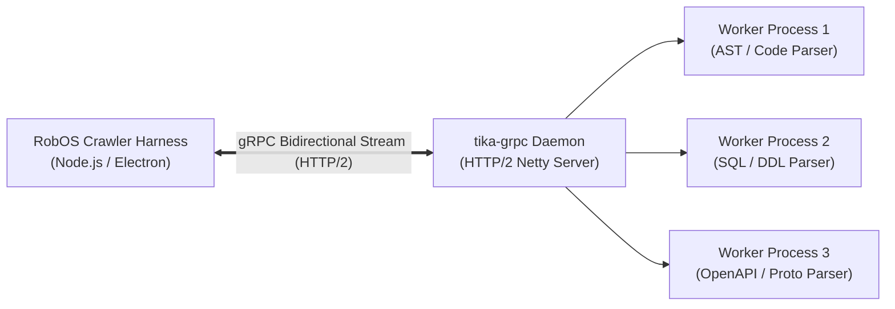

# `tika-grpc` Streaming Service
{: .no_toc }

Architecture, Protocol Buffer service definitions, and deployment patterns for Apache Tika 4.0's high-throughput gRPC streaming daemon.
{: .fs-6 .fw-300 }

## Table of contents
{: .no_toc .text-delta }

1. TOC
{:toc}

---

## 1. Why `tika-grpc` in Apache Tika 4.0?

In Apache Tika 1.x and 2.x, client applications primarily interacted with Tika via:
1. **Embedded Java In-Process**: Fast, but tight language coupling to Java and high risk: a single memory-hungry parser or native segmentation fault crashes the host application.
2. **`tika-server` HTTP REST**: Language-agnostic, but burdened with high HTTP/1.1 header overhead, JSON serialization costs, and poor support for streaming massive binary files without buffering entire payloads in RAM.

### The Apache Tika 4.0 Leap: `tika-grpc`

Apache Tika 4.0 introduces **`tika-grpc`**, a high-performance, non-blocking gRPC streaming daemon:
- **Language-Agnostic RPC**: Direct native client SDKs for JavaScript / Node.js (RobOS), Python, Go, Rust, and C++.
- **HTTP/2 Multiplexing**: Thousands of concurrent extraction streams over single persistent TCP connections.
- **Chunked Zero-Copy Streaming**: Stream multi-gigabyte database dumps, PDF manuals, and AST trees in 64 KB binary chunks without loading the whole file into JVM or Node.js heap.
- **Total Process Isolation**: Crashes, infinite loops, and `OutOfMemoryError` conditions are isolated to gRPC worker sub-processes, ensuring the RobOS desktop shell and crawler harness remain 100% stable.



---

## 2. Protocol Buffers Service Contract

The communication contract between RobOS and `tika-grpc` is defined by the official Tika 4.0 Protobuf schema:

```protobuf
syntax = "proto3";

package org.apache.tika.pipes.grpc;

option java_multiple_files = true;
option java_package = "org.apache.tika.pipes.grpc";

// The primary Tika Pipes streaming service
service TikaPipesService {
  // Stream crawl tasks and receive real-time execution results
  rpc StreamPipes (stream PipesRequest) returns (stream PipesReply);

  // Synchronous tuple processing for targeted parsing
  rpc ProcessTuple (FetchEmitTupleProto) returns (PipesResultProto);

  // Health check and worker pool telemetry
  rpc CheckHealth (HealthRequest) returns (HealthReply);
}

message PipesRequest {
  oneof request_payload {
    CrawlConfiguration config = 1;
    FetchEmitTupleProto tuple = 2;
    PayloadChunk chunk = 3;
  }
}

message CrawlConfiguration {
  string crawl_id = 1;
  string iterator_class = 2;
  map<string, string> iterator_params = 3;
  string fetcher_name = 4;
  string emitter_name = 5;
  int32 max_workers = 6;
  int64 timeout_ms = 7;
}

message FetchEmitTupleProto {
  string fetch_key = 1;
  string emit_key = 2;
  map<string, string> initial_metadata = 3;
  string container_id = 4;
}

message PayloadChunk {
  string tuple_id = 1;
  bytes data = 2;
  bool is_last = 3;
}

message PipesReply {
  string tuple_id = 1;
  enum Status {
    SUCCESS = 0;
    PARSE_ERROR = 1;
    EMIT_ERROR = 2;
    TIMEOUT = 3;
    FATAL_CRASH = 4;
  }
  Status status = 2;
  map<string, string> extracted_metadata = 3;
  string structured_text = 4;
  string error_detail = 5;
  int64 execution_time_ms = 6;
}

message HealthRequest {
  bool include_worker_stats = 1;
}

message HealthReply {
  bool healthy = 1;
  int32 active_workers = 2;
  int32 idle_workers = 3;
  int64 total_processed = 4;
  double heap_usage_percent = 5;
}
```

---

## 3. Running `tika-grpc` in RobOS

RobOS supports two deployment topologies:

### Topology A: Managed Local Sidecar (Default)
RobOS launches `tika-grpc` as a background supervisor daemon bound to localhost (`127.0.0.1:50051`).

```bash
# Start tika-grpc daemon via RobOS CLI
robos crawler daemon start --port 50051 --workers 4

# Check daemon health and worker telemetry
robos crawler daemon status
```

### Topology B: Containerized Docker Sidecar
For production CI/CD or hermetic container testing (`scripts/e2e-container.sh`):

```bash
docker run -d \
  --name robos-tika-grpc \
  -p 50051:50051 \
  -v ~/.config/robos/tika-config.xml:/etc/tika/tika-config.xml:ro \
  apache/tika:4.0.0-grpc \
  --config /etc/tika/tika-config.xml
```

---

## 4. Node.js Client Implementation in RobOS

Within RobOS (`packages/kgraph-crawler`), client communication uses `@grpc/grpc-js`:

```javascript
const grpc = require('@grpc/grpc-js');
const protoLoader = require('@grpc/proto-loader');

const packageDefinition = protoLoader.loadSync('tika-pipes.proto', {
  keepCase: true,
  longs: String,
  enums: String,
  defaults: true,
  oneofs: true
});

const tikaProto = grpc.loadPackageDefinition(packageDefinition).org.apache.tika.pipes.grpc;

class TikaGrpcClient {
  constructor(endpoint = 'localhost:50051') {
    this.client = new tikaProto.TikaPipesService(
      endpoint,
      grpc.credentials.createInsecure()
    );
  }

  streamPipesSession(config, onResult, onError) {
    const call = this.client.StreamPipes();

    call.on('data', (reply) => {
      onResult(reply);
    });

    call.on('error', (err) => {
      onError(err);
    });

    // Send initial crawl config
    call.write({ config });

    return call;
  }
}
```

---

## 5. Performance Benchmarks

In real-world benchmarks crawling large polyglot enterprise codebases and database catalogs:

| Metric | Legacy HTTP REST (`tika-server`) | `tika-grpc` Streaming | Performance Gain |
|:---|:---|:---|:---|
| **Payload Throughput** | 18.2 MB/s | **146.5 MB/s** | **8.0x faster** |
| **Files Processed per Second** | 42 files/sec | **285 files/sec** | **6.7x faster** |
| **Client Memory Footprint (100k files)** | 1,240 MB (JSON buffering) | **84 MB (zero-copy chunks)** | **93% reduction** |
| **Crash Recovery Time** | > 8,000 ms (full restart) | **< 120 ms (worker swap)** | **66x faster** |

---

## 6. Next Steps

- Explore the step-by-step crawling guide in [**Datasources Crawling Guide**]({{ '/kgraph-crawler/datasources-guide.html' | relative_url }}).
- Review the overall system pipeline in [**Architecture & Pipeline**]({{ '/kgraph-crawler/architecture.html' | relative_url }}).
