# PR Review Theater & Verification
{: .no_toc }

How RobOS turns pull request reviews into an interactive, multi-modal governance theater: AI agents teach developers how changes work with interactive masterclasses, prove real execution with 1080p narrated video proof-of-work, link living architecture deltas, and bridge directly into developer IDEs.
{: .fs-6 .fw-300 }

## Table of contents
{: .no_toc .text-delta }

1. TOC
{:toc}

---

## The Paradigm Shift: Why Traditional Code Review Fails for AI Code

In traditional software development, developers spend hours scrolling through lines of green and red text in a browser diff tool. When code is written by humans, diff reading is already tiring and error-prone. When code is drafted at high velocity by autonomous AI agents (Claude Code, Google Antigravity, GitHub Copilot, OpenAI Codex), **traditional line-by-line diff review completely collapses**:

- **Reviewer Cognitive Overload**: AI agents can scaffold entire microservices, refactor 40 files, or regenerate complex database migrations in seconds. Staring at hundreds of lines of code without architectural context causes review fatigue, leading to rubber-stamping or missed edge cases.
- **The "Hallucination Trap"**: Code may look syntactically correct and pass static linters while subtly violating distributed state invariants, breaking event-driven contracts, or failing in real runtime environments.
- **Passive vs. Active Comprehension**: Merely skimming a diff doesn't guarantee the reviewer understands the design decisions, blast radius, or operational failure modes.

### The Lead System Architect Model

RobOS eliminates blind trust in AI diffs by promoting human developers to **Lead System Architects**. Autonomous agents perform the implementation, but they must present their work in the **RobOS PR Review Theater**—an orchestrated 6-stage review environment that actively educates the reviewer, validates comprehension through verifiable knowledge checks, and proves runtime correctness before a single line is merged into `main`.

<div style="margin: 2rem 0; border: 1px solid #1e293b; border-radius: 12px; overflow: hidden; background: #0b101b; box-shadow: 0 10px 40px rgba(0,0,0,0.6);">
  
  <div style="padding: 0.75rem 1.25rem; font-size: 0.85rem; color: #94a3b8; border-top: 1px solid #1e293b; background: #0d1424; text-align: center;">
    <strong>RobOS Dual-Context Review Architecture</strong>: Autonomous task completion triggers the PR Review Theater, synthesizing interactive training, living documentation deltas, and multi-modal verification. <em>(Click image to zoom full screen)</em>
  </div>
</div>

---

## Dual-State Knowledge Graph Governance

Every pull request reviewed in RobOS is anchored to the **Dual-State SDLC Knowledge Graph**. Rather than treating a pull request as an isolated Git patch, RobOS evaluates the difference between two linked worlds:

1. **Production Reality (`World 1: main`)**: The verified, live state of all microservices, databases, API schemas, and Kubernetes deployments.
2. **Proposed Reality (`World 2: feature-branch`)**: The candidate architecture mutated by the AI agent's pull request.

The PR Review Theater leverages W3C SHACL constraint shapes (`robos:PullRequestReviewTheater`, `robos:ReviewTheaterStage`, `robos:LearningCourse`, `robos:CompletionCertificate`, `robos:LivingDocPage`) defined in `.robos/kgraphs/learning/package.jsonld` and `.robos/kgraphs/documentation/package.jsonld`. Every stage of the review is tracked as a first-class semantic entity, ensuring immutable auditability across the enterprise.

---

## PR Review Theater & Team Policy Architecture

<div style="margin: 2rem 0; border: 1px solid #1e293b; border-radius: 12px; overflow: hidden; background: #0b101b; box-shadow: 0 10px 40px rgba(0,0,0,0.6);">
  
  <div style="padding: 0.75rem 1.25rem; font-size: 0.85rem; color: #94a3b8; border-top: 1px solid #1e293b; background: #0d1424; text-align: center;">
    <strong>RobOS PR Review Theater Architecture</strong>: Team Policy Governance (<code>robos:Team</code>) controls dynamic stage activation, anti-rubber-stamp quiz thresholds, evidence video proof teaching feature mechanics first, and the multi-target Walk Me Through It agent verification walkthrough. <em>(Click image to zoom full screen)</em>
  </div>
</div>



```mermaid
sequenceDiagram
    autonumber
    actor Architect as Lead System Architect
    participant Theater as PR Review Theater (:19115)
    participant KGraph as Team KGraph Policy (robos:Team)
    participant Agent as Autonomous Agent Harness
    participant IDE as IDE / Browser / Desktop IPC

    Architect->>Theater: Click "⚙️ Stage Policy" / Open Theater
    Theater->>KGraph: Fetch team policy (robos:prReviewTheaterConfig)
    KGraph-->>Theater: Active stages, quiz pass threshold, required gates

    rect rgb(15, 23, 42)
        Note over Architect,Theater: Stages: Anti-Rubber-Stamp, Living Docs & Code Inspection
        Architect->>Theater: Stage 1: Pass Knowledge Check (Score >= threshold)
        Theater->>KGraph: Issue robos:CompletionCertificate
        Architect->>Theater: Stage 2: Living Docs & REST Verification Runner
        Architect->>Theater: Stage 3: In-App Unified / Split Diff Viewer
        Architect->>Theater: Stage 4: Launch IDE Branch Diff Bridge (IntelliJ / VS Code)
    end

    rect rgb(16, 37, 66)
        Note over Architect,Agent: Stage 5: Evidence Video & Proof-of-Work (Teaches Feature Mechanics First)
        Architect->>Theater: Stage 5: Inspect 1080p Video Walkthrough / Desktop Session
        Theater->>Agent: Stream narrated video playback & WebVTT captions
        Architect->>Theater: Understand feature mechanics & runtime behavior
    end

    rect rgb(15, 30, 55)
        Note over Architect,IDE: Stage 6: "Walk Me Through It" Interactive Agent Walkthrough
        Architect->>Theater: Click "Start Walkthrough"
        Theater->>Agent: Spawn fix walkthrough (Target: Backend / Frontend / Desktop)
        alt Backend Target
            Agent->>IDE: Connect port 63343, set breakpoint, run test, pause thread
            Architect->>IDE: Step over & inspect live variables
        else Frontend Target
            Agent->>IDE: Launch visible browser (headless: false), navigate to fix
            Agent-->>Architect: Interactive Checkpoint: "Take Control in Browser"
            Architect->>Theater: Confirm "Handoff Complete / Fix Verified"
        else Desktop App Target
            Agent->>IDE: Launch desktop app via supervisor, attach DOM snapshot IPC
            Agent-->>Architect: Highlight component with glow & route focus
        end
        Agent-->>Theater: Mark Fix Demonstrated (Gate 6 Passed)
    end

    rect rgb(15, 23, 42)
        Note over Architect,KGraph: Stage 7: Validation Gates & Dual-Branch Merge
        Architect->>Theater: Stage 7: Enter Reviewer Notes & Click Approve
        Theater->>KGraph: Dual-Branch Atomic Merge (Git main + KGraph main)
        KGraph-->>Architect: ✓ Merged & Synchronized
    end
```

### Team KGraph Policy & Theater Customization

Every engineering team has different risk profiles and delivery tempos. RobOS stores PR Review Theater policies directly on `robos:Team` nodes (`robos:prReviewTheaterConfig`) in `.robos/kgraphs/organization/package.jsonld`.

Clicking **`⚙️ Stage Policy`** in the review topbar opens the policy editor:
- **Global Prerequisites**: Toggle strict prerequisites enforcement, mandatory stage confirmation checkboxes, and required written feedback notes on approvals.
- **Stage 1 (eLearning)**: Adjust minimum passing score thresholds (50%–100%), lock Stage 3 code diffs until passed, and toggle auto-generation.
- **Stage 2 (Living Docs & REST)**: Toggle Mermaid sequence synthesis, Dual-Reality deltas, and mandatory REST contract executions.
- **Stage 3 (Diffs)**: Choose default mode (unified vs split) and require file-by-file review checklists.
- **Stage 4 (IDE Bridge)**: Select default IDE (IntelliJ IDEA on port 63343 vs VS Code protocol).
- **Stage 5 (Evidence Video)**: Set default view (1080p recorded video vs live desktop session). Teaches the reviewer how the feature works first before interactive walkthroughs.
- **Stage 6 (Walk Me Through It)**: Select demonstration target (`Auto-Detect`, `Backend`, `Frontend`, or `Desktop`), headed browser flags, and interactive handoff checkpoints.
- **Quick Presets**: Apply 1-click presets: *Strict Anti-Rubber-Stamp*, *Fast Developer Flow*, *Frontend Focus*, or *Full Comprehensive*.

---

## PR Review Theater Walkthrough

Let's walk through the end-to-end PR Review Theater workflow as experienced by a Lead Architect reviewing a multi-component feature (`PR #12: feat(auth): add OAuth2 PKCE social login and session token refresh`).

---

### PR Queue & Triage Dashboard

The review journey begins in the **Agent Code Review Platform** (`packages/pr-review`), which aggregates all active pull requests across the enterprise catalog.

<div style="margin: 2rem 0; border: 1px solid #1e293b; border-radius: 12px; overflow: hidden; background: #0b101b; box-shadow: 0 10px 40px rgba(0,0,0,0.6);">
  
  <div style="padding: 0.75rem 1.25rem; font-size: 0.85rem; color: #94a3b8; border-top: 1px solid #1e293b; background: #0d1424; text-align: center;">
    <strong>PR Queue & Triage</strong>: Review dashboard tracking pull requests with status badges, CI health dots, author attribution (Claude, Antigravity, Copilot, Human), and one-click Theater launch chips. <em>(Click image to zoom full screen)</em>
  </div>
</div>

#### Key Capabilities:
- **Multi-Repo Aggregation**: Collects pull requests across all registered Git repositories and monorepos.
- **AI Attribution & Risk Tiers**: Clearly identifies AI-generated pull requests and their semantic blast radius tier (`Tier 1 Low`, `Tier 2 Medium`, `Tier 3 High Risk`).
- **One-Click Theater Chip**: Each card includes a direct `🎭 Review Theater` launch button to immediately enter the immersive review mode.

---

### PR Overview & Detail Launch

Selecting a pull request opens the comprehensive detail view, summarizing the business objective, automated CI test outcomes, security audits, and impacted architecture components.

<div style="margin: 2rem 0; border: 1px solid #1e293b; border-radius: 12px; overflow: hidden; background: #0b101b; box-shadow: 0 10px 40px rgba(0,0,0,0.6);">
  
  <div style="padding: 0.75rem 1.25rem; font-size: 0.85rem; color: #94a3b8; border-top: 1px solid #1e293b; background: #0d1424; text-align: center;">
    <strong>PR Detail Overview</strong>: High-level architectural briefing displaying branch tracking, commit history, SHACL schema conformance, and the prominent "Launch PR Review Theater" primary action. <em>(Click image to zoom full screen)</em>
  </div>
</div>

#### Key Capabilities:
- **Blast Radius Summary**: Summarizes affected REST endpoints, database schemas, and consumer microservices before diving into code.
- **Automated Security & Audit Scans**: Live indicators verifying zero plaintext secrets, dependency vulnerability scans, and W3C SHACL shape validation gates.
- **Launch Theater CTA**: Clicking the vibrant cyan `🎭 Launch PR Review Theater` button transitions into the dedicated 6-stage guided review environment.

---

### Stage 1: PR Masterclass & Reviewer Knowledge Check

Before examining raw code diffs, the reviewer is enrolled in an **on-demand interactive training masterclass** synthesized specifically for this pull request.

<div style="margin: 2rem 0; border: 1px solid #1e293b; border-radius: 12px; overflow: hidden; background: #0b101b; box-shadow: 0 10px 40px rgba(0,0,0,0.6);">
  
  <div style="padding: 0.75rem 1.25rem; font-size: 0.85rem; color: #94a3b8; border-top: 1px solid #1e293b; background: #0d1424; text-align: center;">
    <strong>Stage 1 — PR Masterclass</strong>: Multi-module interactive curriculum explaining architectural context, design choices, state mutation, and an active Reviewer Knowledge Check quiz. <em>(Click image to zoom full screen)</em>
  </div>
</div>

#### Key Capabilities:
- **Targeted Learning Modules**:
  - *Module 1: Architecture & Rationale*: Why this change was made and how it fits into the broader enterprise topology.
  - *Module 2: Token Lifecycle & Cryptography*: Deep-dive into RFC 7636 PKCE code challenges and SHA-256 state hashing.
  - *Module 3: Blast Radius & Failure Modes*: Downstream consumer impacts, cache invalidation, and timeout recovery.
- **Dual App & PR eLearning**: Access both the PR-specific micro-masterclass and the broader application architecture curriculum in the standalone RobOS eLearning Hub with one click.
- **Strict Anti-Rubber-Stamp Knowledge Gate**:
  - Reviewers cannot bypass or rubber-stamp reviews: code diffs in Stage 3 and approval merge actions in Stage 6 remain **strictly locked** behind a cryptographic comprehension gate.
  - The reviewer must answer scenario-based quiz questions verifying understanding of the system's operational invariants and achieve ≥ 80% to unlock the diff viewer and sign-off console.

---

### Stage 1 (Verified): Knowledge Graph Verified Credential

Upon successfully passing the knowledge check, RobOS mints an **immutable Certificate of Completion** registered directly to the reviewer's node in the SDLC Knowledge Graph.

<div style="margin: 2rem 0; border: 1px solid #1e293b; border-radius: 12px; overflow: hidden; background: #0b101b; box-shadow: 0 10px 40px rgba(0,0,0,0.6);">
  
  <div style="padding: 0.75rem 1.25rem; font-size: 0.85rem; color: #94a3b8; border-top: 1px solid #1e293b; background: #0d1424; text-align: center;">
    <strong>Verified Certificate Credential</strong>: Cryptographically hashed certificate (`robos:CompletionCertificate`) with score, issuance timestamp, and dual-state Knowledge Graph registry link. <em>(Click image to zoom full screen)</em>
  </div>
</div>

#### Key Capabilities:
- **Cryptographic Hash Verification**: Issued with a unique hash (e.g. `ROBOS-CERT-F04FAD16F235707C`) validating non-repudiation.
- **Knowledge Graph Association**: Stored as a `robos:CompletionCertificate` linked via `robos:hasCertificate` to the human reviewer's `robos:Developer` entity.
- **Audit Compliance**: Provides regulated enterprise teams (financial services, healthcare, aerospace) with incontrovertible proof that code was actively understood prior to production deployment.

---

### Stage 2: Living Architecture Guide & Dual-Reality Delta

Stage 2 presents the **Living Architecture Guide**, automatically synthesized from the Dual-State Knowledge Graph by comparing Production Reality against Proposed Reality.

<div style="margin: 2rem 0; border: 1px solid #1e293b; border-radius: 12px; overflow: hidden; background: #0b101b; box-shadow: 0 10px 40px rgba(0,0,0,0.6);">
  
  <div style="padding: 0.75rem 1.25rem; font-size: 0.85rem; color: #94a3b8; border-top: 1px solid #1e293b; background: #0d1424; text-align: center;">
    <strong>Stage 2 — Living Architecture Guide</strong>: Visual sequence flows, dual-reality delta tables comparing Production vs. Proposed behavior, and synchronized API contracts. <em>(Click image to zoom full screen)</em>
  </div>
</div>

#### Key Capabilities:
- **Visual Mermaid Sequence Flows**: Auto-generated sequence diagrams depicting client authentication, OAuth code exchange, and token refresh loops.
- **Dual-Reality Behavioral Delta**: Side-by-side comparison tables showing:
  - *Production Reality*: Legacy session cookie auth without PKCE or mobile OAuth2 support.
  - *Proposed Reality*: RFC 7636 PKCE social login, JWT access tokens, and rolling refresh tokens.
- **Contract Impact**: Live diff of modified OpenAPI 3.1 endpoints (`POST /api/v1/auth/token/refresh`) and database schema additions (`auth_sessions`, `refresh_tokens`).
- **Interactive REST API Verification Panel**:
  - Live execution harness testing the exact REST endpoints touched by the PR.
  - Inspect simulated or real HTTP requests, headers (`Authorization: Bearer ...`, mTLS, content-type), query parameters, and JSON request bodies.
  - Click **"Execute REST API Call"** to send the live request and view real-time response telemetry side-by-side against expected OpenAPI contract schema.

---

### Stage 3: In-App Semantic File Diff Viewer

Reviewers can inspect the actual source code modifications directly inside the theater using the **In-App File Diff Viewer**.

<div style="margin: 2rem 0; border: 1px solid #1e293b; border-radius: 12px; overflow: hidden; background: #0b101b; box-shadow: 0 10px 40px rgba(0,0,0,0.6);">
  
  <div style="padding: 0.75rem 1.25rem; font-size: 0.85rem; color: #94a3b8; border-top: 1px solid #1e293b; background: #0d1424; text-align: center;">
    <strong>Stage 3 — File Diff Viewer</strong>: High-performance syntax-highlighted diff viewer with file tree navigation, addition/deletion metrics, and inline agent commentary. <em>(Click image to zoom full screen)</em>
  </div>
</div>

#### Key Capabilities:
- **Split & Unified View**: Toggle between side-by-side and unified diff views.
- **Syntax Highlighting & Line Numbers**: Polyglot code coloring supporting TypeScript, JavaScript, Python, Java, Go, Rust, and SQL.
- **File Filter & Jump**: File tree sidebar displaying added (`+`), modified (`~`), and deleted (`-`) files with line change tallies.
- **Agent Intent Annotations**: Code hunks feature embedded annotations explaining the exact intent behind non-obvious algorithmic changes.

---

### Stage 4: IDE Branch Diff Viewer Bridge

When a Lead Architect requires full IDE power—AST symbol navigation, type hierarchies, local breakpoint debugging, or custom test execution—RobOS provides an **instant one-click bridge into IntelliJ IDEA and VS Code**.

<div style="margin: 2rem 0; border: 1px solid #1e293b; border-radius: 12px; overflow: hidden; background: #0b101b; box-shadow: 0 10px 40px rgba(0,0,0,0.6);">
  
  <div style="padding: 0.75rem 1.25rem; font-size: 0.85rem; color: #94a3b8; border-top: 1px solid #1e293b; background: #0d1424; text-align: center;">
    <strong>Stage 4 — IDE Review Bridge</strong>: Deep integration launching the pull request branch directly inside IntelliJ IDEA (via port 63343 IPC) or VS Code (via `vscode://` URL handler). <em>(Click image to zoom full screen)</em>
  </div>
</div>

#### Key Capabilities:
- **IntelliJ IDEA IPC Server (Port `63343`)**:
  - Communicates directly with the running IntelliJ IDEA instance.
  - Automatically fetches and checks out the PR branch.
  - Launches JetBrains' native **Pull Request Review Tool Window** with local AST symbol resolution and refactoring analyzers.
  - Sets breakpoint listeners at modified code sites for interactive step-through debugging.
- **Interactive Breakpoint Debugger**:
  - Automatically fires up the target app in the IDE and triggers a breakpoint relevant to the PR (e.g. at line 42 of `TokenController.java`).
  - Halts execution and exposes real-time stack frames, thread status, and live variable inspection (`tokenRequest`, `clientSecret`, `grantType`, `expiresIn`).
  - Reviewers can inspect variables directly in the Theater and click **"Resume Execution"** or step through in their IDE.
- **VS Code Protocol Integration (`vscode://`)**:
  - Triggers the official `GitHub.vscode-pull-request-github` extension (`vscode://github.vscode-pull-request-github/open-pr?repo=...&number=12`).
  - Opens diff editors directly in VS Code with inline comment threads, Copilot completions, and terminal test runners.
- **Zero Configuration**: No manual Git commands, branch checking, or stash management required.

---

### Stage 5: Evidence Video & Proof-of-Work Canvas (1080p Xvfb Video or Live Desktop)

RobOS completely eliminates the question *"Did anyone actually run this to see if it works?"* Stage 5 acts as an autonomous proof-of-work canvas where the robot proves execution through either **autonomous 1080p recorded video walkthrough** or **live execution right in your current desktop session**.

Crucially, **the evidence video teaches the reviewer how the feature works first**—narrating the architectural design decisions with Piper neural TTS, walking through the end-to-end user journey, and validating test assertions before transitioning into interactive hands-on inspection.

<div style="margin: 2rem 0; border: 1px solid #1e293b; border-radius: 12px; overflow: hidden; background: #0b101b; box-shadow: 0 10px 40px rgba(0,0,0,0.6);">
  
  <div style="padding: 0.75rem 1.25rem; font-size: 0.85rem; color: #94a3b8; border-top: 1px solid #1e293b; background: #0d1424; text-align: center;">
    <strong>Stage 5 — Evidence Video &amp; Proof-of-Work Canvas</strong>: Switchable proof canvas supporting 1080p Xvfb recorded video with Piper neural narration or real-time interactive desktop execution on DISPLAY=:0. Teaches feature mechanics first. <em>(Click image to zoom full screen)</em>
  </div>
</div>

#### Key Capabilities:
- **Dual-Mode Canvas Switcher**:
  - **1080p Recorded Xvfb Video**: The agent runs headless inside a virtual framebuffer, interacting with UI buttons, submitting forms, and asserting responses with Piper neural speech and synchronized WebVTT captions.
  - **Live Desktop Session (`DISPLAY=:0`)**: For reviewers who prefer to watch the app run live or interact with it directly in their active GNOME/X11 session. Launches the test reproduction harness right on the reviewer's screen with live terminal logs, process PID tracking, and exit telemetry.
- **Piper Neural TTS Audio**: Explains each action in natural human speech, highlighting edge cases tested and test assertions validated.
- **Synchronized WebVTT Subtitles**: Captions update in real time with interactive timeline jump markers (`00:04 Click Social Login`, `00:12 Submit PKCE Token`, `00:22 Validate Session Refresh`).
- **Zero Fluff**: 30-to-60-second concise proof validating end-to-end functionality before merge.

---

### Stage 6: "Walk Me Through It" Interactive Walkthrough

Now that the reviewer has watched the evidence video and understands the feature mechanics, Stage 6 bridges the gap between passive code reading and active execution. Instead of asking the reviewer to build and run the PR branch manually, the autonomous AI agent is tasked with **actively showing you the fix in real time** across three target architectures:

#### 1. Backend Service Targets (IDE + App Launcher)
- **Automatic IDE Popup**: Connects to IntelliJ IDEA over port 63343 IPC (or VS Code).
- **Automated Breakpoint Injection**: Sets breakpoints at the modified method or AST entrypoint (e.g. `VaccineGatewayClient.java:34`).
- **Live Test Suite Execution**: Fires up the target test scenario (e.g. `mvn test -Dtest=PetServiceTest#testAdoptPetWithRabiesVerification`).
- **Thread Suspension & Inspection**: Suspends thread execution on the breakpoint, streaming stack frames and evaluated local variables (`this.sslContext = TLSv1.3 [ACME-ROOT-CA]`, `petId = "PET-105-VAX"`).
- **Reviewer Stepping**: Reviewers can click **Step Over** or **Resume** directly in the Theater or continue stepping in their IDE.

#### 2. Frontend Web Targets (Headed Browser + Interactive Reviewer Handoff)
- **Headed Browser Launch**: Pops up a visible Chromium browser window on the active display (`headless: false`).
- **Automated E2E Journey**: Drives the browser through setup steps (e.g., navigating to adoption form, uploading certificate details).
- **Interactive Checkpoint Handoff**: Once the modified UI state is reached, the agent yields control with an interactive banner: *"🎮 Take Control in Browser"*.
- **Reviewer Hands-on Verification**: The reviewer interacts directly with the live web application to test responsiveness, accessibility, and edge-case inputs before clicking **"Handoff Complete / Fix Verified"**.

#### 3. Desktop Application Targets (IPC + DOM Snapshot Navigation)
- **Process Supervisor Launch**: Spawns the desktop application in the local workstation session via RobOS supervisor.
- **IPC Navigation**: Connects to the DOM Snapshot debug server (ports 19100–19121) and routes view state directly to the modified component.
- **Component Glow & Inspection**: Highlights the altered UI widget with an animated cyan pulse glow and displays live DOM hierarchy attributes.

---

### Stage 7: Review Validation Gates & Dual-Branch Merge Sign-Off

The review culminates in Stage 7: the **Merge Sign-Off & Verification Gates Console**.

<div style="margin: 2rem 0; border: 1px solid #1e293b; border-radius: 12px; overflow: hidden; background: #0b101b; box-shadow: 0 10px 40px rgba(0,0,0,0.6);">
  
  <div style="padding: 0.75rem 1.25rem; font-size: 0.85rem; color: #94a3b8; border-top: 1px solid #1e293b; background: #0d1424; text-align: center;">
    <strong>Stage 7 — Merge Sign-Off Console</strong>: Comprehensive validation gates, reviewer decision selectors, sign-off notes textarea, and one-click atomic merge button. <em>(Click image to zoom full screen)</em>
  </div>
</div>

#### The 6 Validation Gates:
1. **Gate 1: Reviewer Knowledge Check**: Verifies that the Lead Architect passed the PR masterclass quiz meeting team threshold policy (e.g. ≥ 80%) and holds an active `robos:CompletionCertificate`.
2. **Gate 2: Living Architecture Guide**: Confirms the architectural delta, sequence diagrams, and REST contract scenarios have been inspected and executed.
3. **Gate 3: In-App Code Diff Review**: Confirms the syntax-highlighted code hunks have been audited.
4. **Gate 4: IDE Verification Bridge**: Confirms the PR branch was compared in IntelliJ IDEA or VS Code.
5. **Gate 5: Proof-of-Work Telemetry**: Confirms the 1080p narrated proof video or live robot session was observed.
6. **Gate 6: "Walk Me Through It" Demonstration**: Confirms the agent successfully demonstrated the fix in the IDE, browser, or desktop session.

#### Atomic Sign-Off & Merge:
- **Decision Controls**: Choose between `Approved` (with green badge), `Request Changes`, or `Comment`.
- **Reviewer Notes**: Enter sign-off remarks recorded permanently to the Git commit and Knowledge Graph audit ledger (mandated if required by team policy).
- **Dual-Branch Merge Execution**: The `Execute Review & Dual Merge` button executes an atomic Git merge to `main` while simultaneously synchronizing and merging the Knowledge Graph branch into Production Reality (`World 1`).

---

## Standalone RobOS eLearning Player Hub

In addition to PR-specific review masterclasses, RobOS provides a dedicated standalone desktop application: **RobOS eLearning Hub** (`packages/robos-elearning`).

<div style="margin: 2rem 0; border: 1px solid #1e293b; border-radius: 12px; overflow: hidden; background: #0b101b; box-shadow: 0 10px 40px rgba(0,0,0,0.6);">
  
  <div style="padding: 0.75rem 1.25rem; font-size: 0.85rem; color: #94a3b8; border-top: 1px solid #1e293b; background: #0d1424; text-align: center;">
    <strong>RobOS eLearning Hub</strong>: Enterprise developer learning player featuring multi-course catalog, interactive coding labs, module progress tracking, and verified certificate credentials. <em>(Click image to zoom full screen)</em>
  </div>
</div>

### Features of the Standalone Player:
- **Enterprise Curriculum Catalog**: Browse interactive courses across all cataloged applications, frameworks, and microservices in the organization's Knowledge Graph.
- **Hands-On Interactive Labs**: Execute code exercises directly against local ephemeral sandboxes with real-time automated scoring.
- **Certificate Registry**: Centralized repository of all earned developer certifications, filterable by application, team member, and issuance date.
- **Autonomous Curriculum Generation**: AI agents can scaffold complete eLearning courses on demand for any codebase using the `generate-app-elearning` skill.

---

## Cross-Agent AI Skills & Automation

The PR Review Theater and eLearning capabilities are fully exposed to autonomous agents across all leading LLM platforms via standardized skills:

| Skill Name | Purpose | Target Agents |
|---|---|---|
| **`pr-review-theater`** | Inspects, initializes, and orchestrates the 6-stage PR Review Theater for any pull request. | Claude Code, Antigravity, Copilot, Gemini |
| **`generate-app-elearning`** | Analyzes an application in the Knowledge Graph and scaffolds an interactive eLearning curriculum and lab exercises. | Claude Code, Antigravity, Copilot, Gemini |
| **`generate-app-docs`** | Synthesizes living Markdown architecture documentation and Mermaid sequence diagrams for any service. | Claude Code, Antigravity, Copilot, Gemini |
| **`sync-kgraph-docs`** | Discovers architectural delta between `main` and branch and updates living documentation accordingly. | Claude Code, Antigravity, Copilot, Gemini |
| **`ide-java`** | Automates IntelliJ IDEA over port 63343 IPC for secret run configs, breakpoints, and thread inspection. | Claude Code, Antigravity, Copilot, Gemini |

### Using the `pr-review-theater` Skill

Agents can inspect or advance a PR Review Theater programmatically:
```bash
# Inspect review theater state for PR #12
node .agents/skills/pr-review-theater/scripts/review-theater-cli.js --pr 12 --status

# Generate masterclass curriculum and living doc delta
node .agents/skills/pr-review-theater/scripts/review-theater-cli.js --pr 12 --synthesize

# Verify completion certificate credential
node .agents/skills/pr-review-theater/scripts/review-theater-cli.js --verify-cert ROBOS-CERT-F04FAD16F235707C
```

---

## Semantic Vocabularies & SHACL Shapes

All entities in the PR Review Theater and eLearning Hub conform strictly to W3C SHACL constraint shapes:

- **`robos:PullRequestReviewTheater`**: Governs theater lifecycle, current stage, reviewer assignment, and gate states.
- **`robos:ReviewTheaterStage`**: Individual stage definition with status (`pending`, `in_progress`, `completed`), label, and artifact links.
- **`robos:LearningCourse`**: Educational course structure with lessons, code labs, and quiz questions.
- **`robos:CompletionCertificate`**: Immutable credential tracking reviewer ID, score, issuance timestamp, and cryptographic hash.
- **`robos:LivingDocPage`**: Markdown living documentation with embedded Mermaid diagrams and dual-reality behavioral deltas.

Explore the complete schema definitions in the [Living Learning & Documentation SHACL Schemas]({{ site.baseurl }}).

---

## Next Steps

- **[E2E Walkthroughs & Video Proof of Work]({{ site.baseurl }})**: Watch real-world video walkthroughs generated by autonomous agents.
- **[Agent Tiers & Model Dispatch]({{ site.baseurl }})**: Learn how RobOS optimizes model intelligence and cost across 3 agent tiers.
- **[RobOS Desktop Applications Suite]({{ site.baseurl }})**: Explore all native developer tools in the RobOS platform.
- **[💡 Explore the Ideas Store on GitHub](https://github.com/nddipiazza/robos/tree/main/docs/ideas)**: View raw idea dumps and structured architecture specs.

## Review a local draft before publishing a PR

Launch the theater with a workstation-owned JSON manifest:

```bash
ROBOS_LOCAL_REVIEW=/absolute/path/review.json electron packages/pr-review
```

The manifest supplies `title`, `repo`, an absolute `workspace`, `baseRef`,
`videoPath`, `summary`, and an optional `showMeDescription`. The theater reads the
actual committed Git diff from `baseRef` to `HEAD`, plays the supplied recording,
and labels the review as a local draft. It does not publish a PR or enable merge.
Uncommitted changes are not included in this review.

For an interactive frontend demonstration, add `runner` with an absolute
`command`, an `args` array, optional `cwd`, and optional `timeoutMs` (default
120000). Use only a locally reviewed runner: this is permission to execute it.
Commands are never taken from a PR body or renderer input, and no shell is used.
The runner should launch a headed browser, perform and assert its setup, then
write one JSON line with `status: "HANDOFF_READY"` and an accurate `message`.
It must keep running to leave the browser available to the reviewer. Other JSON
lines containing `message` appear as execution steps. Failed launches, early
exits, and checkpoint timeouts are errors, not successful demonstrations.

The runner receives JSON lines on stdin: `{"action":"focus"}` to bring the
browser forward, and `{"action":"complete"}` after the reviewer confirms the
handoff. It should close its browser and exit on completion or SIGTERM. Merely
opening or focusing a browser does not mark the review verified. The normal
GitHub frontend Show me path now reports missing configuration instead of
opening a hard-coded example app and claiming simulated test results.

## Walk me through it: an editable, checkpoint-based demo

A feature does not have to be a bug fix. **Walk me through it** is the live,
agent-driven review mode. Its compact toolbar has **Explain** and **Next
checkpoint**, and the rest of the interaction is a conversation with the agent.
The agent reaches one checkpoint and pauses. Explain stays at that checkpoint;
chat can request a local code change and its hot-reloaded verification. Only
Next requests the following checkpoint. Failures leave progress unchanged and
expose Retry. Reaching the last checkpoint does not approve or merge anything.

Add two properties to the local review launch manifest:

- `demoProcess`: absolute path to the project's JSON demo process. It contains
  `instructions` and a `checkpoints` array, each with `title`, `given`, `when`,
  and `then`. **Process…** edits this configuration; saving resets progress.
- `demoAgent`: a locally authorized Codex CLI `command` (absolute path), `args`
  (start with `exec`, `--json` and the desired sandbox/MCP configuration), and
  optional `timeoutMs`. The CLI must support the configured model. RobOS sends
  the contextual request on stdin and requires a structured checkpoint result.
  It never takes executable commands from a chat message or PR body.

The bundled example at
`packages/pr-review/demo-processes/hermetiq-cloud-native.json` demonstrates the
compact filters through the existing Customize page flow. Adapt its sandbox URL,
fixture setup, and expected counts to the project's local lab. Connect the agent
to the official Chrome DevTools MCP server and a dedicated, visible Chrome
profile. The project process owns setup, conversational guidance, checkpoints, and mutation
constraints. Code edits happen in the selected workspace: review the resulting
diff before publishing. Explain-only requests explicitly prohibit changes.

Demo progress and chat remain in the running theater session. Restarting the
app starts a fresh demo; the saved project process persists. Legacy one-shot
runner manifests continue to work. The shell executable and permissions remain
workstation configuration and cannot be changed by the in-app process editor.

**Start over** reruns the initial setup and checkpoint one using the current project process. It preserves chat context and source edits, resets prior checkpoint completion, and pauses again after the first checkpoint is verified. It is disabled while an agent action is running. A failed restart stays incomplete; Retry targets checkpoint one.


### Guidance and before-change comparisons

The agent translates checkpoint intent into a short explanation of what is being demonstrated, what to try, and what visible result to expect. Given/When/Then remain internal test intent. Browser callouts use `lib/demo-callout.js`: translucent, click-through except for ×, and limited to one overlay. Showing new guidance removes older overlays. Closing a callout suppresses updates with the same id until a new action starts.

An optional `before` object in the process contains `ref` (default `origin/main`), `instructions`, and its own `checkpoints`. **How it used to work** creates a separate detached worktree at the locally fetched ref; fetch main before launching to compare with its latest revision. The theater displays the pinned revision. Configure a separate dev port and browser tab in its instructions. An optional trusted manifest `beforeWorkspace` object (`workspace`, `ref`, `revision`) can reuse a prepared checkout. **Show the change** returns to checkpoint one of the feature process. Start over resets the current mode. Neither operation resets or switches the feature checkout or discards live edits.

During an action, the theater streams public agent updates and safe descriptions of tool activity. It shows elapsed time, the last six updates, and an explicit quiet-period message after 20 seconds without an update. It does not display raw commands, tool payloads, or reasoning, and progress messages never advance a checkpoint.

The walkthrough toolbar shows only actions relevant to its current state. While paused, Explain and Next checkpoint are visible; Start over, the before/after comparison, and Process settings are in More. During agent work, action buttons disappear and live progress remains visible.
