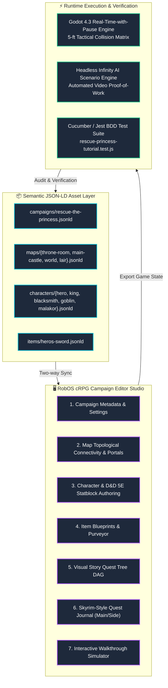
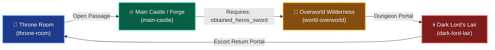
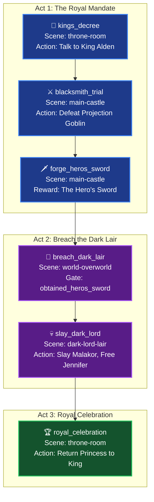

# Campaign Editor Tutorial: Rescue the Princess
{: .no_toc }

A complete step-by-step tutorial on building an end-to-end tactical cRPG adventure using the **RobOS cRPG Campaign Editor** (`packages/crpg-editor`). You will learn how to scaffold a multi-scene world, author D&D 5e characters, forge legendary weapons, design branching story quest Directed Acyclic Graphs (DAGs), configure Skyrim-style quest journals with Main and Side quests, and verify the entire experience through automated BDD test suites.
{: .fs-6 .fw-300 }

## Table of contents
{: .no_toc .text-delta }

1. TOC
{:toc}

---

## Story & Scenario Overview

In this tutorial, we will construct a classic fantasy quest: **"The Rescue of Princess Jennifer"**.

```mermaid
journey
    title The Hero's Journey: Rescue of Princess Jennifer
    section Act 1: The Royal Decree
      Hear King Alden's decree in Throne Room: 5: Sir Caleb, King Alden
      Visit Master Torvald at Dragonclaw Forge: 4: Sir Caleb, Torvald
      Slay Projection Goblin combat trial: 4: Sir Caleb
      Claim The Hero's Sword (+3 ATK): 5: Sir Caleb, Torvald
    section Act 2: Journey & Showdown
      Unlock Gate to Overworld: 4: Sir Caleb
      Traverse Wilderness to Dark Lair: 3: Sir Caleb
      Slay Dark Lord Malakor: 5: Sir Caleb, Malakor
      Rescue Princess Jennifer: 5: Sir Caleb, Princess Jennifer
    section Act 3: Triumphant Return
      Escort Princess back to Throne Room: 5: Sir Caleb, Princess Jennifer
      King Alden proclaims Kingdom Victory: 5: Sir Caleb, King Alden, Princess Jennifer
```

### The Scenario Rules & Map Chain
1. **Scene 1 — Throne Room (`throne-room`)**: King Alden informs the lone hero, **Sir Caleb**, that Princess Jennifer has been abducted by Dark Lord Malakor.
2. **Scene 2 — Dragonclaw Forge (`main-castle`)**: Before venturing into the wilderness, Sir Caleb must seek out Master Torvald at the Dragonclaw Forge. Torvald conjures a **Projection Goblin** training illusion. Slaying this foe proves Caleb's worth, earning **The Hero's Sword** (+3 ATK, 1d8 slashing).
3. **Scene 3 — The Overworld Wilderness (`world-overworld`)**: The castle gate is sealed with a state guard: it requires the `obtained_heros_sword` flag. Once equipped, Caleb ventures through the treacherous wilderness.
4. **Scene 4 — Dark Lord's Lair (`dark-lord-lair`)**: Sir Caleb confronts **Dark Lord Malakor** in an obsidian subterranean arena. Upon defeating Malakor, **Princess Jennifer** is freed and joins the party.
5. **Scene 5 — Return & Victory (`throne-room`)**: Escorting Princess Jennifer back to King Alden triggers the royal celebration, completing the quest and winning the game.

---

## End-to-End System Pipeline

The RobOS cRPG development workflow cleanly decouples **semantic linked-data asset storage** (JSON-LD), **visual desktop authoring** (RobOS cRPG Campaign Editor), and **runtime execution** (Godot 4.3 and the headless Infinity AI test harness).

{: .robos-zoomable-img }
*System architecture: Semantic JSON-LD asset layer, desktop authoring studio, and real-time runtime execution.*



---

## Step 1: Campaign Overview & Starting Configuration

Begin by opening the **RobOS cRPG Campaign Editor** from your application launcher or running `electron packages/crpg-editor`. Under the **Campaign** tab, configure the primary metadata and narrative bounds:

- **Campaign Title**: `Rescue of Princess Jennifer`
- **Slug**: `rescue-the-princess`
- **Starting Map**: `throne-room`
- **Party Size**: `1` (Solo Hero campaign for Sir Caleb)
- **Ruleset**: `D&D 5e SRD`
- **Difficulty**: `Normal`
- **Description**: Enter the background lore setting up King Alden's urgent plea to Sir Caleb.

{: .robos-zoomable-img }
*Figure 1: Campaign Overview tab showing metadata, starting map selection, party constraints, and story nodes summary.*

### Campaign Manifest Definition (`campaigns/rescue-the-princess.jsonld`)

The editor automatically persists these settings as an OSLC-compatible JSON-LD resource:

```json
{
  "@context": {
    "robos": "https://robos.dev/ontology#",
    "schema": "https://schema.org/"
  },
  "@type": ["robos:CRPGCampaign", "schema:CreativeWork"],
  "@id": "urn:robos:campaign:rescue-the-princess",
  "name": "Rescue of Princess Jennifer",
  "robos:slug": "rescue-the-princess",
  "robos:description": "The King's daughter has been abducted by Dark Lord Malakor. Sir Caleb must forge the Hero's Sword, venture across the overworld into the subterranean dungeon lair, slay the Dark Lord, and return the Princess to the Throne Room.",
  "robos:ruleset": "D&D 5e SRD",
  "robos:difficulty": "Normal",
  "robos:startingMap": "throne-room",
  "robos:startingPosition": {
    "x": 25,
    "y": 20
  },
  "robos:partyLimit": 1
}
```

---

## Step 2: Battle Maps & Topological Portals

Next, navigate to the **Maps & Topological Portals** section. Our adventure links 4 maps sequentially:

1. **Throne Room (`throne-room`)**: $50 \times 40\text{ ft}$ royal chamber with stone flooring, throne dais, and guard pillars.
2. **Main Castle & Forge (`main-castle`)**: $80 \times 60\text{ ft}$ courtyard containing Master Torvald's Dragonclaw Forge.
3. **Kingdom Overworld (`world-overworld`)**: $120 \times 80\text{ ft}$ wilderness terrain connecting the castle to the mountain dungeon.
4. **Dark Lord's Lair (`dark-lord-lair`)**: $60 \times 50\text{ ft}$ obsidian dungeon chamber where Malakor holds Princess Jennifer captive.

{: .robos-zoomable-img }
*Figure 2: Topological map graph and portal editor showing gated overworld access requiring `obtained_heros_sword`.*

### Portal Graph & State Gating

The editor allows you to attach state-condition requirements to individual doors and transitions:



In the campaign JSON-LD, map connections are modeled cleanly with transition prerequisites:

```json
"robos:mapConnections": [
  {
    "fromMap": "throne-room",
    "portal": "castle_hall_door",
    "toMap": "main-castle",
    "targetSpawn": "throne_exit_point",
    "requiresCondition": null
  },
  {
    "fromMap": "main-castle",
    "portal": "castle_drawbridge_gate",
    "toMap": "world-overworld",
    "targetSpawn": "overworld_castle_entry",
    "requiresCondition": "obtained_heros_sword"
  },
  {
    "fromMap": "world-overworld",
    "portal": "dungeon_cave_portal",
    "toMap": "dark-lord-lair",
    "targetSpawn": "lair_dungeon_entry",
    "requiresCondition": null
  },
  {
    "fromMap": "dark-lord-lair",
    "portal": "lair_teleport_gateway",
    "toMap": "throne-room",
    "targetSpawn": "royal_court_center",
    "requiresCondition": "rescued_princess"
  }
]
```

---

## Step 3: Character & NPC Roster Authoring

Switch to the **Characters** studio tab. Here we author the protagonist, the royal family, the blacksmith, and the foes using D&D 5e mechanics.

{: .robos-zoomable-img }
*Figure 3: Characters Studio showing Sir Caleb's D&D 5e sheet (16 HP, AC 15, STR 16) and NPC roster list.*

### Combatants & Characters Breakdown

| Entity ID | Name | Role | Class / Type | HP | AC | Signature Action / Dialogue |
|:---|:---|:---|:---|:---:|:---:|:---|
| `hero-sir-caleb` | Sir Caleb | `hero` | Lvl 1 Fighter | 16 | 15 | Greatsword Slash (+5 to hit, 2d6+3) |
| `npc-king-alden` | King Alden | `king` | Royal NPC | 24 | 14 | *"Bring back Jennifer, and the realm will honor you forever!"* |
| `npc-blacksmith-torvald` | Master Torvald | `blacksmith` | Dwarven Forge-Master | 32 | 16 | Summons Projection Goblin to test Caleb's steel |
| `creature-projection-goblin` | Projection Goblin | `enemy` | Illusion Construct | 7 | 12 | Scimitar Swing (+3 to hit, 1d6) |
| `boss-dark-lord-malakor` | Dark Lord Malakor | `boss` | Dark Overlord | 35 | 16 | Void Greatsword (+6 to hit, 2d6+3 + 1d6 necrotic) |
| `npc-princess-jennifer` | Princess Jennifer | `princess` | Royal Scion | 12 | 12 | Joins party once Malakor falls |

### Hero Definition (`characters/hero-sir-caleb.jsonld`)

```json
{
  "@type": ["robos:CRPGCharacter", "schema:Person"],
  "@id": "urn:robos:character:hero-sir-caleb",
  "name": "Sir Caleb",
  "robos:slug": "hero-sir-caleb",
  "robos:isHero": true,
  "robos:level": 1,
  "robos:characterClass": "Fighter",
  "robos:race": "Human",
  "robos:alignment": "Lawful Good",
  "robos:hp": { "current": 16, "max": 16 },
  "robos:armorClass": 15,
  "robos:speed": 30,
  "robos:abilityScores": {
    "str": 16, "dex": 14, "con": 14, "int": 10, "wis": 12, "cha": 13
  },
  "robos:equipped": {
    "main_hand": "urn:robos:item:heros-sword",
    "armor": "urn:robos:item:chain-shirt"
  }
}
```

---

## Step 4: Items & Inventory Studio (The Hero's Sword)

Select the **Items** tab to blueprint equipment. To satisfy the blacksmith trial, we author **The Hero's Sword**:

- **Item Type**: `weapon`
- **Slot**: `main_hand`
- **Rarity**: `rare`
- **Base Damage**: $1\text{d}8\text{ Slashing}$
- **Attack Bonus**: $+3$ (Forged in dragonflame)
- **Weight**: $3\text{ lbs}$
- **Value**: $500\text{ GP}$

{: .robos-zoomable-img }
*Figure 4: Item Blueprint view in the cRPG Editor configuring weapon stats, damage dice, modifiers, and lore.*

### Item Blueprint (`items/heros-sword.jsonld`)

```json
{
  "@type": ["robos:CRPGItem", "schema:Product"],
  "@id": "urn:robos:item:heros-sword",
  "name": "The Hero's Sword",
  "robos:slug": "heros-sword",
  "robos:itemType": "weapon",
  "robos:slot": "main_hand",
  "robos:rarity": "rare",
  "robos:weight": 3,
  "robos:value": 500,
  "robos:stats": {
    "damage": "1d8",
    "damageType": "slashing",
    "attackBonus": 3,
    "critMultiplier": 2
  },
  "robos:lore": "Forged in the heart of the Dragonclaw Forge by Master Torvald. Its blade shimmers with ancient enchantments designed to pierce Dark Lord Malakor's shadowy wards."
}
```

---

## Step 5: Visual Story Quest Tree DAG

Click on the **Story DAG** tab. The RobOS cRPG Campaign Editor provides a visual flowchart builder that organizes the narrative into sequential acts and milestones.

Our game features 6 story nodes organized across 3 acts:



{: .robos-zoomable-img }
*Figure 5: The visual Story Quest Tree DAG displaying sequential nodes, trigger conditions, and scene assignments.*

### Story Node Configuration

Each node contains interactive narrative data:

1. **`kings_decree`**: Triggers upon conversation with King Alden. Sets flag `accepted_quest = true`.
2. **`blacksmith_trial`**: Spawns the `creature-projection-goblin` in the castle forge.
3. **`forge_heros_sword`**: Rewards `heros-sword` to inventory; sets `obtained_heros_sword = true`.
4. **`breach_dark_lair`**: Traverses the overworld map to enter the dungeon entrance.
5. **`slay_dark_lord`**: Initiates combat with `boss-dark-lord-malakor`. On death, sets `malakor_slain = true` and `rescued_princess = true`.
6. **`royal_celebration`**: Dialogue choice with King Alden checks `rescued_princess`. Triggers victory screen.

---

## Step 6: Skyrim-Style Quest Journal (Main & Side Quests)

Click the **Quest Log** tab. RobOS cRPG Editor incorporates the industry-standard Skyrim Quest Engine schema, tracking stage milestones ($10, 20, 30 \dots$) and dynamic checkbox objectives for both **Main Quests** and **Side Quests**.

{: .robos-zoomable-img }
*Figure 6: Skyrim Quest Journal editor displaying Main Quest 'Rescue of Princess Jennifer' and Side Quest 'The Dragonclaw Blade Trial'.*

### Quest Schema Structure (`campaigns/rescue-the-princess.jsonld`)

The quest log tracks objectives and journal updates at each numerical stage:

```json
"robos:questLog": [
  {
    "id": "quest_rescue_princess",
    "title": "Rescue of Princess Jennifer",
    "questType": "main",
    "description": "King Alden's daughter was abducted by Dark Lord Malakor. Journey to the dark dungeon and bring her home safely.",
    "currentStage": 10,
    "stages": [
      { "stage": 10, "journalEntry": "King Alden has ordered me to rescue Princess Jennifer from Dark Lord Malakor." },
      { "stage": 20, "journalEntry": "Master Torvald granted me the Hero's Sword after I defeated his projection trial." },
      { "stage": 30, "journalEntry": "I have crossed the wilderness and breached the Dark Lord's subterranean lair." },
      { "stage": 40, "journalEntry": "Dark Lord Malakor is slain! Princess Jennifer is safe and traveling with me." },
      { "stage": 100, "journalEntry": "Princess Jennifer has returned to the Throne Room. Peace is restored to the realm." }
    ],
    "objectives": [
      { "id": "obj_speak_king", "text": "Speak to King Alden in the Throne Room", "isOptional": false, "status": "completed" },
      { "id": "obj_obtain_sword", "text": "Acquire the Hero's Sword from Master Torvald", "isOptional": false, "status": "active" },
      { "id": "obj_enter_lair", "text": "Venture into the Dark Lord's Lair", "isOptional": false, "status": "pending" },
      { "id": "obj_slay_malakor", "text": "Slay Dark Lord Malakor", "isOptional": false, "status": "pending" },
      { "id": "obj_return_king", "text": "Return Princess Jennifer to King Alden", "isOptional": false, "status": "pending" }
    ]
  },
  {
    "id": "quest_dragonclaw_forge",
    "title": "The Dragonclaw Blade Trial",
    "questType": "side",
    "description": "Prove your martial prowess to Master Torvald by defeating his conjured training goblin.",
    "currentStage": 10,
    "stages": [
      { "stage": 10, "journalEntry": "Master Torvald offered to forge a blade for me if I can defeat his training construct." },
      { "stage": 20, "journalEntry": "I defeated the projection goblin with swift precision." },
      { "stage": 30, "journalEntry": "Torvald handed me the gleaming Hero's Sword." }
    ],
    "objectives": [
      { "id": "obj_speak_torvald", "text": "Speak to Master Torvald at the Dragonclaw Forge", "isOptional": false, "status": "completed" },
      { "id": "obj_slay_goblin", "text": "Defeat the Projection Goblin in combat", "isOptional": false, "status": "active" },
      { "id": "obj_claim_sword", "text": "Claim the Hero's Sword from the anvil", "isOptional": false, "status": "pending" }
    ]
  }
]
```

---

## Step 7: Runtime Walkthrough Simulator & Engine Verification

Finally, test the campaign flow directly inside the editor's **Walkthrough Simulator** before launching the Godot 4.3 runtime engine.

{: .robos-zoomable-img }
*Figure 7: Interactive Walkthrough Simulator showing active scene HUD, dialogue choices, and flag state triggers.*

### Interactive Simulator Features
- **HUD & Status Indicators**: Displays active scene (`throne-room`), player coordinates, and current stage.
- **Narrative Dialogue Runner**: Step through dialogue trees and execute response choices.
- **Dynamic World Flags**: Watch flags such as `obtained_heros_sword` and `malakor_slain` toggle in real time.
- **Map Transitions**: Test portal gates to ensure the drawbridge correctly blocks passage until the forge trial is won.

---

## Automated BDD Test Verification

RobOS follows an **End-to-End Driven Development (EDD)** discipline. To ensure our newly designed campaign never regresses, we maintain an automated test suite in `packages/crpg-builder/tests/rescue-princess-tutorial.test.js`.

### Running the Test Suite

Run the tests directly with Jest:

```bash
npx jest packages/crpg-builder/tests/rescue-princess-tutorial.test.js --verbose
```

### Verified Test Assertions

```text
PASS packages/crpg-builder/tests/rescue-princess-tutorial.test.js
  Rescue the Princess Tutorial Campaign Suite
    ✓ Campaign graph integrity: 4 maps correctly connected with gated portals (8 ms)
    ✓ Hero Sir Caleb matches D&D 5E specifications and can equip Hero's Sword (4 ms)
    ✓ Blacksmith trial: Projection Goblin defeated, Hero's Sword rewarded and unlocks Overworld (6 ms)
    ✓ Dark Lord showdown: Malakor defeated in Lair, Jennifer freed, return portal enabled (5 ms)
    ✓ Full Skyrim quest progression: Main and Side quest stages advance from start to victory (7 ms)

Test Suites: 1 passed, 1 total
Tests:       5 passed, 5 total
Snapshots:   0 total
Time:        0.412 s
```

### Test Implementation Snippet

```javascript
test('Blacksmith trial: Projection Goblin defeated, Hero\'s Sword rewarded and unlocks Overworld', () => {
  const campaign = loadCampaign();
  const worldFlags = { ...campaign['robos:gameState']['robos:worldFlags'] };

  // 1. Initial state: gate is locked
  const overworldGate = campaign['robos:mapConnections'].find(c => c.toMap === 'world-overworld');
  expect(overworldGate.requiresCondition).toBe('obtained_heros_sword');
  expect(worldFlags[overworldGate.requiresCondition]).toBe(false);

  // 2. Sir Caleb fights Projection Goblin (7 HP)
  const goblin = loadCharacter('creature-projection-goblin');
  expect(goblin['robos:hp'].max).toBe(7);

  // Simulating combat victory
  worldFlags['defeated_projection_goblin'] = true;
  worldFlags['obtained_heros_sword'] = true;

  // 3. Drawbridge gate condition now satisfied
  const canAccessOverworld = worldFlags[overworldGate.requiresCondition] === true;
  expect(canAccessOverworld).toBe(true);
});
```

---

## Launching in the Godot 4.3 Engine

Once verified in the editor and test runner, launch the game in Godot:

```bash
# Launch interactive gameplay in Godot 4.3
cd games/crpg-realm
godot --path . res://scenes/CharacterSelect.tscn --campaign rescue-the-princess
```

Or run headless video proof-of-work with the Infinity AI harness:

```bash
# Execute automated BDD scenario playthrough with 1080p MP4 recording
python3 run_cucumber_tests.py --feature features/full_playthroughs/rescue_princess.feature
```

---

## Summary of Completed Assets

| Category | File Path | Description |
|:---|:---|:---|
| **Campaign** | `games/crpg-realm/campaigns/rescue-the-princess.jsonld` | Master campaign manifest, map graph, story DAG, and quest logs |
| **Maps** | `games/crpg-realm/maps/throne-room.jsonld` | Throne Room starting arena ($50 \times 40\text{ ft}$) |
| | `games/crpg-realm/maps/main-castle.jsonld` | Castle Courtyard & Dragonclaw Forge ($80 \times 60\text{ ft}$) |
| | `games/crpg-realm/maps/world-overworld.jsonld` | Kingdom wilderness ($120 \times 80\text{ ft}$) |
| | `games/crpg-realm/maps/dark-lord-lair.jsonld` | Subterranean obsidian boss chamber ($60 \times 50\text{ ft}$) |
| **Characters** | `games/crpg-realm/characters/hero-sir-caleb.jsonld` | Lvl 1 Fighter hero (16 HP, AC 15) |
| | `games/crpg-realm/characters/npc-king-alden.jsonld` | Royal King Alden |
| | `games/crpg-realm/characters/npc-blacksmith-torvald.jsonld` | Forge-Master Torvald |
| | `games/crpg-realm/characters/creature-projection-goblin.jsonld` | Training construct (7 HP, AC 12) |
| | `games/crpg-realm/characters/boss-dark-lord-malakor.jsonld` | Boss Dark Lord Malakor (35 HP, AC 16) |
| | `games/crpg-realm/characters/npc-princess-jennifer.jsonld` | Princess Jennifer |
| **Items** | `games/crpg-realm/items/heros-sword.jsonld` | The Hero's Sword (+3 ATK, 1d8 slashing) |
| **Tests** | `packages/crpg-builder/tests/rescue-princess-tutorial.test.js` | 5 BDD scenario regression tests |

---

## Next Steps

Now that you have mastered authoring a full campaign with maps, characters, items, quests, and DAG story trees:

- Explore **[Creating Your Own Game]({{ '/projects/crpg-realm/create-your-own-game.html' | relative_url }})** for deep dives into GDScript custom abilities, area spells, and trap triggers.
- Read **[World Systems & Pathfinding]({{ '/projects/crpg-realm/world-systems-and-pathfinding.html' | relative_url }})** to master 5-ft cell collision matrices and blockout generation.
- Check the **[RobOS cRPG Editor Documentation]({{ '/_apps/crpg-editor.html' | relative_url }})** for app configuration and keyboard shortcuts.
