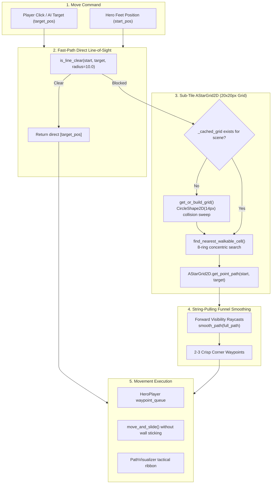
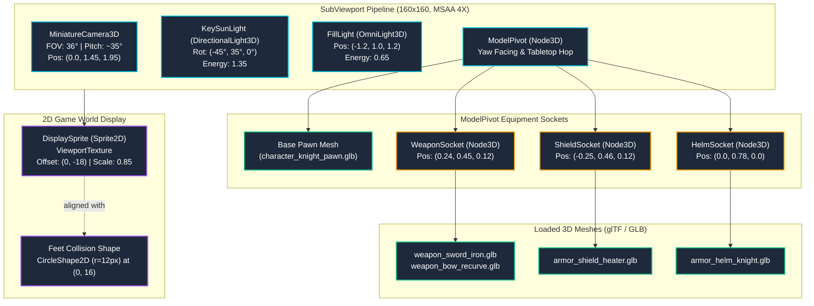

# World Systems, Pathfinding & 3D Character Architecture
{: .no_toc }

The systems that make a location playable: collision polygons over painted backgrounds, a sub-tile `AStarGrid2D` pathfinder with string-pulling funnel smoothing, 3D miniature character pawns with dynamic equipment sockets, NPCs driven by dialogue trees in `data/v1/dialogue.json`, doors, ground items, and fog of war. After reading this, you will understand how characters navigate around walls, how 3D miniature models and weapon sockets are projected into the 2D world, and how to add or modify scene collision.
{: .fs-6 .fw-300 }

## Table of contents
{: .no_toc .text-delta }

1. TOC
{:toc}

---

## Village collision

The village is one 2560x1440 image (`assets/backgrounds/village_open_world_2560.png`) in a `TextureRect` named `Ground`. The buildings you see are painted into that image. What stops the party is a set of `StaticBody2D` nodes on collision layer 1 laid over it in [`scenes/VillageSquare.tscn`](https://github.com/nddipiazza/robos/blob/main/games/crpg-realm/scenes/VillageSquare.tscn).

{: .robos-zoomable-img }
*The party walking between village houses, with the path line drawn by `PathVisualizer`.*

### The eleven house bodies

Each is a `StaticBody2D` (`collision_layer = 1`, `collision_mask = 1`) with one or more `CollisionPolygon2D` children. Bounds are the min/max of the polygon points.

| Node | Polygons | Main footprint bounds (x, y) |
|:---|:---|:---|
| `HouseBlacksmith` | `CollisionPolygon2D` | 580–1110, 200–430 |
| `HouseApothecary` | `CollisionPolygon2D`, `ApothecaryGarden`, `ApothecaryCartBench` | 240–660, 520–770 |
| `HouseSWCottage` | `CollisionPolygon2D`, `SWCartFence` | 0–360, 1000–1340 |
| `HouseTavernInn` | `CollisionPolygon2D`, `TavernBeerTables` | 1280–1730, 160–510 |
| `HouseTownHall` | `CollisionPolygon2D` | 1720–2180, 200–600 |
| `HouseEastThatched` | `CollisionPolygon2D` | 1930–2300, 520–770 |
| `HouseBakeryOven` | `CollisionPolygon2D` | 2160–2540, 590–910 |
| `HouseSouthMerchant` | `CollisionPolygon2D` | 650–1200, 1060–1440 |
| `HouseSouthThatched` | `CollisionPolygon2D` | 1380–1870, 1070–1440 |
| `HouseSouthLower` | `CollisionPolygon2D` | 1850–2250, 910–1320 |
| `HouseEastCorner` | `CollisionPolygon2D` | 2240–2560, 850–1340 |

### `VillageBoundaries`

One more `StaticBody2D` holds the map edges and street furniture:

| Child | Shape | Where |
|:---|:---|:---|
| `WestBorder`, `EastBorder` | 30x1440 rectangles | x = 15 and x = 2545 |
| `NorthWallLeft`, `NorthWallRight` | polygons | north edge; they leave a gap between x = 1130 and x = 1220 for the garrison gate |
| `WestTower` | polygon | (40–240, 220–480) |
| `CentralFountain` | circle r = 95 | (1305, 875) |
| `PlazaWell` | circle r = 38 | (915, 925) |
| `PlazaTree` | circle r = 42 | (1765, 870) |
| `BlacksmithAnvil` | circle r = 25 | (780, 470) |
| `BlacksmithWoodpiles`, `MarketStall1`–`5`, `BenchNorth/East/South/West` | polygons | around the plaza |

### Doors

All doors are `Area2D` nodes with [`DoorPortal.gd`](https://github.com/nddipiazza/robos/blob/main/games/crpg-realm/scripts/DoorPortal.gd). Only two lead anywhere.

| Node | `door_id` | `door_name` | Position | Target |
|:---|:---|:---|:---|:---|
| `GarrisonGate` | `door-id-1` | Royal Garrison Gate | (1175, 200) | `GarrisonKeep.tscn`; `is_locked`, `required_key = "garrison-key"`, `opens_quest_stage = 4` |
| `ForestGate` | `door-id-forest` | Whispering Forest Road | (2500, 940) | `WhisperingForest.tscn`, spawn (180, 720) |
| `DoorInn` | `door-id-inn` | Tavern Door | (1370, 540) | none |
| `DoorBlacksmith` | `door-id-blacksmith` | Forge Door | (850, 420) | none |
| `DoorApothecary` | `door-id-apothecary` | Apothecary Door | (630, 720) | none |
| `DoorTownHall` | `door-id-townhall` | Town Hall Door | (1760, 620) | none |
| `DoorCottage` | `door-id-farmhouse` | Farmhouse Door | (320, 1020) | none |
| `DoorElder` | `door-id-elder` | Elder's Cottage Door | (900, 1060) | none |
| `DoorBarracks` | `door-id-barracks` | Barracks Door | (1550, 1080) | none |
| `DoorRanger` | `door-id-ranger` | Ranger's Lodge Door | (1840, 1000) | none |
| `DoorShrine` | `door-id-shrine` | Shrine Door | (1950, 760) | none |
| `DoorMill` | `door-id-mill` | Bakery Door | (2160, 880) | none |

Clicking a door calls `try_enter()`. It unlocks the door if the party has `required_key` (and calls `GameState.advance_quest(opens_quest_stage)`), emits `door_entered`, sets `GameState.spawn_position` from `target_spawn`, and changes scene if `target_scene` is set.

{: .note }
**Interior status:** The ten residential house doors have no `target_scene`; entering one emits `door_entered`. Door IDs and house bodies are paired by name conventions.

---

## Pathfinding (`Pathfinder.gd`)

[`scripts/Pathfinder.gd`](https://github.com/nddipiazza/robos/blob/main/games/crpg-realm/scripts/Pathfinder.gd) is a `RefCounted` utility class with static functions. It provides collision-aware navigation across open terrain, through doorways, and around arbitrary polygonal buildings and obstacles.

The navigation system integrates five core techniques:
1. **Direct Line-of-Sight Raycasting**: Fast-path bypass for unobstructed movements.
2. **Sub-Tile `AStarGrid2D` Rasterization**: Automatic 20×20 px grid generation with character radius clearance against collision layer 1.
3. **Per-Scene Grid Caching**: Eliminates per-move graph rebuilds by caching the grid by scene instance ID.
4. **Nearest Walkable Cell Remapping**: Concentric ring search recovering safe targets when players click inside walls, fireplaces, or solid furniture.
5. **String-Pulling (Raycast Funnel Smoothing)**: Forward visibility raycasting converting jagged grid steps into direct line-of-sight corner turns.

{: .robos-zoomable-img }
*Architecture comparison: Sparse waypoint graphs vs. Sub-tile AStarGrid2D with String-Pulling funnel smoothing.*

### Navigation Pipeline



### 1. Line-of-Sight Raycasting (`is_line_clear`)

Before engaging the grid, `is_line_clear()` verifies whether the destination can be reached in a straight line. It casts three parallel rays on collision layer 1:
- A center ray from `from_pos` to `to_pos`.
- Two parallel lateral rays offset perpendicular to the travel direction by `check_radius` (default: 12.0 px).

```gdscript
static func is_line_clear(world_2d: World2D, from_pos: Vector2, to_pos: Vector2, check_radius: float = 12.0, exclude: Array[RID] = []) -> bool:
	if not world_2d:
		return true
	var space = world_2d.direct_space_state
	if not space or from_pos.distance_to(to_pos) < 5.0:
		return true

	# 1. Center ray
	var q_center = PhysicsRayQueryParameters2D.create(from_pos, to_pos)
	q_center.collision_mask = 1
	q_center.collide_with_bodies = true
	q_center.collide_with_areas = false
	q_center.exclude = exclude
	if not space.intersect_ray(q_center).is_empty():
		return false

	# 2. Lateral offset rays ensuring 14px body clearance around corners
	var dir = (to_pos - from_pos).normalized()
	if dir == Vector2.ZERO:
		return true
	var perp = Vector2(-dir.y, dir.x) * check_radius

	var q_left = PhysicsRayQueryParameters2D.create(from_pos + perp, to_pos + perp)
	q_left.collision_mask = 1
	q_left.collide_with_bodies = true
	q_left.collide_with_areas = false
	q_left.exclude = exclude
	if not space.intersect_ray(q_left).is_empty():
		return false

	var q_right = PhysicsRayQueryParameters2D.create(from_pos - perp, to_pos - perp)
	q_right.collision_mask = 1
	q_right.collide_with_bodies = true
	q_right.collide_with_areas = false
	q_right.exclude = exclude
	if not space.intersect_ray(q_right).is_empty():
		return false

	return true
```

If unobstructed, `get_nav_path()` immediately returns `PackedVector2Array([target_pos])`, avoiding all pathfinding compute.

### 2. Scene Collision Sweep & Grid Caching (`get_or_build_grid`)

When direct line of sight is obstructed, `Pathfinder` consults `AStarGrid2D`. The grid is configured with:
- **Cell Size**: `Vector2(20.0, 20.0)` px.
- **Diagonal Mode**: `DIAGONAL_MODE_ONLY_IF_NO_OBSTACLES` (prevents cutting through sharp 90-degree wall corners).
- **Heuristic**: `HEURISTIC_EUCLIDEAN` for natural, straight-line distance weighting.

On first access for a given scene, `get_or_build_grid()` sweeps the direct space state using a `CircleShape2D` of radius `14.0 px` (matching the hero's feet collision radius):

```gdscript
	var space = world_2d.direct_space_state
	var circle_shape = CircleShape2D.new()
	circle_shape.radius = 14.0
	var shape_query = PhysicsShapeQueryParameters2D.new()
	shape_query.shape = circle_shape
	shape_query.collision_mask = 1
	shape_query.collide_with_bodies = true
	shape_query.collide_with_areas = false

	for y in range(rows):
		for x in range(cols):
			var world_pos = Vector2(origin_x + x * cell_sz.x + cell_sz.x * 0.5, origin_y + y * cell_sz.y + cell_sz.y * 0.5)
			shape_query.transform = Transform2D(0.0, world_pos)
			var hits = space.intersect_shape(shape_query, 1)
			if not hits.is_empty():
				grid.set_point_solid(Vector2i(x, y), true)
```

The rasterized grid is cached with `_cached_scene_id = scene.get_instance_id()`. Subsequent movement clicks within the same scene execute in less than 0.2 ms with zero shape queries. When terrain changes dynamically (e.g. gates opening or secret walls lowering), calling `Pathfinder.invalidate_grid()` flushes the cache.

### 3. Solid-Click Remapping (`find_nearest_walkable_cell`)

If a player clicks directly on a solid house roof, fireplace, or interior boundary wall, `find_nearest_walkable_cell()` searches outward in concentric square rings up to radius 8 cells:

```gdscript
static func find_nearest_walkable_cell(grid: AStarGrid2D, cell: Vector2i, max_radius: int = 8) -> Vector2i:
	if not grid.is_point_solid(cell):
		return cell
	var best_cell = cell
	var min_dist_sq = INF
	for r in range(1, max_radius + 1):
		for dx in range(-r, r + 1):
			for dy in range(-r, r + 1):
				if maxi(absi(dx), absi(dy)) != r:
					continue
				var c = cell + Vector2i(dx, dy)
				if grid.region.has_point(c) and not grid.is_point_solid(c):
					var d = dx * dx + dy * dy
					if d < min_dist_sq:
						min_dist_sq = d
						best_cell = c
		if min_dist_sq < INF:
			return best_cell
	return cell
```

This prevents pathfinding aborts when interacting with chests, doors, or NPCs positioned close to walls.

### 4. String-Pulling Funnel Algorithm (`smooth_path`)

Raw grid paths follow jagged 45° and 90° tile transitions. `smooth_path()` uses a raycast string-pulling funnel: starting at `current_idx`, it scans backwards from the end of the path (`raw_path.size() - 1` down to `current_idx + 1`), finding the furthest waypoint with an unobstructed 3-ray line of sight. It appends that point and advances:

```gdscript
static func smooth_path(world_2d: World2D, raw_path: PackedVector2Array, exclude: Array[RID] = []) -> PackedVector2Array:
	if raw_path.size() <= 2:
		return raw_path

	var result: PackedVector2Array = []
	result.append(raw_path[0])

	var current_idx = 0
	while current_idx < raw_path.size() - 1:
		var furthest_idx = current_idx + 1
		for next_idx in range(raw_path.size() - 1, current_idx, -1):
			if is_line_clear(world_2d, raw_path[current_idx], raw_path[next_idx], 8.0, exclude):
				furthest_idx = next_idx
				break
		result.append(raw_path[furthest_idx])
		current_idx = furthest_idx

	return result
```

This reduces 30+ tile steps across a map into 2–3 clean corner waypoints that round doorway thresholds and building corners cleanly.

### Who Uses It

- **Hero Movement**: `HeroPlayer.move_to_point()` and `HeroPlayer.queue_move_point()` (Shift-click) call `Pathfinder.get_nav_path()`. The smoothed waypoints populate `waypoint_queue`.
- **Party Companions**: Follow the formation leader offset. If an obstacle intervenes, companions slide along collision normals, and if blocked for >0.3s, their internal navigation queries `Pathfinder` to regroup.
- **Enemies**: `TacticalEnemy` instances query `Pathfinder` when chasing party members around pillars and obstacles during tactical combat.

---

## 3D Miniature Character Pipeline & Equipment Sockets (`CharacterModel3D.gd`)

RobOS cRPG characters, companions, and monsters use a **tabletop miniature pawn architecture** implemented in [`scripts/CharacterModel3D.gd`](https://github.com/nddipiazza/robos/blob/main/games/crpg-realm/scripts/CharacterModel3D.gd). Rather than using flat 2D sprite sheets for every equipment combination, each character hosts an anti-aliased 3D viewport that renders glTF/GLB miniature models with dynamic weapon, shield, and helmet sockets in real time.

{: .robos-zoomable-img }
*Technical architecture of the SubViewport 3D miniature rendering pipeline, ModelPivot sockets, and 2D feet alignment.*

### 3D Rendering Pipeline

The character pawn is composed of an isolated `SubViewport` containing a 3D scene, projected back into the 2D world using a `Sprite2D` texture:



### Viewport Configuration & Feet Alignment

| Component | Property | Value | Purpose |
|:---|:---|:---|:---|
| `SubViewport` | `size` | `160×160` | High-density render buffer for miniature pawn clarity |
| `SubViewport` | `transparent_bg` | `true` | Allows seamless blending over 2D isometric ground maps |
| `SubViewport` | `own_world_3d` | `true` | Prevents lighting interference between multiple character viewports |
| `SubViewport` | `msaa_3d` | `MSAA_4X` | Crisp silhouette anti-aliasing without jagged polygon edges |
| `Camera3D` | `position`, `fov` | `(0, 1.45, 1.95)`, `36.0°` | Fixed isometric perspective (~35° pitch) matching world geometry |
| `DisplaySprite` | `offset` | `Vector2(0, -18)` | Offsets the miniature pedestal so its base aligns with the 2D feet collider at `(0, 16)` |

### Dynamic Equipment Sockets

The character pawn mounts three dedicated `Node3D` sockets as children of `ModelPivot`:

```gdscript
# Equipment Sockets attached to ModelPivot
weapon_socket = Node3D.new()
weapon_socket.name = "WeaponSocket"
weapon_socket.position = Vector3(0.24, 0.45, 0.12)
model_pivot.add_child(weapon_socket)

shield_socket = Node3D.new()
shield_socket.name = "ShieldSocket"
shield_socket.position = Vector3(-0.25, 0.46, 0.12)
model_pivot.add_child(shield_socket)

helm_socket = Node3D.new()
helm_socket.name = "HelmSocket"
helm_socket.position = Vector3(0.0, 0.78, 0.0)
model_pivot.add_child(helm_socket)
```

When an actor equips an item, `CharacterModel3D` resolves the asset reference and instantiates the glTF scene into the corresponding socket:

- **`equip_weapon(ref)`**: Resolves weapons (`weapon_sword_iron.glb`, `weapon_bow_recurve.glb`, `weapon_staff_wizard.glb`, `weapon_dagger_rogue.glb`, `weapon_warhammer.glb`, `weapon_greatsword.glb`).
- **`equip_shield(ref)`**: Resolves shields (`armor_shield_heater.glb`, `armor_shield_round.glb`).
- **`equip_helmet(ref)`**: Resolves helms (`armor_helm_knight.glb`, `armor_helm_iron.glb`).

Because the sockets are children of `ModelPivot`, equipped items automatically rotate with the character's facing direction and bob during the tabletop hop movement.

### Tabletop Miniature Motion Engine

Miniature pawns simulate physical tabletop figurines rather than skeletal skinning:

1. **Continuous 3D Yaw Facing (`update_facing`)**:
   `ModelPivot` rotates smoothly toward the actor's current movement velocity or interaction target:
   ```gdscript
   model_pivot.rotation.y = lerp_angle(model_pivot.rotation.y, target_facing_yaw, 14.0 * delta)
   ```
2. **Tabletop Hop Movement**:
   When walking (`is_moving = true`), the model performs a vertical hop and subtle lateral roll emulating a physical miniature being moved across a grid:
   ```gdscript
   walk_timer += delta * 15.0
   var hop = abs(sin(walk_timer)) * 0.14
   model_pivot.position.y = hop
   model_pivot.rotation.z = sin(walk_timer) * 0.06
   ```
3. **Idle Breathing Sway**:
   When stationary, the pawn performs subtle vertical breathing oscillation (`sin(idle_timer) * 0.03`).
4. **Attack Animation (`play_attack`)**:
   During combat swings, the weapon socket pitches forward (`-45°` to `+45°`) while the character lunges toward the target.

### PBR Armor & Material Styling

`apply_armor_styling(armor_type, armor_color)` traverses child meshes in the glTF hierarchy, applying PBR material properties dynamically:

| Armor Category | Metallic | Roughness | Default Albedo Tint |
|:---|:---:|:---:|:---|
| **Plate / Iron / Steel** | 0.85 | 0.20 | Polished Steel: `Color(0.80, 0.83, 0.88)` |
| **Chain / Scale Mail** | 0.75 | 0.45 | Riveted Mail: `Color(0.65, 0.68, 0.72)` |
| **Studded / Leather** | 0.20 | 0.75 | Cured Leather: `Color(0.48, 0.32, 0.20)` |
| **Cloth / Robes** | 0.05 | 0.90 | Arcane Indigo: `Color(0.55, 0.25, 0.85)` |

### Actor Integration Across Scenes

- **`HeroPlayer`**: Knights, Wizards, Rogues, and Kings automatically spawn their respective 3D model on `_ready()`. Equipping items in inventory updates the sockets live.
- **`Homestead` (Elora)**: Spawns as `character_princess_pawn.glb` equipped with `weapon_bow_recurve.glb`.
- **`VillageSquare` (Blacksmith Brand)**: Spawns as `character_knight_pawn.glb` equipped with `weapon_warhammer.glb`.
- **`ShadowHound`**: Spawns as `monster_hound_pawn.glb` (scale 1.15, shadow tint).
- **`GarrisonKeep` (Captain Malakor)**: Spawns as `character_knight_pawn.glb` scaled 1.25x with crimson plate styling and `weapon_greatsword.glb`.
- **`TacticalEnemy`**: Goblin skirmishers instantiate `monster_goblin_pawn.glb` with `weapon_dagger_rogue.glb`.

---

## 3D Spell Visual Effects & Projectiles (`SpellModel3D.gd`)

Spells in RobOS cRPG use a dedicated 3D particle and projectile pipeline implemented in [`scripts/SpellModel3D.gd`](https://github.com/nddipiazza/robos/blob/main/games/crpg-realm/scripts/SpellModel3D.gd). Like character models, spell effects render in isolated 3D viewports and project into 2D isometric coordinates:

- **Projectiles**: Spherical 3D energy cores with trailing ribbon particles (e.g. Magic Missile arc tracking, Fireball trajectory).
- **Area-of-Effect Explosions**: Expanding 3D sphere meshes with radial shockwave rings, thermal color ramps, and screen-shake impulse emission.
- **Status Auras**: Orbiting 3D rune glyphs for Bless, Shield, Haste, and Dispel Magic.

---

## NPCs and dialogue

### The roster

`data/v1/npcs.json` has 18 records for 17 distinct characters: Blacksmith Brand appears twice, as `blacksmith-brand` and `npc-id-1`, both using `blacksmith-inquiry`. The scene uses `npc-id-1`.

| id | Name | Dialogue tree | Scene | Node | Position |
|:---|:---|:---|:---|:---|:---|
| `elora` | Elora (Partner) | `partner-confrontation` | Homestead | `EloraNPC` | (1180, 560) |
| `npc-id-1` | Blacksmith Brand | `blacksmith-inquiry` | VillageSquare | `BlacksmithBrand` | (820, 470) |
| `blacksmith-brand` | Blacksmith Brand | `blacksmith-inquiry` | — | not placed | — |
| `npc-id-innkeeper` | Barkeep Corwin | `dialogue-innkeeper` | VillageSquare | `NPC_Innkeeper` | (1330, 560) |
| `npc-id-guildmaster` | Guildmaster Aldous | `dialogue-guildmaster` | VillageSquare | `NPC_Guildmaster` | (1720, 660) |
| `npc-id-herbalist` | Maybelle the Apothecary | `dialogue-herbalist` | VillageSquare | `NPC_Herbalist` | (630, 770) |
| `npc-id-guard` | Gate Guard Garrick | `dialogue-guard` | VillageSquare | `NPC_Guard` | (1130, 260) |
| `npc-id-farmer` | Farmer Giles | `dialogue-farmer` | VillageSquare | `NPC_Farmer` | (380, 980) |
| `npc-id-priestess` | Sister Althea | `dialogue-priestess` | VillageSquare | `NPC_Priestess` | (1880, 780) |
| `npc-id-miller` | Miller Hob | `dialogue-miller` | VillageSquare | `NPC_Miller` | (2100, 890) |
| `npc-id-hunter` | Ranger Kaelen | `dialogue-hunter` | VillageSquare | `NPC_Hunter` | (1780, 1020) |
| `npc-id-bard` | Lyra the Minstrel | `dialogue-bard` | VillageSquare | `NPC_Bard` | (1305, 740) |
| `npc-id-merchant` | Trader Borin | `dialogue-merchant` | VillageSquare | `NPC_Merchant` | (1150, 680) |
| `npc-id-elder` | Elder Martha | `dialogue-elder` | VillageSquare | `NPC_Elder` | (880, 1020) |
| `npc-id-peddler` | Goblin Peddler Griknok | `dialogue-peddler` | WhisperingForest | `NPC_Peddler` | (850, 640) |
| `npc-id-fallen` | Fallen Adventurer Rickard | `dialogue-fallen` | WhisperingForest | `NPC_Fallen` | (520, 560) |
| `npc-id-hermit` | Hermit Varis | `dialogue-hermit` | WhisperingForest | `NPC_Hermit` | (1950, 480) |
| `npc-id-crypt-ghost` | Spirit of Sir Justin | `dialogue-crypt-ghost` | AncientCatacombs | `SirJustinGhost` | (1420, 480) |

Placement: 12 in the village, 3 in the forest, 1 in the catacombs, 1 (Elora) in the Homestead. Captain Malakor is not an NPC record; he is the `MalakorBoss` `Area2D` in `GarrisonKeep.tscn`, driven by `GarrisonKeep.gd`.

{: .robos-zoomable-img }
*Dialogue shown in the activity log with numbered choices.*

### Two kinds of NPC node

- **`NPCCharacter`** ([`scripts/NPCCharacter.gd`](https://github.com/nddipiazza/robos/blob/main/games/crpg-realm/scripts/NPCCharacter.gd), instanced from `scenes/components/NPCCharacter.tscn`) — a `CharacterBody2D` used by the 15 `NPC_*`/`SirJustinGhost` nodes. Exports include `npc_id`, `npc_name`, `custom_sprite_path`, `portrait_path`, `waypoints`, `move_speed` (85) and a fallback `dialogue_text`.
- **`ClickableObject`** ([`scripts/ClickableObject.gd`](https://github.com/nddipiazza/robos/blob/main/games/crpg-realm/scripts/ClickableObject.gd)) — a plain `Area2D` that emits `body_clicked`. Used for Brand and Elora. The scene script owns their dialogue and their walking: `VillageSquare._process()` walks Brand between (820, 470) and (760, 470); `Homestead.gd` walks Elora between (1180, 560) and (1380, 560).

### How `NPCCharacter.interact()` finds a dialogue tree

On click it sets the NPC to conversing, facing the hero, then looks for a tree in this order:

1. `DataStore.dialogue_trees[npc_id]`
2. `DataStore.dialogue_trees["dialogue-" + npc_id without "npc-id-"/"npc-"]` — this is the one that matches for `npc-id-innkeeper` → `dialogue-innkeeper`
3. `DataStore.dialogue_trees[DataStore.npcs[npc_id].dialogue_tree]`
4. a one-node tree built from the exported `dialogue_text` and `dialogue_choices`

It then calls `ActionLog.start_dialogue(tree, tree.rootNode)` and reverts the conversing state on `ActionLog.dialogue_ended`.

A tree in `dialogue.json` is an object with `id`, `title`, `rootNode` and a `nodes` map. Each node has `speaker`, `text` and `choices`, and each choice has `text` and `nextNode`. An empty `choices` array ends the conversation.

### Facing the hero

```gdscript
func set_conversing(conversing: bool, face_target: Vector2 = Vector2.ZERO) -> void:
	is_conversing = conversing
	if conversing and face_target != Vector2.ZERO and sprite:
		sprite.flip_h = (face_target.x > global_position.x)
	if not conversing and idle_textures.size() > 0 and sprite:
		sprite.texture = idle_textures[0]
```

The source sprites face left, so `flip_h = true` turns the NPC to face a hero on its right. `VillageSquare.talk_to_blacksmith()` and `Homestead.talk_to_elora()` do the same for Brand and Elora.

{: .note }
**Not implemented yet:** wandering NPCs and NPC walk cycles. No scene sets `waypoints` on an `NPCCharacter`, so all fifteen stand still. And because every one sets `custom_sprite_path`, `_load_npc_textures()` returns before loading `*_walk_N.png` frames. Only Brand and Elora walk and animate.

---

## Ground items

`GroundItem_Potion` (`item-id-1`, "Lesser Healing Draught", at (1200, 820)), `GroundItem_Scroll` (`item-id-scroll`, "Scroll of Arcane Blast", at (1420, 820)) and `GroundItem_Sword` (`item-id-iron-sword`, "Militia Shortsword", at (1050, 820)) are instances of `scenes/components/GroundItem.tscn`. [`GroundItem.gd`](https://github.com/nddipiazza/robos/blob/main/games/crpg-realm/scripts/GroundItem.gd) exports `item_id`, `item_name`, `quantity`, `is_picked_up` and `icon_texture`. A left click calls `pickup()`: `GameState.add_item(item_id)`, emit `item_picked_up`, `queue_free()`.

---

## Fog of war

`FogOfWar` ([`scripts/FogOfWar.gd`](https://github.com/nddipiazza/robos/blob/main/games/crpg-realm/scripts/FogOfWar.gd), instanced from `scenes/components/FogOfWar.tscn`) is in all five location scenes. It keeps a low-resolution image of the map and draws it scaled up over everything.

{: .robos-zoomable-img }
*Explored ground stays dimmed; the area around the hero is clear.*

| Export | Default | Meaning |
|:---|:---|:---|
| `map_width`, `map_height` | 2560, 1440 | map size in pixels |
| `grid_scale` | 8 | one fog cell = 8x8 px, so the grid is 320x180 |
| `vision_radius` | 340.0 | outer edge of sight |
| `inner_vision_radius` | 240.0 | fully clear inside this radius; smoothstep fade to 340 |
| `memory_darkness` | 0.65 | alpha over explored ground not currently in sight |
| `shroud_color` | `Color(0.02, 0.02, 0.04, 1.0)` | fog colour |
| `is_fog_enabled` | true | used only if `GameState.settings` has no `fog_of_war` key |

Each cell stores two values: red = explored (never decreases), green = in sight now. When the hero moves more than 5 px, `update_fog_at_position()` clears last frame's green cells and stamps a precomputed circular brush. The shader [`shaders/fog_of_war.gdshader`](https://github.com/nddipiazza/robos/blob/main/games/crpg-realm/shaders/fog_of_war.gdshader) turns that into alpha:

```glsl
uniform vec4 shroud_color : source_color = vec4(0.02, 0.02, 0.04, 1.0);
uniform float memory_darkness : hint_range(0.0, 1.0) = 0.65;
uniform bool enabled = true;
// ...
		float explored = fog_sample.r;
		float in_vision = fog_sample.g;
		float alpha = (1.0 - explored) + (explored * (1.0 - in_vision) * memory_darkness);
		COLOR = vec4(shroud_color.rgb, clamp(alpha, 0.0, 1.0));
```

- **Unexplored:** alpha 1 (black). **Explored, out of sight:** alpha 0.65. **In sight:** alpha 0.
- **Actors.** Nodes passed to `register_actor()` fade to invisible when their cell is not in sight (green ≤ 0.15), and their `OverheadUI`/`SelectionCircle` hide too. `VillageSquare._ready()` registers the hero, the hound, Brand, companions and every `CharacterBody2D` child.
- **Memory.** Explored cells are cached per scene name in `GameState` metadata (`fog_cache`), so returning to a map keeps what you uncovered. `/reset` clears the cache.
- **Toggle.** The Settings modal checkbox `ChkFogOfWar` writes `GameState.settings.fog_of_war`.

{: .note }
**Not implemented yet:** vision from companions or light sources (only the node in `hero_node`, the `HeroPlayer`, reveals fog), line-of-sight blocking by walls (vision is a plain circle through buildings), and a minimap.

---

## Verify it

```bash
python3 run_cucumber_tests.py tests/e2e/features/normal/10_house_wall_collision_pathfinding.feature
python3 run_cucumber_tests.py tests/e2e/features/normal/11_dozens_npc_dialogue_and_trading.feature
python3 run_cucumber_tests.py tests/e2e/features/normal/01_fog_of_war_exploration.feature
```

---

## Gotchas

- **Collision must match the painting.** Move a polygon without repainting, or repaint without moving the polygon, and the party walks through walls or bumps into air.
- **Waypoints must be in open ground.** A waypoint inside a collision polygon cannot see any neighbour and silently drops out of the graph.
- **Keep everything a direct child of the scene root.** `FogOfWar` registration, the HTTP state API and area-of-effect spells scan `get_tree().current_scene.get_children()`.
- **`GameControlServer` click targets clamp to the screen.** `/user_input/click_object` clamps the cursor to (40–1880, 60–1020) screen pixels, so an off-screen object is "clicked" at the screen edge.
- **Pickups ignore distance.** A mouse click on a `GroundItem` picks it up from anywhere on screen. The agent's `pickup_item` walks there first; a human player does not have to.
- **`item-id-iron-sword` is not in `items.json`.** Picking up the sword adds an id that `GameState.get_item_data()` cannot resolve.

[← Previous: Infinity AI Agent & Test Harness]({{ '/projects/crpg-realm/infinity-ai-agent-harness.html' | relative_url }}) · [Next: Engine Specification →]({{ '/projects/crpg-realm/elearning-masterclass.html' | relative_url }})
