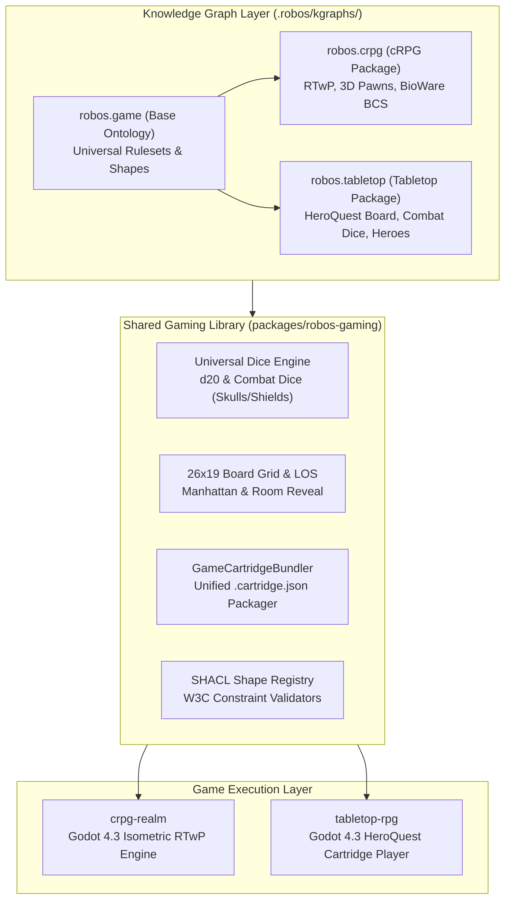

# RobOS Tabletop RPG & HeroQuest Engine
{: .no_toc }

*RobOS Tabletop RPG* is a turn-based tactical dungeon crawler engine and cartridge player modeled after the classic *HeroQuest* board game system. Built on Godot 4.3 and backed by the **`robos-gaming`** shared library and tri-package Knowledge Graph, it executes self-contained tabletop cartridges with automated 2d6 movement, authentic combat dice mechanics (Skulls & Shields), fog-of-war room reveals, and headless agent telemetry.
{: .fs-6 .fw-300 }

{: .robos-zoomable-img }
*Authentic 26×19 HeroQuest tactical dungeon board with outer perimeter corridors, central 4×5 chamber, and interconnected quadrant chambers.*

## Table of contents
{: .no_toc .text-delta }

1. TOC
{:toc}

---

## Technical Architecture

The RobOS Gaming ecosystem is engineered around a three-tier modular architecture spanning declarative semantic linked data, engine-agnostic shared libraries, and dedicated runtime players.

{: .robos-zoomable-img }
*Three-tier architecture diagram showing KGraph packages (game, crpg, tabletop), the shared robos-gaming library, and runtime engines.*

### Architecture Flow



---

## Core Tabletop Mechanics

### 1. Board Layout & Dimensions
* **Grid**: Exactly **26 columns × 19 rows** of square stone tiles.
* **Corridors**: Continuous 1-tile outer perimeter corridors plus inner corridors dividing the 4 quadrants.
* **Central Chamber**: A prominent 4×5 square chamber (columns 11–14, rows 7–11) where boss encounters and tombs reside.
* **Rooms**: 22 distinct rooms with ancient flagstone textures, closed wooden doors, and furniture props.

### 2. Turn Sequence
Each turn in the tabletop system progresses through disciplined phases:
1. **Hero Phase**:
   - **Roll Movement**: 2 standard six-sided dice (2d6) determine available movement squares.
   - **Move**: Navigate along corridors and open rooms within the rolled budget.
   - **Action**: One action per turn:
     - **Attack**: Strike an adjacent monster using Hero combat dice.
     - **Cast Spell**: Unleash one of the 12 elemental spells (Fire, Earth, Water, Air).
     - **Search for Treasure**: Loot the current room for gold chests or artifacts.
     - **Disarm Trap**: Clear pit or falling block traps (Dwarf special ability).
   - **Open Doors**: Stepping next to a closed door allows opening it, immediately lifting the fog of war and revealing all monsters and furniture inside.
2. **Morcar / Zargon Phase**:
   - All revealed monsters navigate toward the nearest heroes and strike with monster combat dice.

### 3. Combat Dice Mechanics
HeroQuest uses specialized 6-sided combat dice:
* **3 Skulls (50%)**: Attack Hits
* **2 White Shields (33.3%)**: Hero Defense Success
* **1 Black Shield (16.7%)**: Monster Defense Success

```
Wounds Inflicted = Max(0, Attack Skulls - Defense Shields)
```

---

## The Four Classic Heroes

| Hero | Body Points | Mind Points | Attack Dice | Defend Dice | Starting Gear & Traits |
|:---|:---:|:---:|:---:|:---:|:---|
| **Barbarian** | 8 | 2 | 3 | 2 | Broadsword (3 dice attack), Frontline powerhouse |
| **Dwarf** | 7 | 3 | 2 | 2 | Shortsword (2 dice attack), Innate ability to disarm traps |
| **Elf** | 6 | 4 | 2 | 2 | Shortsword (2 dice attack), 1 Elemental Spell College |
| **Wizard** | 4 | 6 | 1 | 2 | Dagger (1 die attack), 3 Elemental Spell Colleges (9 spells) |

---

## Standalone Cartridge Player

The tabletop player (`games/tabletop-rpg`) loads self-contained **`.cartridge.json`** game cartridges. 

### Launching the Game
```bash
# Interactive mode on your desktop
./games/tabletop-rpg/play.sh

# Autonomous Demonstration Mode (moves hero, opens doors, fights goblin, loots chest)
./games/tabletop-rpg/play.sh --auto-play

# Headless agent verification
./games/tabletop-rpg/play.sh --headless --auto-play --quit-after 160
```

### Automated Verification
```bash
# Run the Python cartridge verification suite
python3 games/tabletop-rpg/tests/test_tabletop_cartridge.py

# Run the shared gaming library tests
npm --prefix packages/robos-gaming test
```
