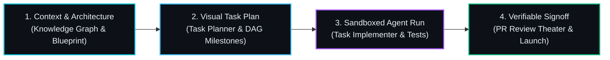

# RobOS Training Academy
{: .no_toc }

Master the AI-First SDLC Platform through hands-on, verifiable, project-driven courses. Whether you have never written a line of code or you are an enterprise Principal Architect, RobOS trains you to direct autonomous AI coding agents with total governance, zero workstation clutter, and rigorous proof-of-work.
{: .fs-6 .fw-300 }

## Table of contents
{: .no_toc .text-delta }

1. TOC
{:toc}

---

## The RobOS Learning Philosophy

Traditional coding bootcamps teach you how to manually type syntax, debug memory leaks, and memorize boilerplate libraries. But in the era of autonomous coding agents, **the bottleneck is no longer typing syntax—it is architecture, context, and review.**

RobOS transforms software engineering from exhausting code monkey labor into an **Executive Director / Lead Architect** workflow:
- **No Blind Trust**: You never accept code simply because an LLM claimed it works. Autonomous agents execute in disposable in-memory sandboxes, produce verifiable test scorecards, and generate 1080p narrated video proof-of-work.
- **Context Over Syntax**: You govern agents by curating schemas, contracts, and blueprints in the Knowledge Graph.
- **Flight Simulator Reviews**: Before changes are merged, you step through the PR Review Theater with interactive knowledge checks, living documentation deltas, and visual blast-radius diffs.

---

## Available Training Tracks

  <a class="rb-link" href="{{ '/training/for-non-developers/' | relative_url }}" style="border-left: 4px solid #00e5ff; background: rgba(0, 229, 255, 0.04);">
    

      <strong style="color: #00e5ff; font-size: 1.15rem;">🚀 Track 1: For Non-Developers — Building Games &amp; Software</strong>
      Live Now &bull; 7 Modules
    

    
      Zero coding required. Learn the Director Mindset, Context Engineering, and AI Generative Review-Based Development while building two real flagship projects from scratch: the <strong>getemgigs.com</strong> web app and the <strong>crpg-realm</strong> tactical video game.
    
  </a>

  

    

      <strong style="color: #e6edf3; font-size: 1.15rem;">📐 Track 2: Systems Architects — Dual-State Knowledge Graph Modeling</strong>
      Coming Soon
    

    
      Model enterprise microservices, OpenAPI 3.1 contracts, Protobuf stubs, and W3C SHACL shapes. Govern multi-repo blast radiuses before a single line of agent code is committed.
    
  

  

    

      <strong style="color: #e6edf3; font-size: 1.15rem;">🤖 Track 3: Agent Personas &amp; UHP Autonomous Harness Engineering</strong>
      Coming Soon
    

    
      Engineer custom developer agent personas, configure UHP gateways (Claude, Antigravity, Codex, Copilot), and calibrate token-saving IDE refactoring suites.
    
  

---

## How Our Courses Are Structured

Every module in the RobOS Academy follows a 4-part hands-on cadence:

1. **Context &amp; Architecture**: Understand the "why" and model the domain using schemas and templates rather than staring at blank text files.
2. **Visual Task Plan**: Break complex ambitions into small, testable chunks with visual dependencies in **Task Planner**.
3. **Sandboxed Agent Execution**: Watch autonomous AI agents execute tasks in clean ephemeral sandboxes with live logs and breakpoint pauses.
4. **Verifiable Signoff &amp; Launch**: Review 1080p narrated video proof-of-work, pass interactive knowledge checks in the **PR Review Theater**, and launch your app in Chrome or on the desktop!

---

## Start Learning Now

Ready to dive in? Jump into **[Track 1: For Non-Developers]({{ '/training/for-non-developers/' | relative_url }})** and see how easy it is to build games and apps with RobOS!
