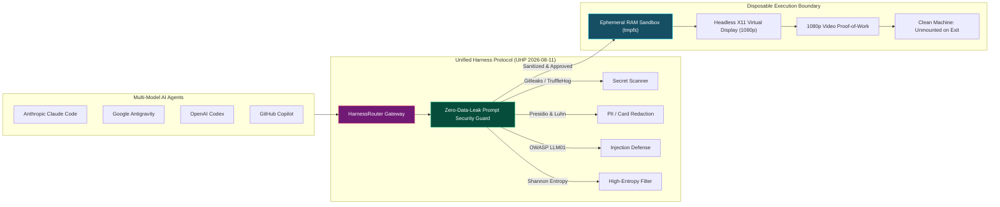

# Agent Harness Engineers: Autonomous Personas & UHP Governance
{: .no_toc }

Learn how to engineer high-velocity agent execution boundaries, route tasks across multi-model swarms with the Unified Harness Protocol (UHP), and enforce zero-data-leak prompt security.
{: .fs-6 .fw-300 }

## Table of contents
{: .no_toc .text-delta }

1. TOC
{:toc}

---

## The Engineering Mission: "Operation Safe Harbor"

Every platform engineering team wants to unleash the speed of autonomous AI coding agents (Anthropic Claude Code, Google Antigravity, OpenAI Codex, and GitHub Copilot). But giving an autonomous LLM raw terminal access to your company's repositories without a harness is asking for disaster:

- **Secret Leaks**: An agent accidentally prints an AWS private key or API token into its prompt context or task logs.
- **Machine Clutter**: An agent installs untracked global npm packages, alters local system dependencies, or deletes working directory files.
- **Prompt Injections**: Malicious content in user tickets or pull request comments hijacks agent behavior.
- **Vendor Lock-In**: Workflows are trapped inside a single proprietary AI vendor's ecosystem.

RobOS solves this with **The Autonomous Agent Governance Harness**. In this track, you will build **Operation Safe Harbor**—a hardened, vendor-neutral execution boundary built on the **Unified Harness Protocol (UHP `2026-08-11`)**, the **Zero-Data-Leak Prompt Security Guard**, and disposable **in-memory RAM sandboxes**.

  
  
<em>Figure: Unified Harness Protocol (UHP) Gateway &amp; Zero-Data-Leak Security Harness Architecture.</em>

---

## Core Tenets of Agent Harness Engineering

| Security Vulnerability | The RobOS Harness Solution |
|:---|:---|
| **Exposed Secrets & Keys**: Agents leaking credentials in prompts or logs. | **Pre-Flight Prompt Interception**: Zero-leak security scanning with regex, Luhn checksums, and Shannon entropy. |
| **Vendor Lock-In**: Code written only for specific agent APIs. | **Unified Harness Protocol**: Standardized UHP `2026-08-11` gateway routing across all models. |
| **Polluted File Systems**: Agents leaving zombie dependencies and files. | **Ephemeral In-Memory RAM Sandboxes (`tmpfs`)**: Zero residual files on disk after task completion. |
| **Blind Execution**: No visibility into agent screen interactions. | **1080p Video Proof-of-Work**: Headless Xvfb virtual framebuffers capturing complete test runs. |

---

## Course Curriculum

  <a class="rb-link" href="{{ '/training/agent-harness-engineering/01-unified-harness-protocol-architecture.html' | relative_url }}">
    

      01 - Unified Harness Protocol (UHP) Architecture
    

    

      Standardizing agent execution across Claude Code, Antigravity, OpenAI Codex, and Copilot. Routing tasks via self-hosted Docker gateways and embedded in-process runners.
    

  </a>

  <a class="rb-link" href="{{ '/training/agent-harness-engineering/02-zero-leak-prompt-security-guard.html' | relative_url }}">
    

      02 - Zero-Data-Leak Prompt Security Guard
    

    

      Configuring real-time prompt protection with Gitleaks, TruffleHog, Presidio PII recognition, Shannon entropy analysis, and OWASP LLM01 injection defense.
    

  </a>

  <a class="rb-link" href="{{ '/training/agent-harness-engineering/03-ephemeral-sandboxes-and-custom-personas.html' | relative_url }}">
    

      03 - Ephemeral Sandboxes &amp; Custom Agent Personas
    

    

      Creating zero-pollution tmpfs in-memory workspaces, configuring virtual displays with Xvfb, and calibrating specialized Agent Personas with token-saving IDE refactoring suites.
    

  </a>

---

## Ready to Secure Your Swarm?

Proceed to **[Unified Harness Protocol (UHP) Architecture]({{ '/training/agent-harness-engineering/01-unified-harness-protocol-architecture.html' | relative_url }})** to construct your first vendor-neutral agent routing gateway!
