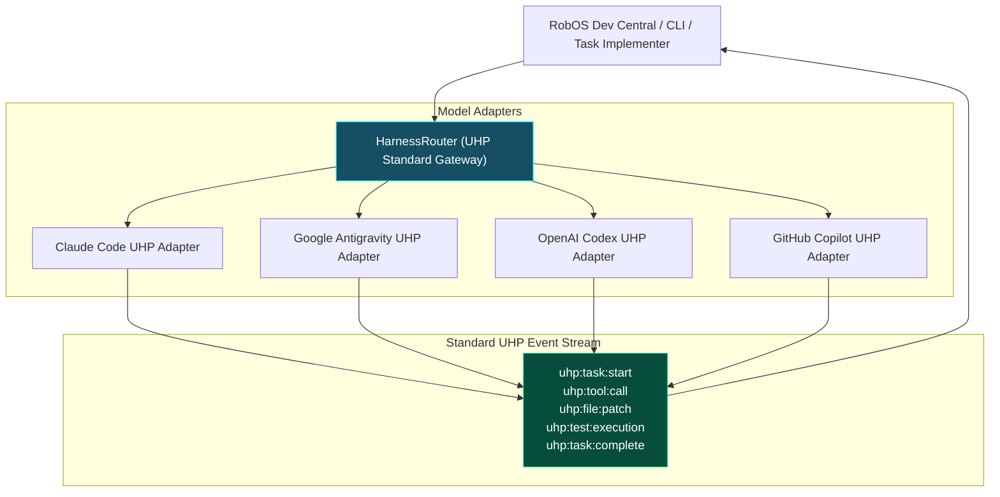

# 01 - Unified Harness Protocol (UHP) Architecture
{: .no_toc }

Learn how the Unified Harness Protocol (UHP `2026-08-11`) standardizes agent execution across Anthropic Claude Code, Google Antigravity, OpenAI Codex, and GitHub Copilot without proprietary cloud subscriptions or vendor lock-in.
{: .fs-6 .fw-300 }

## Table of contents
{: .no_toc .text-delta }

1. TOC
{:toc}

---

## The Trap of Proprietary Agent APIs

When autonomous coding agents first emerged, every AI lab released their own incompatible CLI and API wrapper:
- Anthropic released Claude Code with custom flags and slash commands.
- OpenAI introduced Codex CLI with distinct streaming response formats.
- Google built Antigravity with specialized context mechanisms.
- GitHub Copilot provided IDE-bound execution primitives.

For platform engineering teams, this fragmentation meant building brittle glue code that broke whenever an AI provider updated their SDK. Even worse, it created vendor lock-in.

---

## Enter the Unified Harness Protocol (UHP `2026-08-11`)

The **Unified Harness Protocol (UHP)** provides an open, vendor-neutral execution boundary. Developed as a 100% Free &amp; Open Source (Apache-2.0) standard, UHP treats autonomous agents as interchangeable computational engines.



### UHP Protocol Packet Specification

Every task dispatched through UHP conforms to a standardized JSON schema:

```json
{
  "uhpVersion": "2026-08-11",
  "taskId": "task-citadel-payment-retry",
  "persona": "urn:robos:persona:refactoring-surgeon",
  "targetRepo": "/var/workspaces/citadel",
  "branch": "feature/idempotent-retries",
  "routing": {
    "preferredEngine": "google-antigravity",
    "fallbackEngine": "anthropic-claude",
    "maxTokensPerTurn": 8192
  },
  "guardrails": {
    "promptSecurityPolicy": "block",
    "allowFileDeletion": false,
    "requireVideoProof": true
  },
  "context": {
    "kgraphNodes": [
      "urn:robos:service:billing-api",
      "urn:robos:contract:stripe-payment-v2"
    ]
  }
}
```

---

## Dual-Mode Runtime Architecture

RobOS supports two deployment options for UHP:

- **Self-Hosted Docker Gateway (`:3000`)**: An isolated container hosting the `HarnessRouter` HTTP/WebSocket server. Perfect for remote build clusters, enterprise CI/CD runners, and shared developer environments.
- **Embedded In-Process Runner (`EmbeddedHarnessRouter`)**: Zero-overhead in-memory execution inside the RobOS desktop shell. Allows agents to run locally on your laptop without configuring external Docker daemons.

### Dispatching a Task via UHP CLI

You can dispatch tasks to any agent engine using the uniform CLI:

```bash
# Dispatch a refactoring task through the UHP gateway
robos-harness dispatch \
  --engine google-antigravity \
  --task "Implement exponential backoff in billing webhook retries" \
  --workspace /var/workspaces/citadel \
  --security-mode block
```

The UHP gateway handles authentication, stream normalization, and lifecycle events while streaming live status to your interface.

---

## Up Next

Now that your agent routing layer is standardized, secure your agents against credential leaks and prompt injections in **[Zero-Data-Leak Prompt Security Guard]({{ '/training/agent-harness-engineering/02-zero-leak-prompt-security-guard.html' | relative_url }})**!
