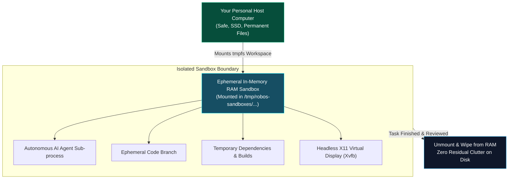

# 03 - Ephemeral Sandboxes & Custom Agent Personas
{: .no_toc }

Learn how to isolate autonomous agent execution in zero-pollution in-memory tmpfs cleanrooms, isolate virtual displays with Xvfb, and calibrate specialized developer agent personas.
{: .fs-6 .fw-300 }

## Table of contents
{: .no_toc .text-delta }

1. TOC
{:toc}

---

## The Threat of Machine Pollution

When you run an autonomous coding agent directly on your host operating system, you are granting an automated script broad write access to your machine:
- It might run `npm install -g` and overwrite critical system binaries.
- It might spawn orphaned background dev servers that hold ports open indefinitely.
- It might litter temporary cache files, `.DS_Store`, or untracked test databases across your disk.

RobOS eliminates machine pollution by running agents inside **Ephemeral In-Memory Sandboxes (`tmpfs`)**.



---

## How In-Memory RAM Sandboxes Work

A `tmpfs` sandbox is a file system stored completely in RAM:
- **Instant Speed**: File reads and writes occur at RAM bus speeds (tens of gigabytes per second), significantly accelerating npm installs and Rust builds.
- **Physical Isolation**: If an agent runs a runaway script, it is physically incapable of touching files outside its mounted temporary directory.
- **Atomic Teardown**: When the task is complete and merged (or rejected), the mount point is unmounted and the memory is freed instantly. Zero stray files remain.

### Isolated Virtual Framebuffers (Xvfb)

Many applications require a graphical display to test (Electron apps, Web browsers, Godot games). Running these directly on your desktop causes windows to pop up and steal your keyboard focus.

RobOS isolates graphical execution using **Xvfb (X Virtual Framebuffer)** and **Picom compositing**:
- Each sandbox is assigned an isolated virtual display (e.g., `:99`).
- The agent launches Chrome or Electron inside the virtual display.
- FFmpeg records the virtual screen at crisp 1080p 60fps, generating verifiable video proof without flashing windows across your monitor.

---

## Crafting Specialized Developer Agent Personas

In the Knowledge Graph (`.robos/kgraphs/organization/package.jsonld`), you can define specialized **Agent Personas** tailored for specific development scenarios.

Here is the declarative definition for **The Refactoring Surgeon**:

```json
{
  "@id": "urn:robos:persona:refactoring-surgeon",
  "@type": ["oslc_am:Resource", "robos:AgentPersona"],
  "schema:name": "The Refactoring Surgeon",
  "schema:description": "Optimized for large-scale AST refactoring, dead code elimination, and strict contract adherence with minimal token usage.",
  "robos:executionMode": "headless-tmpfs",
  "robos:maxTokensPerTurn": 4096,
  "robos:allowedTools": [
    "view_file",
    "replace_file_content",
    "grep_search",
    "run_command:test"
  ],
  "robos:forbiddenTools": [
    "run_command:rm",
    "run_command:curl"
  ],
  "robos:tokenOptimizationSuite": "ast-diff-only"
}
```

### Common Persona Profiles

- **The Non-Headless Developer**: Interacts with live desktop GUI windows, perfect for pairing with human designers and running visual exploratory tests.
- **The Refactoring Surgeon**: Stripped of web access and external network tools; equipped only with AST navigation and local tests to conserve tokens and prevent scope creep.
- **The Speed Demon**: Uses lightweight models for rapid file renames, documentation synchronization, and linting fixes.

---

## Summary & Next Steps

You have mastered:
- The Unified Harness Protocol (UHP `2026-08-11`) for vendor-neutral agent routing.
- The Zero-Data-Leak Prompt Security Guard for pre-flight credential and injection protection.
- Ephemeral in-memory RAM sandboxes and virtual display isolation.

Proceed to the next track: **[Senior Reviewers &amp; Tech Leads — Review-Based Development &amp; The PR Review Theater]({{ '/training/review-based-development/' | relative_url }})**!
