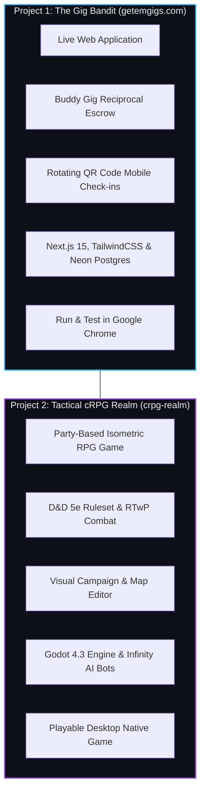

# For Non-Developers: Building Games & Software with RobOS
{: .no_toc }

A complete, hands-on, practical course for creators, designers, product managers, and visionaries who want to build real-world software and video games without writing code by hand.
{: .fs-6 .fw-300 }

## Table of contents
{: .no_toc .text-delta }

1. TOC
{:toc}

---

## Welcome to the Director's Chair

If you have tried using AI chatbots like ChatGPT or Claude in a web browser to build an app, you probably experienced the classic **"AI Honeymoon Crash"**:
1. You ask the chatbot for an app. It gives you 500 lines of Python or JavaScript.
2. You paste it into a file, run it, and get a red error.
3. You paste the error back to the chatbot. It apologizes, rewrites half the code, breaks three other things, and suddenly asks you to install six terminal tools you've never heard of.
4. After three hours, your machine is full of phantom dependencies, your project is a tangled mess, and you give up.

**RobOS fixes this entirely.**

In RobOS, you do not write code, and you do not copy-paste terminal errors. Instead, you step into the role of **Lead System Architect & Executive Director**. You provide the vision, curate the blueprints, define the rules, and review verified proof-of-work. Autonomous AI coding agents carry out the grueling background labor in isolated, disposable sandboxes that can never pollute your computer.

  
  
<em>Figure 1: The 4-Phase RobOS Non-Developer Application &amp; Game Building Lifecycle.</em>

---

## The Three Core Pillars You Will Master

### 1. RobOS: Your Autonomous Engineering Crew & Cleanroom
RobOS is not just an IDE—it is an autonomous agent governance harness. When an AI agent writes code for you, it runs inside an **ephemeral in-memory sandbox (`tmpfs`)** with a virtual screen (Xvfb). The agent cannot leak your personal files, cannot mess up your system, and cannot leave phantom background processes running. If an experiment goes wrong, the sandbox simply vanishes.

### 2. Context Engineering: The Art of the Blueprint
In the old days of programming, you had to learn syntax (semicolons, variable scopes, memory allocation). In the AI era, typing code is a commodity. What matters is **Context Engineering**:
- Defining what the application does in unambiguous terms.
- Curating data models, visual maps, and user rules in the **Knowledge Graph**.
- Using **Task Planner** interactive web forms so the AI has structured boundaries instead of vague guesses.

### 3. AI Generative Review-Based Development
When an agent finishes building a feature, you don't just "hope it works". RobOS enforces **Review-Based Development**:
- **Automated 1080p Video Proof-of-Work**: The agent boots up the app in a virtual screen, clicks buttons, plays through the level, and records a narrated video proving it works.
- **Flight Simulator Knowledge Checks**: The **PR Review Theater** gives you an interactive 60-second walkthrough and quiz to ensure you understand how the piece fits into your vision.
- **Visual Blast-Radius Checks**: You see exactly what changed before approving the merge.

---

## The Two Flagship Projects You Will Build

To make this training real and practical, you will follow the exact creation journey of two flagship RobOS projects:

1. **Project 1: `getemgigs.com` (Live Production Web App)**
   - The mission: Help local indie rock bands eliminate predatory pay-to-play venues through **Buddy Gigs** (reciprocal deposit escrow) and phone-scanned QR door codes.
   - What you'll learn: How to onboard a web app in the App Wizard, break down milestones in Task Planner, watch agents scaffold Next.js 15 and database routes, and test the rotating QR check-in directly in Google Chrome.

2. **Project 2: `crpg-realm` (Playable Tactical Video Game)**
   - The mission: Build a classic party-based tactical isometric RPG inspired by Baldur's Gate and Dragon Warrior.
   - What you'll learn: Using the visual Campaign Editor to paint 2560x1440 maps, create D&D 5e character sheets (Paladins, Rogues, Clerics), place Infinity Engine traps, and watch autonomous AI bots play through the game to verify victory conditions before launching in Godot 4!

---

## Complete Curriculum Modules

  <a class="rb-link" href="{{ '/training/for-non-developers/01-director-mindset-and-context-engineering.html' | relative_url }}">
    <strong>1. The Director Mindset &amp; Context Engineering</strong>
    Why prompt-and-pray fails, how Context Engineering replaces syntax, and the Review-Based Development feedback loop.
  </a>

  <a class="rb-link" href="{{ '/training/for-non-developers/02-onboarding-your-app.html' | relative_url }}">
    <strong>2. Onboarding Your App in App Wizard</strong>
    Greenfield scaffolding vs brownfield ingestion, picking application archetypes (Web App vs PC Game), and Knowledge Graph registration.
  </a>

  <a class="rb-link" href="{{ '/training/for-non-developers/03-visual-task-planning.html' | relative_url }}">
    <strong>3. Visual Project &amp; Task Planning</strong>
    Using Task Planner interactive template forms, decomposing dreams into DAG task trees, and syncing to GitHub issues.
  </a>

  <a class="rb-link" href="{{ '/training/for-non-developers/04-task-implementer-and-sandboxes.html' | relative_url }}">
    <strong>4. Autonomous Task Implementation &amp; Sandboxes</strong>
    Driving agents in the Task Implementer, ephemeral tmpfs sandboxes, breakpoint debugging for non-developers, and passing test suites.
  </a>

  <a class="rb-link" href="{{ '/training/for-non-developers/05-project-getemgigs-web-app.html' | relative_url }}">
    <strong>5. Project 1: Building getemgigs.com (Web App to Chrome)</strong>
    Step-by-step case study: from idea prompt to a live, working web app running in Google Chrome with rotating QR check-ins.
  </a>

  <a class="rb-link" href="{{ '/training/for-non-developers/06-project-crpg-realm-game.html' | relative_url }}">
    <strong>6. Project 2: Building crpg-realm (Your First Video Game)</strong>
    Step-by-step case study: visually designing maps, characters, quests, and traps in Campaign Editor, and playing in Godot 4.
  </a>

  <a class="rb-link" href="{{ '/training/for-non-developers/07-review-theater-and-running-apps.html' | relative_url }}">
    <strong>7. The Review Theater &amp; Running Your Creations</strong>
    The ultimate quality gate: 1080p video proofs, knowledge checks, and launching desktop apps, web URLs, and game builds.
  </a>

---

Ready to begin? Let's dive into **[Module 1: The Director Mindset &amp; Context Engineering]({{ '/training/for-non-developers/01-director-mindset-and-context-engineering.html' | relative_url }})**!
