# Module 1: The Director Mindset & Context Engineering
{: .no_toc }

Learn why you don't need to write code to build software, how Context Engineering replaces syntax memorization, and why non-developers make world-class Lead System Architects.
{: .fs-6 .fw-300 }

## Table of contents
{: .no_toc .text-delta }

1. TOC
{:toc}

---

## The Great Shift: From Typist to Director

For fifty years, building software required one mandatory skill: **typing cryptic syntax into a text editor without making a typo.** If you missed a semicolon on line 412, the entire program crashed. Because computers were completely unforgiving, developers spent 90% of their careers memorizing syntax rules, package managers, and compiler flags.

Autonomous AI agents (Claude, OpenAI Codex, Google Gemini CLI, Copilot) have completely flipped this equation. AI agents can write 100 lines of error-free syntax in four seconds. **Typing code is now free.**

So what is the bottleneck today? **Direction, context, and review.**

Think of building an app like directing a feature film:
- A film director doesn't operate every camera, stitch every costume, or solder the lighting wires.
- The director holds the **vision**. They approve the script, set the emotional tone, review the daily footage ("dailies"), and demand reshoots when a scene doesn't feel right.

In RobOS, **you are the Director**. The AI agents are your hyper-fast technical production crew. Your job is not to write code—your job is to make sure what gets built matches your vision, passes its tests, and never breaks your machine.

---

## Why "Chatting in a Browser" Fails (Chatbot Chaos)

Almost everyone who tries building an app with an LLM in a web chat window hits the same brick wall. Why does this happen?

```mermaid
flowchart TD
    subgraph BrowserChaos ["The Fragile Browser Chat Loop"]
        B1["User asks chat window: 'Make me an app'"] --> B2["AI pastes 600 lines of raw code"]
        B2 --> B3["User copies into local text file"]
        B3 --> B4["Local terminal crashes with cryptic error"]
        B4 --> B5["User pastes error back to AI"]
        B5 --> B6["AI apologizes, rewrites everything & breaks 3 new files"]
        B6 --> B4
    end

    subgraph RobOSGovernance ["The RobOS Context-Engineered Loop"]
        R1["User defines visual blueprint in Task Planner"] --> R2["RobOS provisions disposable tmpfs sandbox"]
        R2 --> R3["Agent writes code, tests & 1080p video proofs inside sandbox"]
        R3 --> R4["PR Review Theater verifies behavior & runs knowledge check"]
        R4 --> R5["User approves with 1-click & runs creation"]
    end
    
    style BrowserChaos fill:#161b22,stroke:#f85149,stroke-width:2px,color:#e6edf3
    style RobOSGovernance fill:#0d1117,stroke:#00e5ff,stroke-width:2px,color:#e6edf3
```

When you chat with an AI in a generic web browser:
1. **Zero Context**: The AI does not know what operating system you are on, what files already exist, or what packages are installed. It is guessing in the dark.
2. **Zero Execution**: The AI cannot actually run the code it wrote. It hallucinates that the code works, but has never executed a single test.
3. **Machine Pollution**: When you follow its instructions, you end up installing mismatched packages, polluting your global system, and creating security hazards.

---

## What is Context Engineering?

If writing code is dead, what replaces it? **Context Engineering.**

Context Engineering is the practice of giving autonomous AI agents the exact boundaries, data structures, and acceptance criteria they need so they can succeed on the first try without guessing.

Think of it like hiring a contractor to remodel your kitchen:
- **Bad Prompting**: "Hey, make me a nice modern kitchen." *(The contractor guesses, knocks down the wrong wall, and installs neon purple cabinets.)*
- **Context Engineering**: Handing the contractor an architectural blueprint, a list of electrical outlet locations, dimensions for the refrigerator, and tile swatches.

In RobOS, Context Engineering consists of four concrete things:

| Element | What It Is | How Non-Developers Control It |
|:---|:---|:---|
| **1. Application Archetype** | The foundational skeleton of your project (e.g. Next.js Web App, Godot PC Game, Electron Desktop Tool). | Selected with 1 click in the **App Wizard**. |
| **2. Knowledge Graph Model** | The dictionary of concepts your app understands (e.g., "A Band has Gigs; Gigs have Escrow Deposits; QR codes rotate every 30 seconds"). | Curated visually in **Knowledge Graph Explorer** and **Schema Studio**. |
| **3. Visual Task Plan** | The step-by-step assembly sequence arranged in a Directed Acyclic Graph (DAG). | Built using interactive web forms in **Task Planner**. |
| **4. Acceptance Criteria** | How we prove the feature works (e.g. "When Sir Caleb picks up The Hero's Sword, his attack increases by +3 and a victory fan-fare plays"). | Defined in plain English BDD scenarios. |

---

## The 4-Phase RobOS Building Lifecycle

Here is the exact lifecycle you will follow for every game, tool, or website you create in this course:

  
  
<em>Figure 1.1: The 4-phase non-developer development lifecycle in RobOS.</em>

1. **Phase 1: App Onboarding &amp; Archetypes**  
   You open the **App Wizard**, choose what you are building (Web App, Game, or Desktop App), give it a name, and register it to the Knowledge Graph. RobOS scaffolds the full project structure automatically.
2. **Phase 2: Visual Task Planning**  
   You open **Task Planner** and describe your features through structured web forms. RobOS generates an ordered plan of bite-sized milestones and syncs them to GitHub issues.
3. **Phase 3: Autonomous Implementation in Sandboxes**  
   You trigger the **Task Implementer**. The agent spins up a clean, disposable in-memory sandbox (`tmpfs`), writes the code, runs automated tests, and even allows you to pause at a breakpoint to see what the app looks like mid-build.
4. **Phase 4: Review Theater &amp; Running Your Creations**  
   You open the **PR Review Theater**. You watch a 1080p video of the agent running your app, answer a quick 60-second knowledge check, approve the merge, and launch your creation in Google Chrome or on your desktop!

---

## Quick Knowledge Check

Before moving to Module 2, test your understanding:

> [!TIP]
> **Q: What is the primary role of a creator in the RobOS workflow?**  
> **A:** You act as the **Lead System Architect & Director**. You provide the blueprint, curate the context, and review the verified proof-of-work, while autonomous AI agents handle the code synthesis.

> [!NOTE]
> **Q: Why does RobOS run agent tasks in ephemeral `tmpfs` sandboxes?**  
> **A:** To ensure total safety and zero machine pollution. Agents can build and test packages without leaving rogue processes, conflicting dependencies, or sensitive file leaks on your actual operating system.

---

Ready for Step 1 of the building lifecycle? Proceed to **[Module 2: Onboarding Your App in App Wizard]({{ '/training/for-non-developers/02-onboarding-your-app.html' | relative_url }})**!
