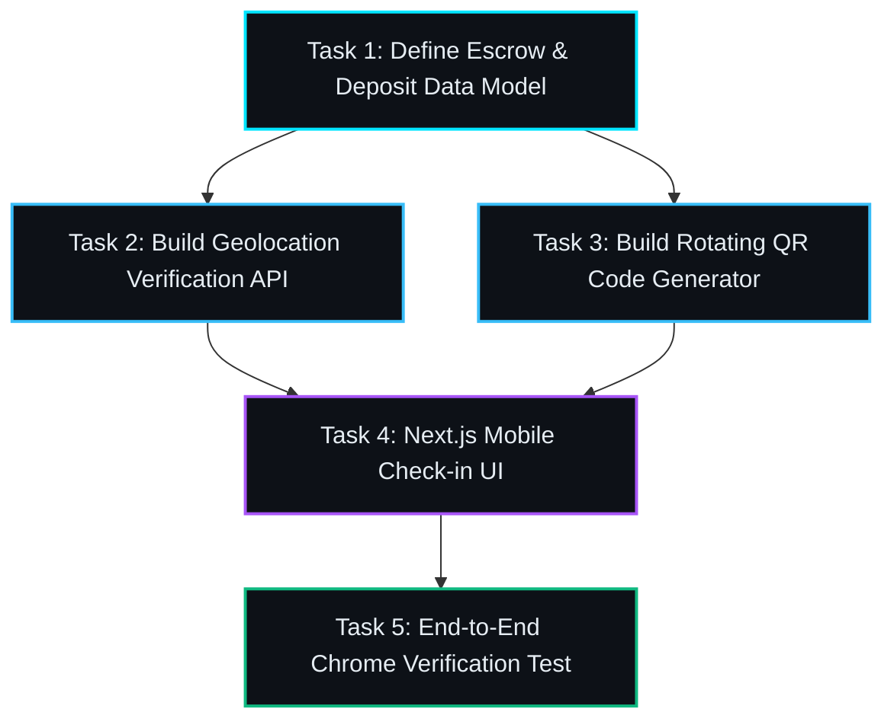

# Module 3: Visual Project & Task Planning
{: .no_toc }

Step 2 of the lifecycle: How to convert raw ideas into structured milestones in Task Planner, resolve design questions with interactive web forms, build a DAG task graph, and sync to GitHub Issues.
{: .fs-6 .fw-300 }

## Table of contents
{: .no_toc .text-delta }

1. TOC
{:toc}

---

## Why Giant Prompts Make AI Agents Explode

When beginners first use AI tools, they almost always write a massive, unstructured paragraph like this:

> *"Build me a complete fantasy role-playing game with five dungeons, an inventory system, a trading shop, sixteen magic spells, real-time combat, audio sound effects, and a boss fight."*

What happens when an AI agent gets a prompt like that?
- The agent gets completely overwhelmed.
- It tries to write 5,000 lines of code across twelve files all at once.
- It forgets half the requirements, invents fake functions that don't exist, and crashes midway through.

In human engineering, nobody builds a skyscraper by telling a construction crew "build a building". You create an architect's blueprint, pour the foundation first, frame the floors, install the plumbing, wire the electricity, and inspect each stage before moving to the next.

In RobOS, this architectural blueprint is created in **Task Planner** (`packages/task-planner`).

---

## The 4-Stage Task Planning Workflow

Let's inspect the exact screens from our automated test runs to see how Task Planner turns ideas into structured, bite-sized tasks.

### 1. The Prompt Modal & Context Sources

When you open Task Planner, you click **New Project Plan**. The prompt modal lets you describe what you want in simple English, attach Knowledge Graph nodes, and pick context sources.

  
  
<em>Screenshot 3.1: Entering your feature goals and selecting context sources in Task Planner.</em>

Notice the `@-search` feature: You can type `@getemgigs` or `@crpg-realm` to immediately link existing database tables, map scenes, or API contracts.

---

### 2. The Clarification Questionnaire (Interactive Forms)

AI agents often make assumptions when requirements are vague. To prevent bad assumptions, Task Planner includes an **Interactive Clarification Questionnaire**.

  
  
<em>Screenshot 3.2: Answering multiple-choice design decisions instead of writing essays.</em>

Instead of forcing you to write essays, the planner asks targeted multiple-choice questions:
- *"Do you want rotating QR check-in codes with 30-second expiry, or static venue barcodes?"*
- *"Should the trap trigger when stepped on, or allow a Rogue perception check first?"*
- *"Should the hero character start with Full Plate armor or Leather armor?"*

You click the option you want, and the planner immediately factors your design decisions into the architectural plan.

---

### 3. Reviewing the Milestone Proposal

Next, Task Planner synthesizes a comprehensive **Plan Proposal**.

  
  
<em>Screenshot 3.3: Reviewing the generated plan proposal and task breakdowns.</em>

The plan organizes your feature into logical milestones:
- **Milestone 1: Core Data Models &amp; Schemas**
- **Milestone 2: Backend Logic &amp; Verification Tests**
- **Milestone 3: User Interface &amp; Interactive Controls**
- **Milestone 4: End-to-End Verification &amp; Walkthrough**

---

### 4. The Directed Acyclic Graph (DAG) View

How does an AI agent know what order to build things in?
In Task Planner, every task has explicit dependencies arranged in a **Directed Acyclic Graph (DAG)**.

  
  
<em>Screenshot 3.4: Visual DAG dependency graph ensuring tasks execute in logical order.</em>

Because of this graph:
- The agent cannot try to build the UI before the data model exists.
- Tasks that are independent (like Tasks 2 and 3) can even be worked on by multiple AI agents in parallel!

---

### 5. Instant Sync to GitHub Issues

Once you are satisfied with the plan, you click **Sync to Project**.

  
  
<em>Screenshot 3.5: All tasks converted into tracked GitHub Issues with a single click.</em>

Without ever touching git commands or logging into a browser, Task Planner creates real GitHub Issues with labels, acceptance criteria, and dependency links.

---

## Best Practices for Non-Developer Task Planning

> [!TIP]
> **Keep Tasks Under 30 Minutes of Agent Work**: A task like "Implement Hero's Sword weapon and ground pickup trigger" is easy for an agent to build and test cleanly. A task like "Build the entire inventory and economy system" is too broad and should be split into 3 sub-tasks.

> [!NOTE]
> **Define Clear "Done When" Statements**: In Task Planner's criteria box, specify observable behavior:
> - *"Done when: Clicking 'Generate QR' displays an SVG QR code that updates its hash every 30 seconds."*
> - *"Done when: Stepping onto the trap tile with a rogue triggers an automatic WIS check line in the action log."*

Now that your project blueprint is locked and loaded, let's watch the autonomous agents actually build it!

Proceed to **[Module 4: Autonomous Task Implementation &amp; Sandboxes]({{ '/training/for-non-developers/04-task-implementer-and-sandboxes.html' | relative_url }})**!
