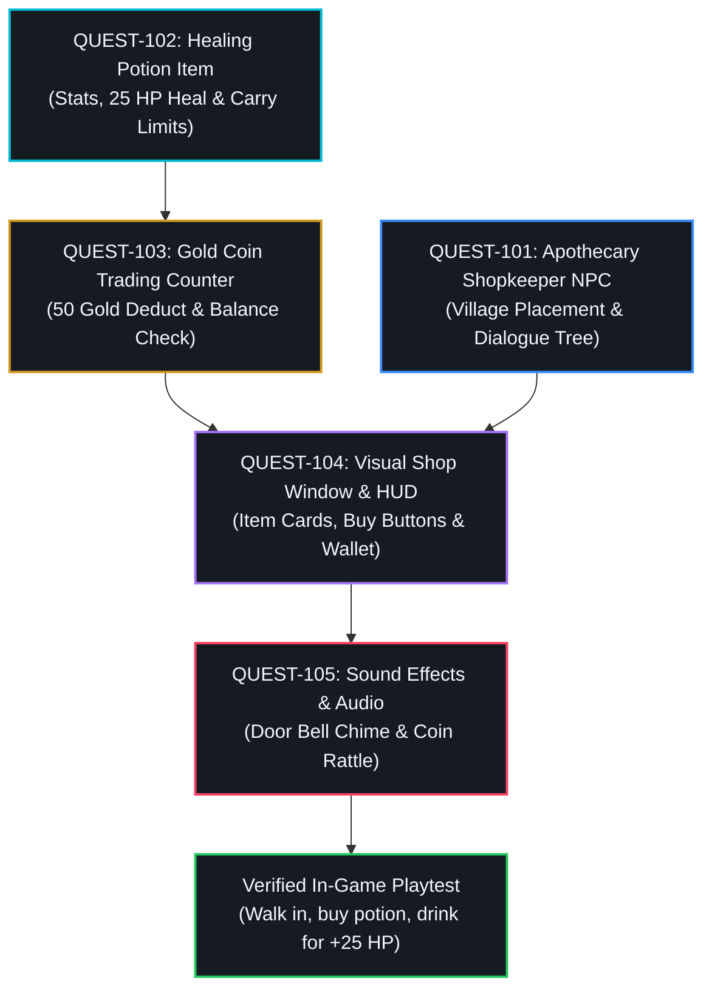

# Visual Project & Task Planning
{: .no_toc }

From raw ideas to structured blueprints in Task Planner: resolve gameplay design decisions with interactive forms, understand dependency flowcharts, and turn concepts into visual project cards.
{: .fs-6 .fw-300 }

## Table of contents
{: .no_toc .text-delta }

1. TOC
{:toc}

---

## Why Giant Prompts Make AI Agents Explode

When beginners first experiment with AI tools, they almost always write a massive, sprawling paragraph like this:

> *"Build me a complete 2D fantasy adventure game with three towns, a dungeon, an inventory system, a trading shop, sixteen magic spells, real-time sword combat, sound effects, and a dragon boss fight."*

What happens when an autonomous AI agent receives a prompt like that?

- **Context Overload**: The agent tries to juggle hundreds of unrelated concepts in its working memory all at once.
- **The Cluttered Kitchen Countertop**: Imagine a chef trying to cook a seven-course banquet on a tiny counter, chopping fish on top of birthday cake frosting. Bowls spill, salt pours into the cream, and the meal is ruined.
- **Context Rot**: Halfway through writing the inventory system, the agent forgets what rules it set for player health or sword damage.
- **Hallucinations & Ghost Helpers**: When the agent gets confused, it invents imaginary helper functions that do not exist, runs into errors, panics, and leaves you with an unplayable mess.

In construction, nobody builds a house by shouting *"build a two-story home"* at a team of carpenters and walking away. An architect draws blueprints. The crew pours concrete for the foundation first, frames the timber walls second, installs the plumbing and electrical wires third, hangs the drywall fourth, and finally paints the rooms and arranges the furniture. Each phase is inspected and approved before the next begins.

In RobOS, you act as the **Lead Architect**. You never have to write programming code or memorize cryptic terminal commands. Instead, you design the blueprint visually in **Task Planner** (`packages/task-planner`), breaking large dreams into small, bite-sized tasks that autonomous agents can build without breaking a sweat.

---

## The Anatomy of a Perfect Work Card (Task)

Before launching the planner, let's understand what makes a task succeed when an autonomous AI agent builds it. Every high-performing task is like a clear recipe card:

| Component | Everyday Purpose | Video Game Example (`Realm Quest: Village Potion Shop`) |
|:---|:---|:---|
| **Concise Title** | A short, unmistakable action label | `QUEST-102: Healing Potion Item & Inventory Bag` |
| **Player Story (Why)** | Why this feature matters to the player | *As an injured hero, I want to drink a red potion from my belt bag so I can restore health during battle.* |
| **Acceptance Criteria (Proof)** | Clear, testable proof that anyone can verify | *Clicking the potion item in the backpack restores +25 Health Points (HP) and reduces potion quantity by 1.* |
| **Guardrails (Out of Scope)** | Clear boundaries on what the agent must NOT touch | *Do not modify the dragon boss stats, change shopkeeper dialogue, or redesign the overworld terrain.* |

Notice that the acceptance criteria are written in observable, everyday language. You do not need to know what programming language or game engine is running behind the scenes. You only need to describe what you expect to see on the screen when the feature is working.

---

## The Step-by-Step Task Planning Workflow

Let's walk through the exact screens captured from our automated test runs to see how Task Planner turns an everyday feature idea into an organized project blueprint.

### Describing Feature Goals & Using the Project Pantry

When you open Task Planner, select your project from the sidebar and describe what you want to build in everyday language:

<div style="margin: 1.5rem 0;">
  
  <p style="text-align: center; color: #8b949e; font-size: 0.85rem; margin-top: 0.5rem;"><em>Entering plain-English game feature goals into the multi-line AI textarea in Task Planner.</em></p>
</div>

Notice how clean and natural the prompt is:
- **Village Potion Shop**: An interactive shop in the town square run by an apothecary NPC.
- **Healing Potions & Elixirs**: Items that restore health points (HP) when used from the inventory bag.
- **Gold Coin Economy**: Heroes earn gold from quests and spend 50 gold coins to buy potions.
- **NPC Dialog Interaction**: Walk up to the shopkeeper to open a chat bubble and trade window.
- **Sound Effects & Music**: Cheerful shopkeeper greeting chime and item purchase sound effect.

> [!TIP]
> **The Project Pantry (`@-search`)**  
> Notice the `@-search` feature inside the textarea. When working on an existing game or website, you do not need to retype what your character's stats are or where the village square is located. You can simply type `@village-scenes` or `@items-catalog`. Task Planner pulls the verified data rules directly from your project's Knowledge Graph, just like grabbing pre-measured ingredients from your kitchen pantry!

---

### Interactive Clarification Forms (No Essay Writing)

When humans build software, the hardest part is rarely writing the code—it is making design decisions. What happens when a player drinks a potion? How do they talk to the shopkeeper? 

Traditional AI tools force you into an exhausting game of 20 questions, typing back and forth for an hour. Task Planner solves this with the **Interactive Clarification Form**:

<div style="margin: 1.5rem 0;">
  
  <p style="text-align: center; color: #8b949e; font-size: 0.85rem; margin-top: 0.5rem;"><em>Answering targeted multiple-choice design questions without writing essays.</em></p>
</div>

Instead of demanding technical answers, Task Planner presents intuitive multiple-choice options:
- *"How should hero characters interact with the village apothecary shopkeeper?"*
  - **Proximity Pop-Up & Comic Chat Bubble (Recommended)**: Walking near the merchant shows an 'E - Talk' prompt and opens a comic chat bubble above their head.
  - **Full-Screen Visual Novel Dialog Window**: Pauses gameplay and slides up character portraits with branching dialogue choices.
  - **Automatic Open on Tile Collision**: Stepping onto the shop threshold tile immediately opens the buy/sell merchant screen.

You click the choice that matches your creative vision, and the AI incorporates your decision directly into the technical blueprint.

---

### Reviewing the Bite-Sized Task Breakdown

Once you answer the clarification questions, Task Planner synthesizes a complete **Milestone Task Breakdown**:

<div style="margin: 1.5rem 0;">
  
  <p style="text-align: center; color: #8b949e; font-size: 0.85rem; margin-top: 0.5rem;"><em>Reviewing the generated task cards, effort allocations, and assigned specialist agent personas.</em></p>
</div>

Notice how the AI has organized the feature into logical, focused work items:
- **Epic: Village Potion Shop & Adventure Quest System**: The master umbrella card grouping all related work.
- **QUEST-101: Apothecary Shopkeeper NPC & Dialog Tree**: Setting up the character sprite and greeting conversation.
- **QUEST-102: Healing Potion Item & Inventory Bag**: Defining the item stats, healing amount (+25 HP), and backpack icon.
- **QUEST-103: Gold Coin Economy & Trading Counter**: The transaction logic that checks player gold and deducts 50 coins upon purchase.
- **QUEST-104: Visual Shop Window & Inventory HUD**: The on-screen merchant menu with clickable buy buttons.
- **QUEST-105: Sound Effects & Cheerful Greeting Audio**: Adding the audio chime, coin rattle, and potion sipping sound.

Notice the **Assigned Agent Personas**: Task Planner automatically routes each task to the right digital specialist. Narrative dialogue goes to the Story Writer, visual menus go to the UI & Screen Artist, and item math goes to the Game Systems Developer.

---

### The Dependency Flowchart (Directed Acyclic Graph)

How does an autonomous agent know what order to build things in? Why can't it start with the visual buy button on day one?

Think about baking a cake:
- You cannot frost a cake before baking the sponge.
- You cannot bake the sponge before mixing the flour, eggs, and sugar.
- But while the sponge is baking in the oven, another person can whip the cream and chop fresh strawberries in parallel!

In software engineering, this logical sequence is called a **Directed Acyclic Graph (DAG)**. That sounds like intimidating mathematical jargon, but the concept is wonderfully simple:
- **Directed**: The work flows in one clear forward direction (from foundation to polish).
- **Acyclic**: There are **no circular loops** (Task A never gets stuck waiting for Task B while Task B is waiting for Task A).
- **Graph**: A visual flowchart connecting prerequisites together.

Here is the dependency graph for our Village Potion Shop in Task Planner:

<div style="margin: 1.5rem 0;">
  
  <p style="text-align: center; color: #8b949e; font-size: 0.85rem; margin-top: 0.5rem;"><em>Interactive task dependency flow ensuring tasks execute in logical sequence without deadlocks.</em></p>
</div>

<div style="margin: 2rem 0;">
  
  <p style="text-align: center; color: #8b949e; font-size: 0.85rem; margin-top: 0.5rem;"><em>Architectural task dependency schematic: prerequisites unlock downstream tasks in an unstoppable flow.</em></p>
</div>

Here is the exact dependency structure represented as a flow diagram:



### The Magic of Parallel Sandboxes

Look closely at the top of the flowchart. **QUEST-102** (creating the potion item) and **QUEST-101** (writing the shopkeeper's dialogue) do not depend on each other at all!

In traditional software development, a solo developer would build one task on Monday, the second on Tuesday, and the third on Wednesday. 

In RobOS, the harness detects that these tasks are independent. It can spawn **two autonomous agents simultaneously**, running each in an isolated in-memory sandbox. Agent A builds the potion item in its sandbox while Agent B writes the shopkeeper dialogue in a separate sandbox. Once both finish and pass their tests, their verified changes merge together into **QUEST-104** (the visual shop window).

---

### Syncing Tasks to Your Visual Project Board

Once you are thrilled with your plan, click **Sync All to Server**:

<div style="margin: 1.5rem 0;">
  
  <p style="text-align: center; color: #8b949e; font-size: 0.85rem; margin-top: 0.5rem;"><em>All tasks published as tracked work cards with ticket badges (#101, #102, #103) on your visual board.</em></p>
</div>

Every card receives a green ticket badge (`#101`, `#102`, `#103`, etc.).

> [!NOTE]
> **What Is an "Issue" in Software? (It's Not a Bug!)**  
> In everyday conversation, an "issue" sounds like a problem, glitch, or headache. But in software development:
> - An **"Issue" is simply a digital index card or sticky note** on a visual project board (just like a card on Trello, Asana, or a refrigerator chore chart).
> - Each card lists the instructions, rules, and acceptance criteria for one specific task.
> - Programmers historically tracked these on **GitHub** (the online cloud locker for software projects, like Google Drive or Dropbox for code). 
> - In RobOS, you never need to visit GitHub or manually manage spreadsheets—Task Planner automatically creates, links, and organizes these visual work cards for you!

---

## Directing Agents Like an Executive

As a non-developer using RobOS, your job is not to write code or tweak configuration files. Your role is like an **Executive Producer** on a movie set or a **Lead Game Director**:

1. **You set the vision**: You write plain-English goals and select design options in the clarification form.
2. **You inspect the blueprint**: You ensure tasks are bite-sized, logically sequenced, and free of circular blockers.
3. **The agents do the heavy lifting**: The AI harness checks out temporary scratchpad drafts (`branches`) and writes the code inside isolated cleanrooms (`sandboxes`).
4. **You review the proof**: When an agent finishes a task, it doesn't just hand you raw code; it delivers a narrated 1080p video walkthrough demonstrating the working feature. You watch the video, verify the acceptance criteria, and approve the work.

---

## Hands-On Guided Lab: The Village Blacksmith Forge

To cement your understanding, let's practice planning a second feature for our fantasy adventure game.

### The Challenge
We want to add a **Blacksmith Forge** where heroes can craft an **Iron Sword** for 100 gold coins and 2 iron ores.

### Step 1: Open Task Planner
Open Task Planner from the RobOS App Launcher and select `🗡️ Realm Quest: The Village Potion Shop`.

### Step 2: Draft the Plain-English Feature Goals
In the prompt textarea, type:

```
Add a Blacksmith Forge to the village square:
- Blacksmith Goran NPC: A burly dwarf blacksmith standing near his anvil with a forge fire animation.
- Iron Sword Weapon Item: An equippable sword that grants +5 Attack damage to the hero.
- Crafting Transaction Counter: Deducts 100 gold coins and 2 iron ores from player inventory to forge the sword.
- Blacksmith Dialogue & Anvil Clang: Sound effect of hammer striking metal upon successful crafting.
```

### Step 3: Answer the Clarification Questionnaire
When prompted:
- *How should sword crafting work if the player lacks enough iron ore?*
  - Select: **Show Missing Materials in Red with Helpful Hint** (*"You need 2 Iron Ore from the Northern Mines"*).
- *Can the hero equip the sword immediately after forging?*
  - Select: **Prompt to Auto-Equip Immediately** with current stats comparison.

### Step 4: Inspect the Dependency Graph
Verify that the generated task tree flows in the correct logical sequence:
- **Prerequisite 1**: `Iron Sword Item Definition & Stats (+5 ATK)`
- **Prerequisite 2**: `Blacksmith Goran NPC Sprite & Village Placement`
- **Downstream 1**: `Forge Crafting Logic (100 Gold + 2 Ore Check)`
- **Downstream 2**: `Anvil Hammer Clang Sound FX & Sparks Animation`
- **Final Verification**: `Automated Playtest (Gather ore, visit Goran, craft Iron Sword, verify +5 ATK in HUD)`

### Step 5: Sync to Project Board
Click **Sync All to Server**! Your work cards are now published and ready for autonomous agent execution.

---

## Common Traps to Avoid

When planning features with autonomous AI agents, keep these practical lessons in mind:

- **The Omnibus Card Trap**: Never bundle five different features into a single task card. If a task says *"Build the inventory, the potion shop, the magic spells, and the boss battle"*, the agent will choke. Keep each card focused on one observable capability.
- **The Missing Acceptance Checklist**: Always include clear, observable proof. Instead of writing *"Make the shop good"*, write *"Clicking the 50 Gold potion card deducts 50 coins and adds 1 Healing Potion to inventory"*.
- **Circular Blockers**: Ensure work flows in one direction. Task A cannot require Task B if Task B requires Task A. Task Planner automatically checks for this and displays the **Acyclic Verified ✓** badge.

---

## What Comes Next?

Now that your project blueprint is locked, loaded, and synced as visual cards on your board, it is time to watch autonomous agents actually build your game!

Proceed to the next module:  
**[Autonomous Task Implementation &amp; In-Memory Sandboxes]({{ '/training/for-non-developers/04-task-implementer-and-sandboxes.html' | relative_url }})**
