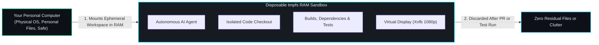

# Module 4: Autonomous Task Implementation & Sandboxes
{: .no_toc }

Step 3 of the lifecycle: How the Task Implementer drives autonomous coding agents, how disposable in-memory sandboxes keep your computer pristine, and how non-developers use Breakpoint Debugging to inspect live apps mid-flight.
{: .fs-6 .fw-300 }

## Table of contents
{: .no_toc .text-delta }

1. TOC
{:toc}

---

## Welcome to the Cleanroom: Ephemeral `tmpfs` Sandboxes

The single biggest fear people have when letting an AI run commands on their computer is simple: **"What if it breaks my computer?"**

What if an agent deletes your personal photos? What if it modifies your global Python environment and breaks your other apps? What if it accidentally leaks your SSH keys or passwords?

RobOS solves this with **Ephemeral In-Memory Sandboxes (`tmpfs`)**:

- When an agent starts a task, RobOS creates an isolated workspace that lives purely in temporary RAM (`tmpfs`).
- The agent gets its own virtual display (Xvfb) so it can boot graphical applications (like Chrome or Godot) without popping windows up over your mouse cursor.
- When the task is done, the sandbox is completely torn down. **Zero residual clutter, zero machine pollution, zero security risk.**

---

## Driving the Task Implementer

When you open **Task Implementer** (`packages/task-implementer`), you see your project's active tasks lined up in prioritized order.

  
  
<em>Screenshot 4.1: Task Implementer running an autonomous implementation task.</em>

When you click **Start Implementation on Task #12**:
1. **Branch Checkout**: The agent creates an isolated Git feature branch (e.g. `feature/12-buddy-gig-escrow`).
2. **Sandbox Provisioning**: RobOS mounts the in-memory `tmpfs` workspace.
3. **Context Injection**: The agent reads the exact task acceptance criteria and linked Knowledge Graph nodes.
4. **Execution Loop**: The agent writes the code, installs necessary local libraries inside the sandbox, and runs tests.

  
  
<em>Screenshot 4.2: RobOS provisioning the isolated execution environment.</em>

---

## Breakpoint Debugging for Non-Developers

What if you want to see what the agent is building *before* it finishes?

In traditional programming, "debugging" meant staring at raw memory addresses. In RobOS, **Breakpoint Debugging** is like a **Pause Button on an automated movie set**:

  
  
<em>Screenshot 4.3: Pausing execution at a breakpoint for live visual inspection.</em>

When an agent hits a breakpoint:
- Execution temporarily pauses.
- The app stays loaded in memory.
- You can open the live window, look at the screen layout, click buttons, and inspect values.
- In the variable inspector, you can see live data (e.g. `party_gold = 150`, `escrow_deposit = $25`).

  
  
<em>Screenshot 4.4: Inspecting live variables and state during a paused breakpoint session.</em>

If you like what you see, you simply click **Resume** and the agent continues!

---

## Verifiable Scorecards: Watching Tests Turn Green

How do you know the agent didn't write fake code that looks pretty but actually crashes?

Before finishing, the Task Implementer runs automated test suites:

  
  
<em>Screenshot 4.5: Automated test execution scorecard showing 100% verified assertions.</em>

The scorecard shows:
- **Test Results**: e.g., "6 passed, 0 failed in 1.4s".
- **Contract Compatibility**: Proving the frontend matches the backend schema.
- **Narrated Video Capture**: A 1080p recording of the test running in the virtual screen.

With the task implemented and verified, the agent opens a Pull Request into the **PR Review Theater**.

---

Now that you understand the machinery, let's build our two real-world projects!

Proceed to **[Module 5: Project 1 — Building getemgigs.com (Web App to Chrome)]({{ '/training/for-non-developers/05-project-getemgigs-web-app.html' | relative_url }})**!
