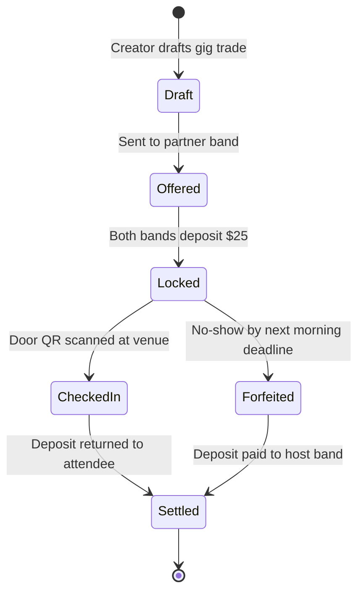

# Project Case Study: Building getemgigs.com (Web App to Chrome)
{: .no_toc }

A complete real-world case study: How a creator with zero coding experience uses RobOS to design, scaffold, implement, and run a production web application in Google Chrome.
{: .fs-6 .fw-300 }

## Table of contents
{: .no_toc .text-delta }

1. TOC
{:toc}

---

## The Vision: Ending Predatory Pay-To-Play for Indie Bands

Meet a flagship project: **The Gig Bandit &amp; Get 'Em Gigs** ([`getemgigs.com`](https://www.getemgigs.com)).

If you've ever played in an indie garage band, you know the music industry's dirty secret:
- Venues demand that bands bring dozens of people.
- Predatory promoters force bands to **pre-pay for tickets** out of their own pocket ("pay-to-play") and eat the loss if friends don't show up.
- Friends and fellow musicians promise they will attend, then bail to stay home.

We set out to fix this with radical software mechanics:
- **Buddy Gigs ("I'll come to your gig if you come to mine")**: Band A and Band B agree to cross-attend each other's concerts. Both bands put up an escrow deposit ($10–$100). If you show up at the venue door, your deposit is instantly refunded. If you flake, **the playing band keeps your cash**. Either you get a crowd, or you get paid!
- **Rotating Door QR Codes**: To prevent people from texting a screenshot of their ticket to a buddy at home, the door QR code rotates periodically with a cryptographic timestamp.

<div style="margin: 2rem 0;">
  
  <p style="text-align: center; color: #8b949e; font-size: 0.85rem; margin-top: 0.5rem;"><em>The Buddy Gig attendance agreement and escrow deposit lifecycle.</em></p>
</div>

---

## Onboarding the Web App in App Wizard

In **App Wizard**, we selected the **Web Application (Next.js / SSR)** archetype:
- **Name**: `getemgigs`
- **Domain**: `schema:WebApplication`, `robos:FrontEndApp`
- **Stack**: Next.js 15 App Router, React 19, TailwindCSS, Neon Serverless Postgres.

RobOS generated the clean project structure under `packages/getemgigs` and registered the node `urn:robos:app:getemgigs` in the Knowledge Graph.

<div style="margin: 2rem 0;">
  
  <p style="text-align: center; color: #8b949e; font-size: 0.85rem; margin-top: 0.5rem;"><em>System architecture of getemgigs.com running on Vercel and Neon Postgres.</em></p>
</div>

---

## Context Engineering the Escrow Rules

Instead of trying to code banking logic by hand, we used **Context Engineering** to define the exact rules in plain English:



```json
{
  "dealRules": {
    "depositRange": "$10 to $100 per band",
    "lockCondition": "When reciprocal agreement accepted by both hosts",
    "checkInWindow": "From 1 hour before scheduled doors until 5 hours after",
    "qrCodeExpirySeconds": 30,
    "settlementCron": "Every morning at scheduled deadline",
    "defaultOutcome": "Flaked deposit forfeited to the band that played"
  }
}
```

Because these rules were explicitly registered in the Knowledge Graph, the AI agents never had to guess what happens when someone arrives late or forgets their phone.

---

## Decomposing into DAG Tasks in Task Planner

In **Task Planner**, we used the interactive form to generate a structured milestone plan:
- **Core Data &amp; Escrow Engine**: Neon Postgres schema for `users`, `bands`, `gigs`, and `escrow_deals`.
- **Rotating QR Code API**: Crypto token generator that invalidates QR codes on a timed schedule.
- **Mobile-First Web UI**: Responsive phone screens for browsing gigs, initiating trades, and displaying the live QR ticket.

<div style="margin: 1.5rem 0;">
  
  <p style="text-align: center; color: #8b949e; font-size: 0.85rem; margin-top: 0.5rem;"><em>Reviewing web app deployments and automated build pipelines.</em></p>
</div>

---

## Running the Task Implementer in Sandboxes

We dispatched the tasks to the **Task Implementer**:
- The agent spun up an ephemeral `tmpfs` container.
- It wrote the Next.js routes under `app/api/deals/` and `app/deals/[id]/`.
- It created a complete automated test suite (`tests/escrow.test.js`) verifying:
  - Deposit locking on trade agreement.
  - Door QR verification with timed token rotation.
  - Automatic forfeiture of funds for no-shows at deadline.
- Result: **Automated test suites passed!**

---

## Running &amp; Testing in Google Chrome

Now for the best part: **using the app you just created!**

Because this is a web app, you can launch the local development server and open it directly in **Google Chrome**:

<div style="margin: 1.5rem 0;">
  
  <p style="text-align: center; color: #8b949e; font-size: 0.85rem; margin-top: 0.5rem;"><em>Running and testing your web application directly inside Google Chrome.</em></p>
</div>

### Testing in Chrome (Mobile Emulation)
- Open Google Chrome to `http://localhost:3000` (or visit the live deployment at [getemgigs.com](https://www.getemgigs.com)).
- Press `F12` (or right-click &rarr; **Inspect**) to open Chrome Developer Tools.
- Click the **Toggle Device Toolbar** icon (`Ctrl+Shift+M` or `Cmd+Shift+M`) to switch to **Mobile Emulation** (e.g. iPhone or Pixel).
- Interact with the mobile layout:
  - Click **Find a Buddy Gig**.
  - Review an incoming deal and click **Accept &amp; Lock Deposit**.
  - Click **Show Door QR Code** and watch the QR code refresh its cryptographic hash on schedule!

You just built and verified a full-scale production web application with escrow economics, database storage, and mobile device rendering without writing a single line of JavaScript!

---

Ready to step into the world of game development?

Proceed to **[Project Case Study: Building crpg-realm (Your First Video Game)]({{ '/training/for-non-developers/06-project-crpg-realm-game.html' | relative_url }})**!
