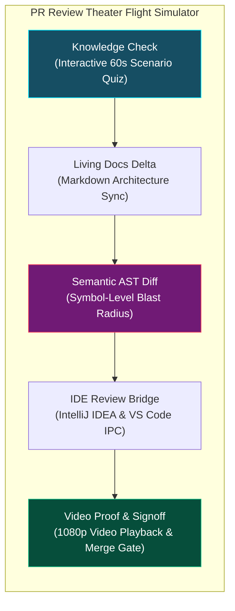

# Senior Reviewers & Tech Leads: Review-Based Development
{: .no_toc }

Master the art of governing autonomous AI code generation without drowning in diffs. Shift from tedious line-by-line syntax reading to high-signal architectural verification in the PR Review Theater.
{: .fs-6 .fw-300 }

## Table of contents
{: .no_toc .text-delta }

1. TOC
{:toc}

---

## The Crisis: Surviving the AI Pull Request Tsunami

In the pre-AI era, a software engineer opened one or two pull requests a week, each containing 50 to 200 lines of human-crafted code. Senior engineers had time to review logic, check style guidelines, and verify edge cases.

Today, autonomous coding agents can generate 1,500 lines of code across twelve files in under two minutes. 

Senior engineers and tech leads are drowning. Faced with massive pull requests every morning, humans experience severe review fatigue and succumb to the most dangerous failure mode in software engineering: **the reflexive "LGTM" (Looks Good To Me) rubber stamp.**

Rubber-stamping AI diffs leads to silent security regressions, architectural drift, and subtle hallucinated edge-case bugs.

RobOS re-engineers code review from the ground up through **Review-Based Development & The PR Review Theater**.

  
  
<em>Figure: The PR Review Theater Flight Simulator Workflow for Senior Reviewers.</em>

---

## Paradigm Shift: Syntax Reading vs. Flight Simulator Review

| Traditional Code Review | The RobOS Flight Simulator Review |
|:---|:---|
| **Syntax Nitpicking**: Reviewers waste time commenting on variable naming and bracket formatting. | **Automated Formatting Gates**: Linter and formatter scorecards run automatically in the sandbox. |
| **Silent Intent Blindness**: Reviewer reads code without knowing what the agent was attempting to achieve. | **Interactive Scenario Quiz**: Reviewer proves domain comprehension before inspecting code. |
| **Text Diff Noise**: 800 lines of red and green text showing boilerplate changes. | **AST Semantic Symbol Diff**: Focuses strictly on changed signatures, contracts, and blast radiuses. |
| **"Works on My Machine"**: Trusting that the developer or agent ran the test suite locally. | **1080p Narrated Video Proof**: Watch the test execute in an isolated virtual framebuffer with audio narration. |
| **Context Switching**: Leaving the browser review tool to manually check out branches in git. | **1-Click IDE Bridge**: Native IPC bridge into IntelliJ IDEA (port 63343) and VS Code with live breakpoint pauses. |

---

## Course Curriculum

  <a class="rb-link" href="{{ '/training/review-based-development/01-death-of-lgtm-rubber-stamping.html' | relative_url }}">
    

      01 - The Death of "LGTM" Rubber-Stamping
    

    

      Why reading AI code line-by-line is mathematically impossible, understanding review fatigue psychology, and shifting from syntax auditing to behavioral proof-of-work.
    

  </a>

  <a class="rb-link" href="{{ '/training/review-based-development/02-pr-review-theater-workflow.html' | relative_url }}">
    

      02 - The PR Review Theater Workflow
    

    

      Stepping through the focused review stages: the 60-second scenario quiz, living documentation synchronization, AST semantic diffs, and 1080p video playback.
    

  </a>

  <a class="rb-link" href="{{ '/training/review-based-development/03-ide-review-bridge-and-breakpoint-debugging.html' | relative_url }}">
    

      03 - IDE Review Bridge &amp; Breakpoint Debugging
    

    

      Connecting the review platform directly to IntelliJ IDEA and VS Code via port 63343 IPC, triggering breakpoints mid-flight, and inspecting live variables.
    

  </a>

---

## Ready to Lead High-Signal Reviews?

Proceed to **[The Death of "LGTM" Rubber-Stamping]({{ '/training/review-based-development/01-death-of-lgtm-rubber-stamping.html' | relative_url }})** to eliminate AI diff fatigue forever!
