# 01 - The Death of "LGTM" Rubber-Stamping
{: .no_toc }

Learn why reading AI-generated code line-by-line causes cognitive saturation, how the reflexive "LGTM" comment causes production disasters, and how Review-Based Development restores total architectural governance.
{: .fs-6 .fw-300 }

## Table of contents
{: .no_toc .text-delta }

1. TOC
{:toc}

---

## The Cognitive Math of AI Code Review

Consider the daily workload of a tech lead managing a team of four developers paired with autonomous coding agents:
- Each developer dispatches several agent tasks per day.
- By 3:00 PM, four pull requests await review, each averaging 800 lines of code across fifteen files.
- That is over 3,000 lines of freshly generated code.

Studies in software engineering cognitive ergonomics demonstrate that human comprehension drops precipitously after reviewing 400 lines of code in a single sitting. Beyond that threshold, reviewers suffer from **attention saturation**:
- They stop tracing logical branches.
- They glaze over subtle off-by-one errors and missing transaction rollbacks.
- They scroll to the bottom of the pull request, type `"LGTM"` (Looks Good To Me), and hit approve.

```mermaid
graph TD
    subgraph TheTrap["The Rubber-Stamp Spiral"]
        A["Agent generates 1,200 lines of code"] --> B["Reviewer opens massive diff"]
        B --> C["Cognitive Saturation: Glazed eyes, 45 minutes spent"]
        C --> D["Reflexive 'LGTM' rubber stamp"]
        D --> E["Production Outage: Undetected contract mismatch"]
    end

    subgraph TheRobOSWay["Review-Based Development"]
        A2["Agent generates feature in RAM sandbox"] --> B2["PR Review Theater Flight Simulator"]
        B2 --> C2["Knowledge Check: Verify architectural intent in 60s"]
        C2 --> D2["1080p Video Proof: Watch test execution live"]
        D2 --> E2["Atomic Verified Signoff: Zero cognitive fatigue"]
    end

    style TheTrap fill:#7f1d1d,stroke:#ef4444,color:#fff
    style TheRobOSWay fill:#064e3b,stroke:#10b981,color:#fff
```

---

## The Core Fallacy: Code is Not the Output

The root of review fatigue is a fundamental misunderstanding: **human reviewers treat code as the primary artifact to inspect.**

In traditional software development, code had to be scrutinized by hand because tests were sparse and developers made mechanical syntax errors. But autonomous AI agents rarely make syntax errors—they make **architectural, contextual, and behavioral errors**:
- An agent hallucinates a database query that works for ten users but locks tables under ten thousand concurrent requests.
- An agent introduces a subtle race condition in an asynchronous message worker.
- An agent alters a shared schema that breaks a client application.

Reading line-by-line syntax will not reveal these problems. What reveals them is **observable behavior, verifiable contract assertions, and automated behavioral test scorecards**.

---

## Shifting to Flight Simulator Governance

In aviation, when a flight instructor checks out a pilot, they do not sit down and read the electrical wiring schematics of the Boeing 787. They place the pilot in a **Flight Simulator**:
- Does the pilot understand the flight plan?
- Does the aircraft respond properly when an engine fails at 20,000 feet?
- Do the flight instruments confirm safe descent and landing?

**The PR Review Theater** brings this exact methodology to software engineering:
- **Scenario Knowledge Check**: The reviewer answers three quick domain scenario questions proving they understand the feature's intent.
- **Contract &amp; Schema Diff**: The reviewer inspects AST-level structural changes rather than 1,000 lines of formatting.
- **Narrated Video Playback**: The reviewer watches a 1080p video recording of the automated test suite executing inside the virtual framebuffer.
- **Behavioral Test Scorecards**: The reviewer verifies explicit BDD Gherkin test assertions.

---

## Up Next

Now that you understand the cognitive mechanics of Review-Based Development, step inside the simulator in **[The PR Review Theater Workflow]({{ '/training/review-based-development/02-pr-review-theater-workflow.html' | relative_url }})**!
