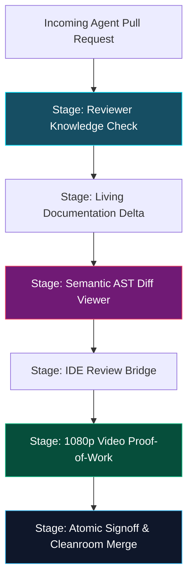

# 02 - The PR Review Theater Workflow
{: .no_toc }

Step inside the RobOS PR Review Theater and learn how each verification stage turns overwhelming pull requests into fast, high-signal, bulletproof approvals.
{: .fs-6 .fw-300 }

## Table of contents
{: .no_toc .text-delta }

1. TOC
{:toc}

---

## Entering the Theater

When you open a pull request in the **Agent Code Review Platform** (`packages/robos-review`), you are not presented with a wall of red and green diff text. Instead, you enter the **PR Review Theater Flight Simulator**.

  
  
<em>Figure: The PR Review Theater Flight Simulator stages from Knowledge Check to Atomic Signoff.</em>

---

## Deep Dive into the Review Stages

### Stage: Reviewer Knowledge Check
Before you see any diffs, the Theater presents a **60-Second Scenario Quiz**:
- Generated automatically by the agent from the task acceptance criteria.
- Example: *"If a user's payment fails with code `INSUFFICIENT_FUNDS`, what state does the Escrow transaction enter?"*
  - (A) `CANCELLED_NO_PENALTY`
  - (B) `RETRY_QUEUED`
  - (C) `LOCKED_DEPOSIT`
- Passing the scenario quiz confirms you understand the business rules of the change. This eliminates "blind approving" without knowing what the code was meant to accomplish.

### Stage: Living Documentation Delta
Every feature developed in RobOS automatically updates system documentation:
- Architecture Decision Records (ADRs) are synchronized.
- OpenAPI contracts and Mermaid flow diagrams are updated.
- You review the documentation delta first: if the architectural explanation is unclear, the code itself is fundamentally incomplete.

### Stage: Semantic AST Diff Viewer
Unlike traditional text diffs that flag irrelevant indentation or whitespace changes, the **Semantic Diff Viewer** parses the code into Abstract Syntax Trees (AST):
- Highlights modified functions, new parameters, and exported symbols.
- Suppresses boilerplate changes.
- Traces the blast radius directly to downstream consumers in the Knowledge Graph.

### Stage: 1080p Video Proof-of-Work
Autonomous agents in RobOS do not just report that tests passed—they prove it visually:
- An embedded video player plays a 1080p 60fps recording captured inside the ephemeral RAM sandbox's virtual display (Xvfb).
- Text narration overlays show the exact test assertions executing step by step.
- Piper TTS audio narrates the actions: *"Navigating to login page... entering test credentials... confirming 200 OK response."*
- If the video shows unexpected UI glitches or flickering, you catch it in seconds without having to pull down the branch or run local dev servers.

### Stage: Atomic Signoff & Cleanroom Merge Gate
Once all stages are verified, clicking **Approve & Merge** executes an atomic signoff:
- The changes are merged into the target branch.
- The ephemeral RAM sandbox is unmounted and purged.
- The Knowledge Graph updates World 1 to reflect the new production state.

---

## Up Next

Want to step inside your real editor during a review? Learn how in **[IDE Review Bridge &amp; Breakpoint Debugging]({{ '/training/review-based-development/03-ide-review-bridge-and-breakpoint-debugging.html' | relative_url }})**!
