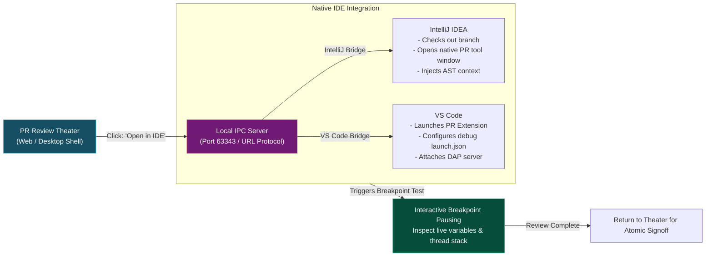

# 03 - IDE Review Bridge & Breakpoint Debugging
{: .no_toc }

Learn how the RobOS IDE Review Bridge seamlessly connects the PR Review Theater into IntelliJ IDEA and VS Code via port 63343 IPC, enabling interactive breakpoint pauses and live variable inspection.
{: .fs-6 .fw-300 }

## Table of contents
{: .no_toc .text-delta }

1. TOC
{:toc}

---

## When Browser Reviews Fall Short

Web-based pull request interfaces (like GitHub or GitLab) are fine for reading text diffs, but when you need to understand complex logic, they leave you stranded:
- You cannot click through function definitions or trace class hierarchies.
- You cannot run static type analysis or hover to see compiler inferences.
- You cannot set a breakpoint to pause execution and inspect local memory states.

In traditional development, reviewing in an IDE was painful: you had to copy branch names, stash your local changes, run `git checkout`, rebuild dependencies, and manually launch debuggers.

RobOS changes this through the **IDE Review Bridge**.



---

## How the IDE Bridge Operates

When you click **Open in IDE** inside the PR Review Theater, RobOS communicates with your local development environment using high-speed Inter-Process Communication (IPC):

### 1. IntelliJ IDEA Plugin (Port 63343 IPC)
RobOS ships a native IntelliJ IDEA plugin that listens on port `63343`:
- Receives the payload containing the workspace path, branch name, and modified files.
- Automatically provisions the workspace and checks out the branch in a worktree without touching your personal work.
- Generates `.idea/runConfigurations/` XML configurations configured with secret environment variables.
- Opens JetBrains' native **Pull Request tool window** with full AST symbol navigation, type checks, and inline comment capabilities.

### 2. VS Code Integration (`vscode://` Protocol)
For VS Code users, RobOS uses the deep `GitHub.vscode-pull-request-github` protocol:
- Dispatches a command URL: `vscode://github.vscode-pull-request-github/open-pr?number=142`.
- Focuses the diff in the editor with Monaco syntax highlighting and keyboard shortcuts.
- Configures launch debug targets automatically in `.vscode/launch.json`.

---

## Interactive Breakpoint Debugging for Senior Reviewers

The most powerful capability of the IDE Review Bridge is **Breakpoint Debugging**:
- When reviewing a complex algorithmic change (such as an escrow calculation or battle simulation), you don't have to guess whether the logic works.
- Click a line number in your IDE editor gutter to set a breakpoint.
- Click **Run Test with Breakpoints** from the RobOS toolbar.
- The test runner executes inside the sandbox and pauses instantly at your breakpoint.

```
[Debugger Paused: BillingService.ts:142]
Thread 1 (Suspended at breakpoint)
Variables:
  - this.escrowState: "DEPOSIT_PENDING"
  - incomingPayload.amountCents: 2500
  - calculatedFee: 75
  - netDeposit: 2425

Call Stack:
  > BillingService.lockDeposit() (BillingService.ts:142)
    EscrowController.handlePost() (EscrowController.ts:68)
    ExpressRouter.dispatch() (router.js:210)
```

You can step over, step into, evaluate expressions, and inspect live memory before approving the change.

---

## Returning to the Theater

Once you have verified the change in your IDE:
- You submit your review comments directly from the IDE tool window.
- The comments sync instantly to the PR Review Theater and project issue tracker.
- You click **Approve & Merge** in the Theater to complete the atomic signoff.

---

## Summary of the Senior Reviewer Track

You have completed the **Senior Reviewers & Tech Leads** curriculum:
- Eliminated review fatigue and the dangerous "LGTM" rubber stamp.
- Mastered the 6-stage PR Review Theater flight simulator workflow.
- Connected reviews to IntelliJ IDEA and VS Code for interactive breakpoint inspection.

Return to the **[RobOS Training Academy]({{ '/training/' | relative_url }})** to explore other training tracks!
