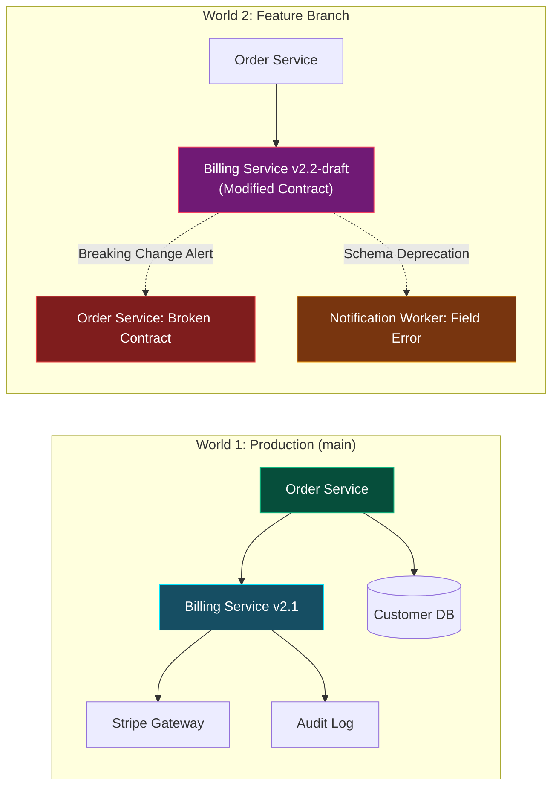

# Systems Architects: Dual-State Knowledge Graph Modeling
{: .no_toc }

Learn how to govern enterprise microservices, databases, and message brokers with compile-time semantic precision. Prevent breaking downstream changes before an autonomous agent writes a single line of code.
{: .fs-6 .fw-300 }

## Table of contents
{: .no_toc .text-delta }

1. TOC
{:toc}

---

## The Architectural Mission: "Taming The Citadel"

Every senior architect knows the sinking feeling of Friday afternoon: an engineer modifies a field in an internal microservice, passes their isolated unit tests, merges to production, and instantly takes down billing, user search, and warehouse fulfillment.

Why does this happen? **Because traditional architecture documentation is dead on arrival.**
- Architecture diagrams live in Confluence or Miro boards that rot the moment someone pushes an update.
- Transitive blast radiuses are invisible across multi-repository organizations.
- Autonomous coding agents blindly generate code without knowing whether an API schema was updated five minutes ago in a sister repository.

RobOS changes the paradigm entirely. In this track, you step into the role of **Chief Systems Architect** of **The Citadel**—a complex, distributed commerce platform. You will replace stale wikis with a **Dual-State Knowledge Graph** grounded in W3C Linked Data (Schema.org, OASIS OSLC, and SHACL constraint shapes).

  
  
<em>Figure: Dual-State Knowledge Graph Semantic Blast Radius Diff comparing World 1 (Production main) with World 2 (Feature Branch).</em>

---

## Architectural Principles of RobOS

Rather than viewing architecture as static drawings, RobOS treats your system topology as executable, queryable linked data:

| Conventional Approach | The RobOS Knowledge Graph Standard |
|:---|:---|
| **Stale Documentation**: Diagrams in Miro or Confluence drift from reality within days. | **Machine-Readable Truth**: Architecture is stored in versioned JSON-LD packages validated by W3C SHACL shapes. |
| **Silent Blast Radiuses**: Downstream breakage is discovered after production deployments fail. | **Pre-Flight Blast-Radius Diffing**: Compares World 1 (`main`) against World 2 (feature proposal) before implementation begins. |
| **Manual API Drifts**: Engineers manually adjust Swagger files after breaking code is written. | **Contract-First Code Generation**: Agents generate code strictly bounded by formal OpenAPI 3.1, Protobuf, and GraphQL contracts. |
| **Monolithic Silos**: System models are locked inside opaque enterprise repository wikis. | **Modular Namespaced Packages**: Distributed packages under `.robos/kgraphs/` indexed by `.robos/kgraph.yaml`. |

---

## Course Curriculum

  <a class="rb-link" href="{{ '/training/systems-architects/01-living-graph-vs-dead-confluence.html' | relative_url }}">
    

      01 - The Living Graph vs. Dead Confluence Diagrams
    

    

      Why static documentation fails, how Schema.org + OASIS OSLC JSON-LD turn architecture into compile-time verified system truth, and exploring the KGraph schema hierarchy.
    

  </a>

  <a class="rb-link" href="{{ '/training/systems-architects/02-declarative-modeling-and-shacl-shapes.html' | relative_url }}">
    

      02 - Declarative Modeling &amp; SHACL Shape Validation
    

    

      Domain modeling with Schema Studio, writing TypeSpec definitions, enforcing structural constraints with W3C SHACL shapes, and registering services and databases.
    

  </a>

  <a class="rb-link" href="{{ '/training/systems-architects/03-dual-state-time-machine-and-blast-radius.html' | relative_url }}">
    

      03 - The Dual-State Time Machine &amp; Semantic Blast Radius
    

    

      How to execute semantic diffs comparing World 1 (Production main) with World 2 (feature branches), tracing transitive dependencies, and guaranteeing zero breaking changes.
    

  </a>

---

## The Citadel Architecture: Your Sandbox Playground

Throughout this track, you will interact with the reference architecture of **The Citadel**:
- **Services**: `orders-api`, `billing-api`, `inventory-worker`, `customer-gateway`.
- **Databases**: PostgreSQL relational database (`citadel-core-db`), MongoDB document store (`audit-events`), Redis cache (`session-store`).
- **Brokers & Contracts**: Apache Kafka topic (`order-events.v1`), OpenAPI 3.1 REST contracts, and gRPC Protobuf definitions.

Ready to declare war on stale documentation? Proceed to **[The Living Graph vs. Dead Confluence Diagrams]({{ '/training/systems-architects/01-living-graph-vs-dead-confluence.html' | relative_url }})**!
