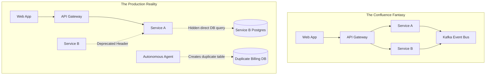

# 01 - The Living Graph vs. Dead Confluence Diagrams
{: .no_toc }

Discover why static documentation guarantees architectural rot, how Schema.org + OASIS OSLC turn architecture into compile-time verified linked data, and how RobOS indexes your entire platform.
{: .fs-6 .fw-300 }

## Table of contents
{: .no_toc .text-delta }

1. TOC
{:toc}

---

## The Autopsy of a Confluence Architecture Diagram

Every engineering organization starts with the best intentions. A Principal Architect spends three weeks drawing boxes and arrows in Miro, Lucidchart, or Confluence. The diagram shows clean tiers, unidirectional arrows, and pristine boundaries. Everyone nods in Slack.

Then real life happens:
- A developer adds an emergency database query bypassing the repository layer to fix a timeout.
- A payment microservice quietly deprecates a webhook header without alerting downstream listeners.
- An autonomous AI agent is asked to *"add a subscription tier"*, and hallucinates a new table structure that duplicates existing billing fields because it had no machine-readable way to discover them.

Within a month, the beautiful architecture diagram is a lie. The documentation says Service A talks to Service B through Kafka, but in reality, Service A is directly reading from Service B's Postgres replica.



---

## Enter Linked Data: Turning Architecture into Code

RobOS treats system architecture with the same rigor compilers treat code. Instead of inert pixels or free-form markdown, architecture in RobOS is expressed as **W3C Linked Data (JSON-LD 1.1)** grounded in established global ontologies:

- **Schema.org**: Defines foundational digital entities (`schema:SoftwareApplication`, `schema:WebApplication`, `schema:VideoGame`, `schema:Organization`).
- **OASIS OSLC (Open Services for Lifecycle Collaboration)**: Bridges software lifecycle artifacts (`oslc_am:Resource` for architecture, `oslc_cm:ChangeRequest` for tasks, `oslc_rm:Requirement` for specs, and `oslc_qm:TestPlan` for verification).
- **C4 Model**: Standardizes structural levels from system context down to microservices and database containers.

### A Concrete Node in RobOS

Here is how the Citadel's `billing-api` is formally defined in the Knowledge Graph (`.robos/kgraphs/services/package.jsonld`):

```json
{
  "@id": "urn:robos:service:billing-api",
  "@type": ["oslc_am:Resource", "robos:Microservice"],
  "schema:name": "Citadel Billing Service",
  "schema:description": "Processes subscription payments, merchant settlements, and escrow transactions.",
  "robos:ownerTeam": "urn:robos:team:fintech-core",
  "robos:runtime": "node20",
  "robos:consumesContract": [
    "urn:robos:contract:stripe-payment-v2",
    "urn:robos:contract:orders-api-v1"
  ],
  "robos:providesContract": [
    "urn:robos:contract:billing-events-kafka"
  ],
  "robos:dependsOn": [
    "urn:robos:db:citadel-core-postgres",
    "urn:robos:broker:citadel-kafka"
  ],
  "robos:blastRadiusScore": 0.82
}
```

Notice what this provides:
- **Explicit Provenance**: Every entity has a permanent URI (`urn:robos:service:...`).
- **Explicit Ingress & Egress**: We know exactly which contracts the service consumes and provides.
- **Machine Readability**: AI agents, CI/CD pipelines, and blast-radius diff engines can traverse this graph like an AST (Abstract Syntax Tree).

---

## Exploring the Graph in RobOS

When you launch **Knowledge Graph Explorer** (`packages/robos-graph`), you are not looking at a static vector drawing. You are inspecting a live semantic graph:

```
[Knowledge Graph Explorer]
├── 📦 core-platform (robos.core)
│   ├── 🗄️ citadel-core-postgres (robos:Database)
│   ├── 📡 citadel-kafka (robos:MessageBroker)
│   └── 🛡️ prompt-security-guard (robos:MCPServer)
├── 📦 services (robos.services)
│   ├── ⚡ billing-api (robos:Microservice)
│   ├── ⚡ orders-api (robos:Microservice)
│   └── ⚡ customer-gateway (robos:Microservice)
└── 📦 devops (robos.devops)
    ├── ☸️ citadel-prod-cluster (robos:KubernetesCluster)
    └── 🚀 billing-gitops-pipeline (robos:GitOpsDeployment)
```

Because every node is typed, you can run semantic queries:
- *"Which microservices consume the `orders-api-v1` contract?"*
- *"What is the blast radius if we migrate `citadel-core-postgres` to Aurora?"*
- *"Show all unauthenticated endpoints across our entire portfolio."*

---

## Interactive Architect Spike: Querying The Citadel

Try running a semantic query directly inside your RobOS environment or Tilix terminal:

```bash
# Query all microservices owned by the fintech squad
robos-graph query --type "robos:Microservice" --filter "robos:ownerTeam=urn:robos:team:fintech-core"
```

The CLI returns the verified graph topology:
```json
[
  {
    "id": "urn:robos:service:billing-api",
    "name": "Citadel Billing Service",
    "consumes": ["orders-api-v1", "stripe-payment-v2"],
    "dependents": ["urn:robos:service:orders-api", "urn:robos:worker:audit-logger"]
  }
]
```

---

## Up Next

Now that you understand how Linked Data eliminates documentation rot, proceed to **[Declarative Modeling &amp; SHACL Shape Validation]({{ '/training/systems-architects/02-declarative-modeling-and-shacl-shapes.html' | relative_url }})** to learn how to enforce architectural rules with W3C constraint shapes!
