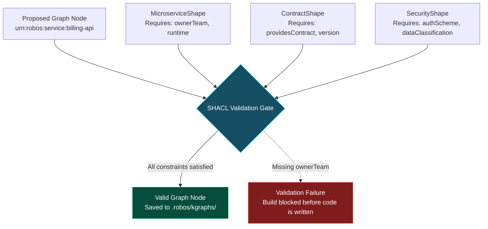

# 02 - Declarative Modeling & SHACL Shape Validation
{: .no_toc }

Learn how to define rock-solid architectural constraints using TypeSpec and W3C SHACL shapes. Transform governance from subjective human review meetings into automated, compile-time validation gates.
{: .fs-6 .fw-300 }

## Table of contents
{: .no_toc .text-delta }

1. TOC
{:toc}

---

## Why Rules Must Be Machine-Enforced

In most enterprises, "architecture standards" are recorded in a PDF called *Enterprise Architecture Guidelines 2026*. It contains rules like:
- *"All microservices must declare an owner team."*
- *"All database nodes must specify backup and replication policies."*
- *"No external API contract may be deprecated without a 6-month grace window."*

The problem? Humans rarely read guidelines, and autonomous AI agents never read PDFs unless explicitly prompted.

RobOS solves this with **W3C SHACL (Shapes Constraint Language)**. SHACL is to RDF Knowledge Graphs what JSON Schema or TypeScript interfaces are to JavaScript—except it validates relational dependencies, multi-hop links, and topological constraints.



---

## Anatomical Breakdown of a SHACL Shape

In RobOS, all architectural shapes live under `.robos/shapes/` and are registered in **Schema Studio & Registry**.

Here is the formal SHACL constraint shape for any `robos:Microservice`:

```turtle
@prefix sh: <http://www.w3.org/ns/shacl#> .
@prefix robos: <urn:robos:ontology:> .
@prefix schema: <http://schema.org/> .
@prefix xsd: <http://www.w3.org/2001/XMLSchema#> .

robos:MicroserviceShape
    a sh:NodeShape ;
    sh:targetClass robos:Microservice ;
    sh:property [
        sh:path schema:name ;
        sh:datatype xsd:string ;
        sh:minCount 1 ;
        sh:message "Microservice must declare a human-readable schema:name." ;
    ] ;
    sh:property [
        sh:path robos:ownerTeam ;
        sh:nodeKind sh:IRI ;
        sh:minCount 1 ;
        sh:message "Microservice must link to an authenticated owner team IRI." ;
    ] ;
    sh:property [
        sh:path robos:runtime ;
        sh:in ( "node20" "node22" "go1.22" "python3.11" "rust1.78" ) ;
        sh:minCount 1 ;
        sh:message "Runtime must be an approved enterprise LTS version." ;
    ] ;
    sh:property [
        sh:path robos:blastRadiusScore ;
        sh:datatype xsd:decimal ;
        sh:maxInclusive 1.0 ;
        sh:minInclusive 0.0 ;
    ] .
```

---

## Declarative Modeling with TypeSpec & Schema Studio

Writing Turtle syntax by hand can be tedious. RobOS provides **Schema Studio & Registry** (`packages/robos-schema`), allowing architects to model domains using modern **TypeSpec** (Microsoft's concise API modeling grammar) while compiling directly into JSON-LD and SHACL shapes:

```tsp
import "@typespec/http";
import "@typespec/rest";

using TypeSpec.Http;
using TypeSpec.Rest;

@service({
  title: "Citadel Order Processing API",
  version: "1.0.0"
})
namespace Citadel.Orders;

model Order {
  @key id: string;
  customerId: string;
  totalCents: integer;
  currency: string;
  status: "pending" | "settled" | "failed";
}

@route("/orders")
interface OrdersService {
  @post createOrder(@body order: Order): Order;
  @get getOrder(@path id: string): Order;
}
```

When you save this in Schema Studio, RobOS automatically:
- Synthesizes the OpenAPI 3.1 specification.
- Generates the SHACL structural validator.
- Registers `urn:robos:contract:orders-api-v1` into the Knowledge Graph package.

---

## Testing SHACL Validation in Practice

Let's test what happens when someone attempts to register a rogue microservice without an owner team:

```bash
# Validate the proposed changes against SHACL constraints
robos-graph validate --package services
```

The validation engine immediately catches the violation:

```
[SHACL Validation Report]
Status: VIOLATION DETECTED
Target Node: urn:robos:service:rogue-logger
Constraint: robos:MicroserviceShape -> robos:ownerTeam
Severity: Violation
Message: Microservice must link to an authenticated owner team IRI.
Source File: .robos/kgraphs/services/package.jsonld:48
```

The build fails **before any AI agent writes code, before any cloud resource is provisioned, and before any pull request is opened.**

---

## Up Next

Now that your system architecture is protected by automated SHACL validation gates, learn how to compare past, present, and future states in **[The Dual-State Time Machine &amp; Semantic Blast Radius]({{ '/training/systems-architects/03-dual-state-time-machine-and-blast-radius.html' | relative_url }})**!
