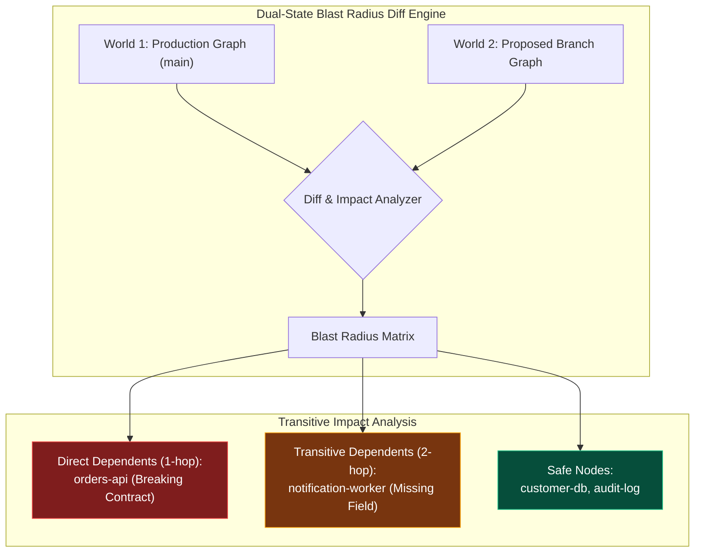

# 03 - The Dual-State Time Machine & Semantic Blast Radius
{: .no_toc }

Discover how the Dual-State Knowledge Graph compares World 1 (Production main) with World 2 (Feature Branch) to catch breaking contract ripple effects before an agent writes code.
{: .fs-6 .fw-300 }

## Table of contents
{: .no_toc .text-delta }

1. TOC
{:toc}

---

## The Nightmare of the Unseen Blast Radius

In complex enterprise architectures, the most dangerous bug is not a syntax error or null pointer exception. **It is an unexpected semantic ripple effect.**

Consider this scenario in **The Citadel**:
- The Fintech squad updates `billing-api` to rename the payload field `customer_id` to `account_uuid` to conform to a new global standard.
- The Fintech squad updates their local tests. Everything passes with flying colors.
- They merge to `main`.
- Three hours later, the Order Fulfillment team reports that order placement is crashing. The Shipping notification worker has halted because it was parsing `customer_id` from the billing event stream.

In traditional organizations, this blast radius was invisible because Git only tracks file diffs (`git diff`), not **semantic graph dependencies**.

---

## The Dual-State Architecture in RobOS

RobOS solves this by maintaining two concurrent world states in memory:
- **World 1 (The Baseline)**: The canonical, verified architecture living on `main`.
- **World 2 (The Horizon)**: The proposed state living on your feature branch or active task scratchpad.

When an autonomous agent or architect proposes an architectural change, the **Dual-State Engine** computes a semantic diff across the linked graph:

<div style="margin: 2rem 0;">
  
  <p style="text-align: center; color: #8b949e; font-size: 0.85rem; margin-top: 0.5rem;"><em>Figure: Dual-State Knowledge Graph Semantic Blast Radius Diff showing World 1 vs. World 2 transitive downstream impact.</em></p>
</div>



---

## Running a Semantic Diff

You can run the semantic diff from the CLI or inspect it visually inside **Agent Code Review Platform**:

```bash
# Compare current working branch against main
robos-graph diff --world1 origin/main --world2 HEAD
```

The output highlights exact semantic structural impacts:

```
[RobOS Dual-State Blast Radius Analysis]
Comparing: World 1 (origin/main) <-> World 2 (HEAD: feature/billing-uuid)

Modifications Detected:
  ~ urn:robos:contract:billing-events-kafka
    - Field removed: customer_id (string)
    + Field added: account_uuid (string, UUIDv4)

Blast Radius Impact Score: 0.74 (HIGH RISK)
Direct Dependents Impacted:
  ⚠️  urn:robos:service:orders-api
      Status: Incompatible Contract Version
      Requires: customer_id on topic order-events.v1
  ⚠️  urn:robos:worker:notification-worker
      Status: Transitive Field Deprecation

Resolution Recommendations:
  1. Deprecate customer_id with dual-write fallback.
  2. Increment contract version to billing-events-kafka.v2.
  3. Dispatch migration tasks to dependent squad queues.
```

---

## Autonomous Agent Guardrails

When autonomous agents are instructed to implement features in RobOS, the **Dual-State Engine acts as an automated circuit breaker**:
- Before the agent creates code files, the blast radius is evaluated.
- If the proposed change triggers a breaking change on an un-versioned contract consumed by another service, the task plan is rejected.
- The agent is forced to either provide backward-compatible shims or submit contract deprecation proposals first.

This guarantees that autonomous agents can develop high-velocity features across dozens of repositories without threatening architectural stability.

---

## Summary & Next Steps

You have learned how to:
- Transform static documentation into a live, queryable Knowledge Graph.
- Enforce strict enterprise standards using W3C SHACL constraint shapes.
- Predict and neutralize transitive ripple effects using Dual-State Blast Radius diffs.

Explore the next track in the RobOS Academy: **[Agent Harness Engineers — Autonomous Personas & UHP Governance]({{ '/training/agent-harness-engineering/' | relative_url }})**!
